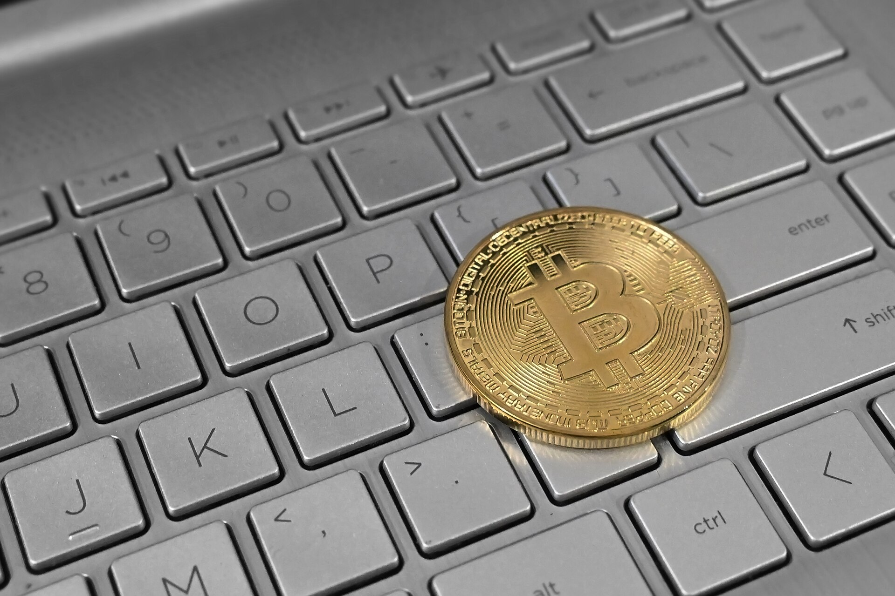

אחרי תקופה ממושכת של שפל, שבה נמחקו מיליארדי דולרים משווי השוק, **הביטקוין חזר לשבור שיאים** ומושך מחדש את תשומת ליבם של המשקיעים הישראלים. המטבע הדיגיטלי המוביל נסחר סביב רמות שיא היסטוריות, והתשובה הקצרה לשאלה מדוע — היא שילוב של אישור קרנות סל אמריקאיות, כניסת גופים מוסדיים גדולים לתחום, וציפייה לסביבת ריבית יורדת שמחזירה את התיאבון לנכסי סיכון.

## מה מניע את הראלי בביטקוין?

הזרז המרכזי לגל העליות הנוכחי היה אישור **קרנות הסל (ETF) על ביטקוין** בארצות הברית על ידי רשות ניירות ערך האמריקאית. לראשונה, משקיעים מסורתיים יכולים לקבל חשיפה למטבע הדיגיטלי דרך חשבון ניירות ערך רגיל, בלי להתמודד עם ארנקים דיגיטליים, מפתחות פרטיים או בורסות קריפטו זרות. ענקיות ניהול נכסים כמו בלאקרוק ופידליטי גייסו מיליארדי דולרים לקרנות אלה בזמן קצר.

גורם נוסף הוא ה"הַחְצָאָה" (Halving) — מנגנון מובנה בפרוטוקול הביטקוין שמפחית מדי כארבע שנים את קצב יצירת המטבעות החדשים. ההיצע המתכווץ, בשילוב ביקוש גובר, יצר לחץ מעלה על המחיר. במקביל, הציפייה שהבנק הפדרלי בארה"ב ימשיך במגמת הורדות הריבית מחזירה את המשקיעים לנכסים בעלי פוטנציאל תשואה גבוה יותר.

## האם הישראלים באמת חוזרים לקריפטו?

העניין המחודש בקרב הציבור הישראלי ניכר היטב. פלטפורמות המסחר המקומיות מדווחות על עלייה בפתיחת חשבונות, והבנקים — שבמשך שנים חסמו העברות הקשורות למטבעות דיגיטליים — מגלים גמישות מסוימת בזכות רגולציה מתפתחת. חשוב לזכור שהמשקיע הישראלי כבר חווה על בשרו את התנודתיות: רבים נכנסו לשוק בשיא הקודם וספגו הפסדים כבדים בהמשך.

הפעם, הכניסה נעשית לעיתים בכלים "מסודרים" יותר. חלק מהמשקיעים מעדיפים חשיפה עקיפה — דרך קרנות סל זרות או מניות של חברות הקשורות לתחום — על פני החזקה ישירה של המטבע.

## השוואה: אפיקי חשיפה לקריפטו

| אפיק | יתרון מרכזי | חיסרון מרכזי |
|---|---|---|
| החזקה ישירה בביטקוין | בעלות מלאה על הנכס | סיכוני אבטחה וניהול ארנק |
| קרן סל על ביטקוין | פיקוח ונזילות גבוהה | דמי ניהול, חשיפה עקיפה |
| מניות חברות קריפטו | חשיפה דרך שוק ההון | תלות בביצועי החברה |
| מטבעות יציבים (סטייבלקוין) | תנודתיות נמוכה | תשואה מוגבלת |

## אילו סיכונים אורבים למשקיעים?

למרות ההתלהבות, חשוב לשמור על פרופורציות. **הביטקוין נותר נכס תנודתי במיוחד**, ומהלכי ירידה של עשרות אחוזים בתוך שבועות אינם תרחיש נדיר. בניגוד למניות, אין לביטקוין תזרים מזומנים, דיבידנד או רווחים שניתן לתמחר לפיהם — ערכו נקבע כמעט כולו על ידי היצע וביקוש ופסיכולוגיה של שוק.

מעבר לכך, יש להביא בחשבון סיכונים ייחודיים:

- **סיכון רגולטורי:** מדינות עשויות להחמיר הגבלות על מסחר ומיסוי.
- **סיכוני אבטחה:** פריצות לבורסות קריפטו ואובדן מפתחות פרטיים.
- **מיסוי בישראל:** רשות המסים רואה ברווח ממימוש קריפטו רווח הון החייב במס.

רשות ניירות ערך והרשות לאיסור הלבנת הון בישראל ממשיכות להדק את הפיקוח על הזירה, במטרה להגן על הציבור ולמנוע שימוש לרעה.

## מה מקומו של הביטקוין בתיק ההשקעות?

יועצי השקעות רבים ממליצים להתייחס לקריפטו כאל רכיב "תבלין" בתיק — כלומר, להגביל את החשיפה לאחוזים בודדים בלבד מסך ההשקעות, בהתאם ליכולת נשיאת הסיכון של המשקיע. הרעיון הוא ליהנות מפוטנציאל הרווח מבלי לסכן את יציבות התיק כולו.

עבור המשקיע הישראלי, שכבר מכיר את התנודתיות של הנאסד"ק ושל מניות הטכנולוגיה, הביטקוין מהווה שכבת סיכון נוספת. ההיסטוריה מלמדת ששוק הקריפטו נע במחזורים חדים של עליות ומפולות — ומי שנכנס אליו חייב להיות מוכן נפשית וכלכלית גם לתרחיש ההפוך מהראלי הנוכחי.

בשורה התחתונה, השיא הנוכחי של הביטקוין משקף בשלות מסוימת של השוק וכניסה של כסף מוסדי, אך אינו מבטל את הסיכונים הבסיסיים. משקיע שמבין את הנכס, מגביל את חשיפתו ופועל בכלים מפוקחים — יוכל להשתתף במגמה מבלי לחשוף את עצמו לזעזועים בלתי נשלטים.
