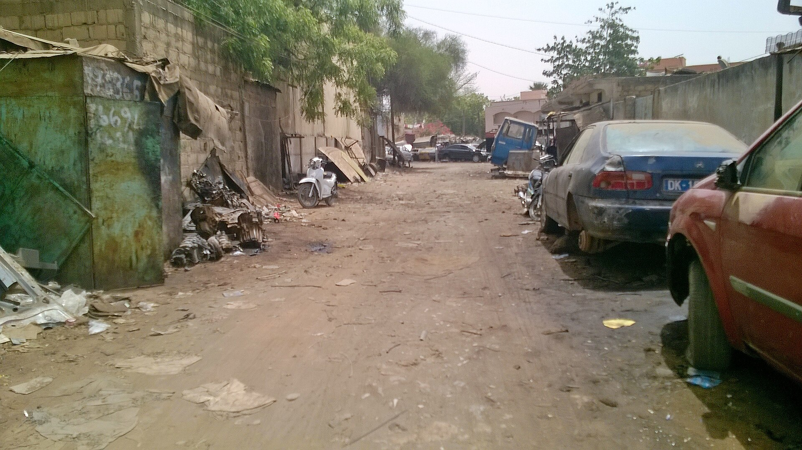

בעלי הרכב בישראל פוגשים בחודשים האחרונים מציאות מטלטלת בחידוש הפוליסה: **ביטוח רכב מתייקר** בקצב חד, כשפרמיות הביטוח המקיף רשמו עלייה של עשרות אחוזים בשנה החולפת. מדובר באחת ההתייקרויות הצרכניות המורגשות ביותר, שנוגעת כמעט לכל משק בית — ומצטרפת ללחצי יוקר המחיה שממשיכים להעיק על הצרכן הישראלי.

התשובה הקצרה לשאלה מדוע הביטוח מזנק טמונה בשילוב של שלושה גורמים: התייקרות חדה של חלקי החילוף ועבודות התיקון, שינוי הרכב הישראלי לכיוון רכבים חשמליים והיברידיים יקרים לתיקון, וגל נזקים וגניבות שפגע ברווחיות חברות הביטוח.

## למה ביטוח הרכב מתייקר דווקא עכשיו?

הגורם המרכזי לכך שביטוח רכב מתייקר הוא עליית עלות התיקונים. חלקי חילוף מיובאים, ומחירם הושפע גם מפיחות בשער השקל בתקופות מסוימות וגם משיבושים בשרשראות האספקה הגלובליות. מוסך שמתקן רכב היום מתמודד עם חלפים יקרים יותר, עם רכיבים אלקטרוניים מורכבים ועם עלויות עבודה גבוהות — וכל אלה מתגלגלים היישר לפרמיה שמשלם הצרכן.

גורם שני הוא הרכב עצמו. הרכב הישראלי הממוצע התייקר, התמלא במערכות בטיחות מתקדמות, במצלמות ובחיישנים — כך שאפילו תאונה קלה עלולה לגרור החלפת רכיבים בעלות של אלפי שקלים. פגוש שנשבר אינו רק חתיכת פלסטיק; הוא נושא חיישנים ומצלמות שמייקרים משמעותית את התיקון.

### כיצד הרכב החשמלי משפיע על הפרמיה?

המעבר המואץ לרכבים חשמליים והיברידיים, שבהם בולטים המותגים הסיניים שכבשו נתח שוק משמעותי, משנה את פני ענף הביטוח. הסוללה היא הרכיב היקר ביותר ברכב החשמלי, ופגיעה בה עלולה להוביל להשבתה מלאה של הרכב (אובדן להלכה) גם בתאונה שנראית שגרתית. חברות הביטוח, שעדיין צוברות ניסיון בתמחור הסיכון של הרכבים הללו, נוטות לגבות פרמיה גבוהה יותר עד שיתגבש מודל אקטוארי מדויק.

## גל הגניבות והמלחמה: הלחץ על הרווחיות

מעבר לעלויות התיקון, ענף הביטוח התמודד בשנתיים האחרונות עם עלייה בהיקף גניבות הרכב ובנזקי רכוש, בין היתר על רקע תקופת המלחמה. ריבוי התביעות שחק את רווחיות ענף ביטוח הרכב, ודחף את החברות — הראל, כלל ביטוח, מנורה מבטחים, הפניקס ומגדל — לתמחר מחדש את הסיכון כלפי מעלה. כשהיחס בין הפרמיות שנגבות לבין התביעות ששולמות מתדרדר, התוצאה הצפויה היא התייקרות רוחבית לצרכן.

## השוואת עלויות: כמה באמת עולה לבטח רכב?

הטבלה הבאה ממחישה את פערי המחירים העקרוניים בין סוגי כיסוי שונים, כמגמה כללית ולצורך המחשה בלבד:

| סוג פוליסה | מה מכסה | מגמת מחיר בשנה החולפת |
|---|---|---|
| חובה | נזקי גוף בלבד (חובה חוקית) | עלייה מתונה |
| צד ג' | נזק לרכב אחר | עלייה בינונית |
| מקיף לרכב בנזין | נזק עצמי, גניבה, צד ג' | עלייה חדה |
| מקיף לרכב חשמלי | נזק עצמי כולל סוללה | עלייה חדה במיוחד |

הפער בין ביטוח מקיף לרכב חשמלי לבין רכב בנזין מקביל יכול להגיע למאות שקלים בשנה, בעיקר בשל עלות הסוללה וחוסר הוודאות בתמחור.

## כיצד הצרכן יכול לחסוך?

למרות המגמה, לצרכן יש כלים להתמודד עם התייקרות ביטוח הרכב:

- **השוואת הצעות מחיר.** הפערים בין החברות ובין הסוכנים יכולים להגיע לעשרות אחוזים על אותה פוליסה בדיוק. שווה לבקש מספר הצעות לפני חידוש.
- **התאמת ההשתתפות העצמית.** העלאת ההשתתפות העצמית מפחיתה את הפרמיה השנתית — כדאי במיוחד לנהגים ותיקים עם היסטוריית תביעות נקייה.
- **בדיקת כיסויים מיותרים.** לא כל נהג זקוק לכל הרחבה. ביטול כיסויים שאינם רלוונטיים חוסך כסף.
- **מיגון הרכב.** התקנת אמצעי מיגון מתקדמים עשויה להוזיל את הפרמיה, במיוחד בדגמים המועדים לגניבה.
- **פוליסות דיגיטליות.** חברות הביטוח הישיר (דיגיטל) מציעות לעיתים תעריפים תחרותיים לנהגים בעלי פרופיל סיכון נמוך.

המסקנה לצרכן ברורה: התייקרות ביטוח הרכב אינה גזירה שאין להשיב ממנה. פוליסה היא מוצר צרכני לכל דבר, וכמו בכל רכישה משמעותית — השוואה, בדיקה והתאמה אישית עשויות לחסוך סכומים לא מבוטלים בכל שנה מחדש.
