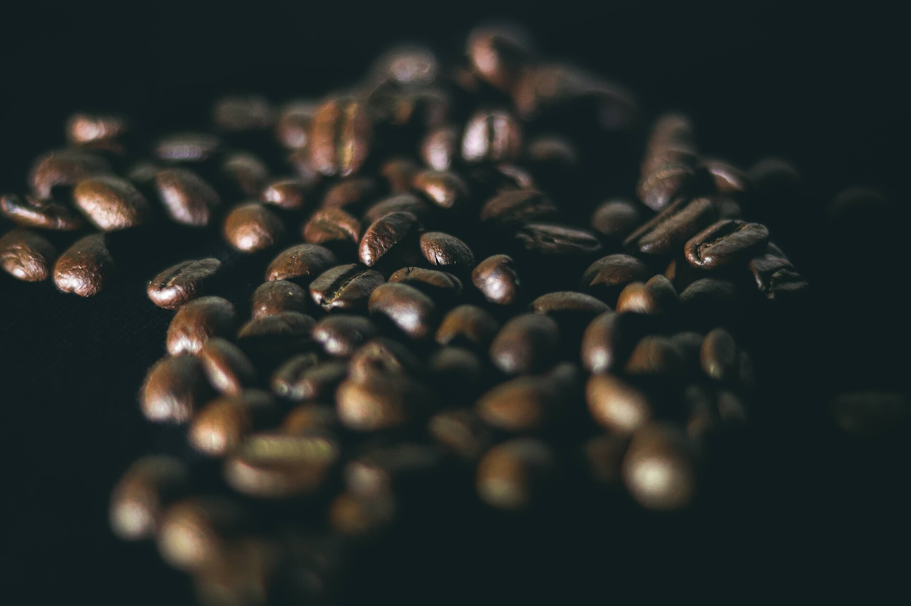

התייקרות השוקולד והקפה הפכה בחודשים האחרונים לאחד הביטויים המוחשיים ביותר של יוקר המחיה עבור הצרכן הישראלי. הסיבה המרכזית אינה מקומית אלא גלובלית: מחירי הקקאו והבּן בשוק הסחורות העולמי רשמו זינוק חד, והעלייה מחלחלת במהירות אל מדפי הרשתות בישראל. התוצאה — טבלת שוקולד וכוס קפה, שנחשבו לפינוקים זולים ויומיומיים, נעשות יקרות יותר.

## מה עומד מאחורי הזינוק במחירי הקקאו?

עיקר הקקאו בעולם מגיע ממערב אפריקה, בעיקר מחוף השנהב ומגאנה, המספקות יחד את מרבית התוצרת העולמית. בשנה החולפת נפגע היבול בשל שילוב של בצורת, גלי חום ומחלות צמחים שפגעו קשות בשיחי הקקאו. המחסור בהיצע דחף את מחירי הקקאו בבורסות הסחורות לרמות שיא היסטוריות, לעיתים גבוהות פי כמה מהרמות שנרשמו לפני מספר שנים.

כשמחיר חומר הגלם המרכזי בשוקולד מזנק כך, יצרניות הענק — ובהן נסטלה, מונדלז והרשי — נאלצות להתאים את מחיריהן. חלקן מעלה מחירים ישירות, ואחרות בוחרות במסלול עקיף יותר: הקטנת משקל האריזה תוך שמירה על המחיר, תופעה שזכתה לכינוי "אינפלציית התכווצות".

## ולמה גם הקפה מתייקר?

במקביל לקקאו, גם שוק הקפה חווה זעזוע מחירים. שני זני הקפה המרכזיים — ערביקה ורובוסטה — התייקרו משמעותית על רקע שיבושי אקלים במדינות היצרניות המובילות. ברזיל, יצרנית הערביקה הגדולה בעולם, סבלה מבצורת ומגלי חום, וגם וייטנאם, ספקית הרובוסטה המרכזית, נפגעה מתנאי מזג אוויר קיצוניים.

התוצאה היא לחץ כפול על הצרכן הישראלי, שרואה את שני אחד הפינוקים היומיומיים שלו — הקפה של הבוקר והשוקולד של הערב — מתייקרים בו-זמנית. בבתי הקפה ההשפעה מתונה יותר, שכן מרכיב חומר הגלם קטן יחסית מעלות התפעול, אך במדף הקמעונאי העלייה בולטת.

## כמה זה באמת עולה לצרכן?

הקושי המרכזי בהערכת ההתייקרות הוא שהיא אינה אחידה. חלק מהמוצרים מתייקרים בשיעור ניכר, אחרים כמעט ולא, ובחלקם ההתייקרות "מוסתרת" בהקטנת אריזה. הטבלה הבאה ממחישה את מנגנוני ההתייקרות השונים שהצרכן עשוי להיתקל בהם:

| מנגנון | איך זה נראה במדף | ההשפעה על הצרכן |
|---|---|---|
| העלאת מחיר ישירה | אותה אריזה, מחיר גבוה יותר | שקוף אך מורגש מיד |
| הקטנת אריזה | אותו מחיר, פחות גרמים | פחות שקוף, מחיר ליחידה עולה |
| הפחתת אחוז קקאו | מרקיב זול יותר בתוך המוצר | ירידה איכותית סמויה |
| צמצום מבצעים | פחות הנחות ופחות "1+1" | עלייה עקיפה בהוצאה |

## איך זה משתלב באינפלציה בישראל?

רכיבי המזון הם בין הגורמים המשפיעים ביותר על תחושת יוקר המחיה, גם אם משקלם במדד המחירים לצרכן שמפרסמת הלשכה המרכזית לסטטיסטיקה מוגבל. בנק ישראל עוקב מקרוב אחר סעיף המזון, שכן התייקרות מתמשכת בו עלולה להשפיע על ציפיות האינפלציה של הציבור.

חשוב להדגיש: מדובר בעליית מחירים המונעת מגורמים גלובליים — אקלים ושיבושי היצע — ולא מגורם מקומי. לכן גם חיזוק השקל מול הדולר, שמוזיל בדרך כלל יבוא, אינו מספיק כדי לקזז לחלוטין את הזינוק במחיר חומרי הגלם עצמם.

## מה הצרכן יכול לעשות?

כמה כלים פרקטיים יכולים למתן את הפגיעה בכיס:

- **מעבר למותג פרטי:** רשתות המזון בישראל הרחיבו את קווי המותג הפרטי, שלרוב זולים משמעותית ממותגים מובילים.
- **השוואת מחיר ליחידה:** בדיקת המחיר לכל 100 גרם חושפת "אינפלציית התכווצות" ומאפשרת השוואה הוגנת.
- **רכישה מרוכזת ובמבצעים:** קנייה של כמויות גדולות בזמן מבצע מקטינה את העלות הממוצעת.
- **גמישות בהרגלים:** מעבר לזני קפה זולים יותר או לשוקולד באחוז קקאו נמוך יכול לחסוך בהוצאה.

השורה התחתונה: התייקרות השוקולד והקפה צפויה להישאר עמנו כל עוד המחסור בשוקי הסחורות העולמיים נמשך. עד להתאוששות היבולים במערב אפריקה, בברזיל ובווייטנאם, הצרכן הישראלי יידרש לחוכמת קנייה כדי לשמור על הפינוקים הקטנים במחיר סביר.
