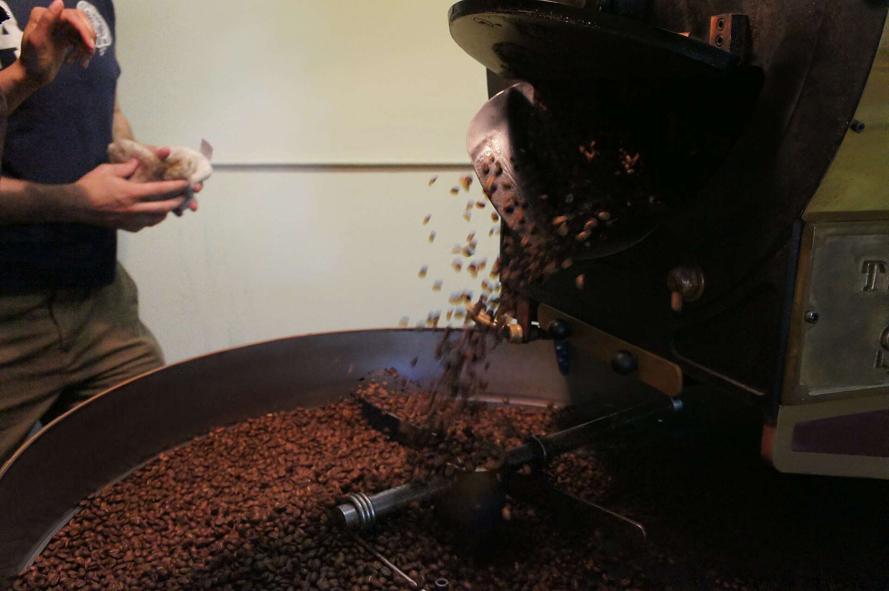

מחירי הקפה בעולם רשמו בשנה החולפת אחת מקפיצות המחירים החדות בעשורים האחרונים, וההשפעה כבר מחלחלת אל הכיס הישראלי — הן במדפי רשתות השיווק והן בבתי הקפה. השילוב של פגעי מזג אוויר במדינות המגדלות המובילות, עלייה בעלויות ההובלה הימית ורגולציה אירופית חדשה, דחף את **מחירי הקפה** בבורסות הסחורות לרמות שלא נראו כמותן שנים רבות. עבור המשק הישראלי, שבו הקפה הוא כמעט מוצר יסוד, מדובר בייקור שקשה להתחמק ממנו.

## מדוע מחירי הקפה זינקו כל כך?

הקפה נסחר בשני זנים עיקריים: ארביקה, האיכותי והפופולרי יותר, ורובוסטה, החזק והזול יותר המשמש בעיקר לקפה נמס ולתערובות אספרסו. בשנה האחרונה שני הזנים התייקרו במקביל — תופעה נדירה יחסית.

הגורם המרכזי הוא מזג האוויר. ברזיל, יצואנית הקפה הגדולה בעולם, ספגה בצורת ממושכת שפגעה ביבולים, בעוד וייטנאם — המעצמה המובילה ברובוסטה — התמודדה עם גלי חום וגשמים חריגים. כשההיצע מצטמצם והביקוש העולמי ממשיך לגדול, המחיר מזנק.

לכך מתווספים שני גורמים משמעותיים:

- **עלויות הובלה ולוגיסטיקה** שעלו על רקע המתחים בים האדום ושיבושים בשרשראות האספקה.
- **רגולציית ההיערנות של האיחוד האירופי**, שמחייבת הוכחה כי הקפה לא גודל על קרקע שעברה כריתת יערות — דרישה שמעלה את עלויות התיעוד לאורך שרשרת האספקה.

## איך זה מתורגם למחיר בישראל?

ישראל מייבאת כמעט את כל צריכת הקפה שלה, כך שהיא חשופה במלואה לתנודות במחירי הסחורה העולמיים ולשער הדולר-שקל. עם זאת, המחיר לצרכן אינו נע בזמן אמת עם הבורסה: היבואנים והקלייות מחזיקים מלאים, וחוזים נחתמים מראש, כך שהייקור מחלחל בפיגור של כמה חודשים.

המשמעות היא שגם אם מחירי הסחורה יתייצבו, חלק מהעליות עדיין לפנינו — במדפי הרשתות, בחבילות הקפה הנמס והטחון, ובתפריטי בתי הקפה שבהם הכוס כבר חצתה ברשתות רבות רף פסיכולוגי.

### הקפה כמוצר לא אלסטי

אחד ההסברים לכך שהיצרנים והמשווקים מצליחים לגלגל את הייקור הוא היותו של הקפה מוצר **לא אלסטי** — הביקוש אליו נותר יציב גם כשהמחיר עולה. הצרכן הישראלי הממוצע לא יוותר על ספל הבוקר בקלות, וזו בדיוק הסיבה שחברות המזון רואות בקטגוריה הזו מקור רווח יציב יחסית, גם בתקופות אינפלציוניות.

## טבלת השוואה: מה מייקר את הספל

| גורם | השפעה על המחיר | טווח זמן |
|---|---|---|
| בצורת בברזיל (ארביקה) | עלייה חדה בהיצע המצומצם | מיידי עד בינוני |
| גלי חום בווייטנאם (רובוסטה) | ייקור קפה נמס ותערובות | מיידי עד בינוני |
| עלויות הובלה ימית | תוספת לכל שרשרת האספקה | קצר עד בינוני |
| רגולציה אירופית (כריתת יערות) | עלויות תיעוד ובקרה | בינוני עד ארוך |
| שער הדולר-שקל | מוזיל או מייקר את היבוא | משתנה |

## מה צפוי בהמשך?

התחזיות בשוק הסחורות חלוקות. חלק מהאנליסטים מעריכים כי אם עונת הגידול הבאה בברזיל תהיה תקינה, מחירי הארביקה יתמתנו בהדרגה במהלך השנה הקרובה. אחרים מזהירים כי שינויי האקלים הופכים את פגעי מזג האוויר לתכופים יותר, מה שעלול לשמר מחירים גבוהים לאורך זמן.

עבור הצרכן הישראלי, המשמעות המעשית היא פשוטה: מחירי הקפה במדף ובבית הקפה כנראה לא יחזרו בקרוב לרמות של לפני שנתיים. מי שמעוניין לחסוך יכול לבחון מעבר למותגים פרטיים של הרשתות, לרכישת פולים בכמות גדולה, או פשוט להכין יותר קפה בבית — שם עלות הכוס נותרת נמוכה משמעותית מזו שבבית הקפה.

בשורה התחתונה, הקפה הפך לדוגמה מובהקת לאופן שבו זעזוע גלובלי — משילוב של אקלים, לוגיסטיקה ורגולציה — מגיע עד לספל היומיומי של הישראלי, ומזכיר עד כמה המשק המקומי חשוף למגמות המחירים בשווקי הסחורות בעולם.
