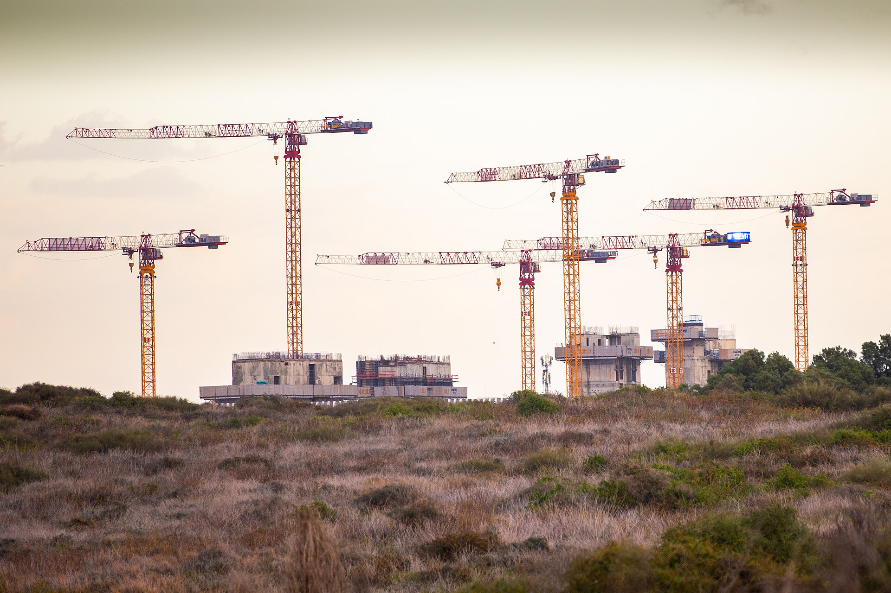

ענף הבנייה הישראלי מתמודד עם אחד המשברים החמורים בתולדותיו: **מחסור בפועלי בניין** שהחל עם פרוץ המלחמה באוקטובר 2023 ולא נפתר עד היום. סגירת השוק בפני עשרות אלפי עובדים פלסטינים, לצד גיוס מילואים נרחב, יצרו חוסר חמור בכוח אדם שמתורגם ישירות להתארכות לוחות זמנים, לעלייה בעלויות ולפגיעה בהיצע הדירות החדשות בישראל.

## מה גרם למחסור בפועלי בניין?

עד ערב המלחמה נשען ענף הבנייה במידה רבה על עובדים פלסטינים מהגדה המערבית ומרצועת עזה, שהיוו נתח מהותי מכוח האדם באתרי הבנייה. עם פרוץ הלחימה נשללו אישורי הכניסה, ובבת אחת נעלמו עשרות אלפי עובדים מנוסים. במקביל, גיוס המילואים ההיסטורי שאב עובדים ישראלים נוספים מהשוק.

התוצאה הייתה מיידית: אתרי בנייה רבים נעצרו כליל או האטו את הקצב באופן דרמטי. ענף שכבר סבל מפערי פריון בהשוואה למדינות מפותחות מצא את עצמו מול משבר כוח אדם עמוק.

## איך זה משפיע על התחלות הבנייה ועל לוחות הזמנים?

המחסור בפועלי בניין פגע בשתי חזיתות. ראשית, **התחלות הבנייה** — מספר הדירות שבנייתן החלה — ירדו בתקופת המלחמה, מה שמבטיח מחסור בהיצע דירות חדשות בשנים הקרובות. שנית, **קצב הסיום** של פרויקטים קיימים התארך, כך שרוכשים רבים ממתינים חודשים ארוכים מעבר למועד המקורי לקבלת המפתח.

עבור קבלנים, כל חודש עיכוב מתורגם לעלויות מימון נוספות, לקנסות פיגורים ולשחיקה ברווחיות. חלק מהחברות הקטנות נקלעו למצוקת תזרים, בעוד החברות הגדולות והמבוססות מצליחות לספוג את הזעזוע טוב יותר.

## הפתרון: עובדים זרים ממדינות אסיה

המענה המרכזי של הממשלה הוא הגדלה חדה במכסות העובדים הזרים. במסגרת הסכמים בין-לאומיים החלה ישראל לגייס עשרות אלפי עובדים ממדינות כמו **הודו, סרי לנקה ומולדובה**, כתחליף לעובדים הפלסטינים.

עם זאת, המהלך אינו חף מקשיים. גיוס והכשרת עובדים חדשים אורכים זמן, רמת המיומנות המקצועית משתנה, ועלות ההעסקה של עובד זר גבוהה יותר בשל הוצאות טיסה, לינה ותיווך. הפער בפריון בין עובד מנוסה לעובד חדש מורגש היטב באתרים.

## השוואה: מצב ענף הבנייה לפני המלחמה ואחריה

| פרמטר | לפני אוקטובר 2023 | המצב הנוכחי |
|---|---|---|
| מקור עיקרי לכוח אדם | עובדים פלסטינים וישראלים | עובדים זרים מאסיה וישראלים |
| זמינות פועלים | יחסית גבוהה | מחסור חריף |
| לוחות זמנים לפרויקט | סטנדרטיים | התארכות של חודשים |
| עלות כוח אדם | יציבה | במגמת עלייה |
| התחלות בנייה | גבוהות | ירידה מורגשת |

## מה המשמעות לרוכשי הדירות?

החוליה החלשה בשרשרת היא בסופו של דבר **רוכש הדירה**. עלויות כוח האדם הגבוהות מגולגלות בחלקן אל מחירי הדירות החדשות, בעוד המחסור הצפוי בהיצע בשנים הקרובות מפעיל לחץ נוסף כלפי מעלה. גם מי שכבר רכש דירה על הנייר עלול לגלות שמועד האכלוס נדחה שוב ושוב.

מנגד, ריבוי הדירות הגמורות שטרם נמכרו אצל חלק מהקבלנים ממתן חלקית את הלחץ בטווח הקצר. השאלה המרכזית היא מה יקרה כאשר המלאי הקיים ייגמר — ומאחוריו יעמוד צינור פרויקטים דליל בשל התחלות הבנייה שנפגעו.

## מבט קדימה

התאוששות ענף הבנייה תלויה בשלושה גורמים: קצב הכנסת העובדים הזרים והכשרתם, מגמת הריבית של בנק ישראל שמשפיעה על עלויות המימון של הקבלנים, ורמת הביקושים בשוק הדיור. ככל שהמחסור בפועלי בניין יימשך, כך יתעצם הפער בין הביקוש להיצע — פער שעלול ללוות את שוק הנדל"ן הישראלי שנים קדימה.
