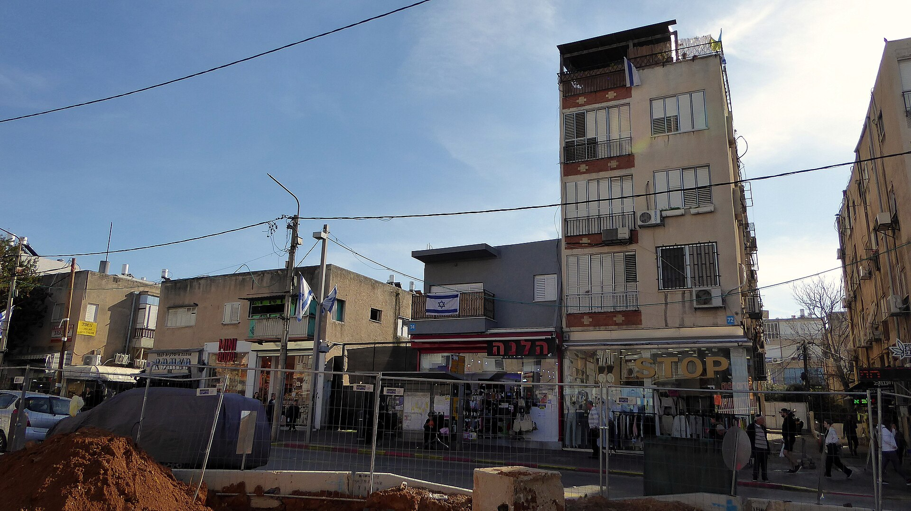

מבצעי המימון של הקבלנים, ובראשם מודל ה-20-80, הפכו בשנתיים האחרונות לכלי המכירה המרכזי בשוק הנדל"ן הישראלי — ובנק ישראל החליט שהגיע הזמן להדק את הפיקוח. בעידן של ריבית גבוהה ומלאי דירות לא מכורות בשיא, הקבלנים מציעים לרוכשים לשלם חלק זעום מהתמורה במעמד החתימה ואת עיקר הסכום רק במסירת המפתח. המהלך מזרים אוויר לשוק המכירות, אך יוצר סיכונים חדשים שהרגולטור מבקש לרסן.

## מה זה בעצם מבצע 20-80?

במודל הקלאסי, הרוכש משלם כ-20% ממחיר הדירה במעמד חתימת החוזה, ואת יתרת ה-80% רק בעת קבלת הדירה — לעיתים שנתיים-שלוש קדימה. בפועל צצו גם וריאציות אגרסיביות יותר, כמו 10-90 ואפילו 5-95. היתרון לרוכש ברור: הוא נמנע מתשלומי משכנתא כבדים בתקופת הבנייה, ובמקרים רבים גם ממשיך להתגורר בשכירות מבלי לשאת בכפל תשלומים.

הקבלן, מצידו, מגשר על הפער התזרימי באמצעות אשראי בנקאי — ומכאן נובע לב העניין שמטריד את בנק ישראל.

### למה הקבלנים מציעים את זה דווקא עכשיו?

התשובה נעוצה בשילוב של ריבית גבוהה ומלאי דירות שלא נמכרו שהגיע לרמות שיא. כאשר עלות המשכנתה מרתיעה רוכשים פוטנציאליים, מבצעי המימון הם דרך לעקוף את המחסום הפסיכולוגי והתזרימי. במקום להוריד מחירים באופן גלוי — מהלך שפוגע בשווי הפרויקט כולו ובביטחונות מול הבנקים — הקבלן "מוכר" לרוכש דחיית תשלומים.

## הצד האפל: איך זה מנפח את המחיר?

המימון אינו מגיע בחינם. עלות דחיית התשלום מגולמת פעמים רבות במחיר המחירון, כך שהרוכש משלם בפועל פרמיה על ה"הטבה". במילים אחרות, מחיר הדירה במבצע 20-80 עשוי להיות גבוה ממחירה בעסקה רגילה בתשלום מלא. בכך נוצר עיוות: מחירי העסקאות המדווחים נותרים גבוהים גם כשהביקוש האמיתי נחלש.

סיכון נוסף אורב במסירה. הרוכש שהתחייב לשלם 80% בעוד שלוש שנים תלוי ביכולתו לקבל משכנתה באותו מועד — בתנאי ריבית ובמחירי דירות שאינם ידועים מראש. אם מצבו הכלכלי ישתנה או שהבנק יסרב, הוא עלול להיקלע למלכוד.

## למה בנק ישראל מתערב?

הפיקוח על הבנקים בבנק ישראל רואה בהתרחבות המבצעים סיכון מערכתי. ככל שהקבלנים נשענים יותר על אשראי בנקאי כדי לממן את הפער התזרימי, כך גדלה החשיפה של המערכת הבנקאית לענף הנדל"ן. הרגולטור פרסם הנחיות שמגבילות את היקף המימון שהקבלן יכול לקבל בגין עסקאות מסוג זה, ומחייבות שקיפות רבה יותר כלפי הרוכשים לגבי המחיר ה"אמיתי" של הדירה.

המטרה: לצנן את השימוש בכלי מבלי לחסום אותו לחלוטין, ולמנוע מצב שבו זעזוע בשוק הדיור יגלגל הפסדים אל תוך המערכת הבנקאית.

## השוואה: עסקה רגילה מול מבצע 20-80

| פרמטר | עסקה רגילה | מבצע 20-80 |
|---|---|---|
| תשלום ראשוני | כ-25%-30% | כ-20% |
| תשלומים בזמן הבנייה | לפי קצב התקדמות | מינימליים |
| עיקר התשלום | מפוזר | במסירת המפתח |
| מחיר הדירה | מחיר בסיס | לרוב גבוה יותר |
| סיכון עיקרי לרוכש | תזרים שוטף | קבלת משכנתה במסירה |

## מה זה אומר לרוכש הדירה?

למי ששוקל דירה במבצע מימון, כדאי לבחון כמה שאלות מהותיות. ראשית, מהו מחיר הדירה בעסקה רגילה לעומת המבצע — הפער הוא העלות האמיתית של ההטבה. שנית, מה תהיה יכולת ההחזר במועד המסירה, בהנחה שהריבית תישאר גבוהה. ושלישית, האם קיים "ביטחון" בדמות ליווי בנקאי מלא לפרויקט, המגן על כספי הרוכש.

עבור משקיעים, המשוואה מורכבת אף יותר: דחיית התשלום מקטינה את ההון הראשוני הנדרש, אך הפרמיה במחיר שוחקת את התשואה הפוטנציאלית.

## לאן הולך השוק מכאן?

כל עוד הריבית נותרת גבוהה והמלאי הלא מכור תופח, הקבלנים ימשיכו לחפש כלים יצירתיים לדחיפת מכירות. הידוק הפיקוח של בנק ישראל צפוי למתן את אגרסיביות המבצעים, אך לא לבטלם. בשורה התחתונה, מבצעי המימון של הקבלנים ימשיכו להיות חלק מנוף השוק — ועל הרוכשים מוטלת האחריות להבין מה בדיוק הם קונים, ובכמה.
