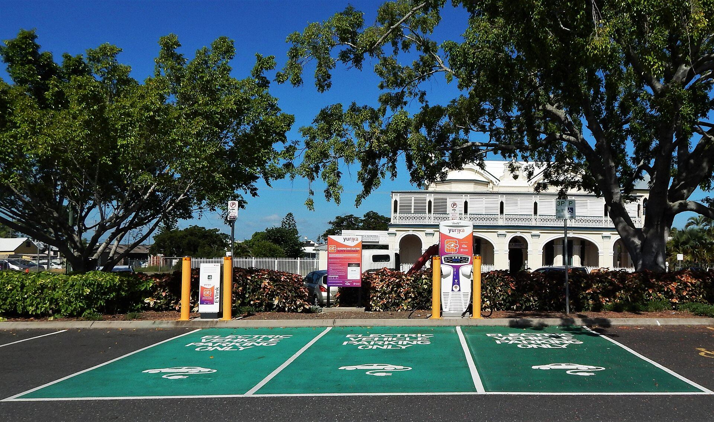

שוק הרכב הישראלי עובר בשנים האחרונות מהפכה שקטה אך מהירה: **הרכב החשמלי** חדל להיות מוצר נישה יוקרתי והפך לאפיק צריכה מרכזי עבור משק בית ישראלי ממוצע. מי שמוביל את המגמה אינם היצרנים המסורתיים מאירופה, אלא שורה של מותגים סיניים — ובראשם בי.וואי.די, אם.ג'י וגיאומטרי — שמציפים את הכביש הישראלי בדגמים במחירים אגרסיביים ובמפרט טכנולוגי עשיר. התוצאה: הצרכן הישראלי מקבל יותר תמורה לשקל, אך גם ניצב בפני שאלות חדשות שלא הכיר בעולם הבנזין.

## מדוע הרכב החשמלי הפך ללהיט צרכני?

העניין הגובר ברכב חשמלי נשען על שילוב של כמה כוחות. ראשית, מחיר: המותגים הסיניים נכנסו לשוק עם תגי מחיר שמתחרים ישירות ברכבי בנזין קומפקטיים, לעיתים אף מתחת להם. שנית, עלות תפעול נמוכה — טעינה ביתית זולה בהרבה מתדלוק, ותחזוקה שוטפת מצומצמת יותר בהיעדר מנוע בעירה מורכב. שלישית, מודעות סביבתית גוברת ורצון של צרכנים צעירים להזדהות עם טכנולוגיה חדשה.

עם זאת, בשונה מהשנים שבהן הרכב החשמלי נהנה מפטור כמעט מלא ממס, מדינת ישראל מעלה בהדרגה את **מס הקנייה** על כלי רכב חשמליים. המשמעות הצרכנית ברורה: פער המחיר מול רכב בנזין הולך ומצטמצם, והחלטת הרכישה כבר אינה מובנת מאליה כלכלית.

## מי מובילים את השוק?

הנוכחות הסינית בשוק המקומי מרשימה. בי.וואי.די, שהפכה בעולם ליצרנית הרכב החשמלי הגדולה, מתמודדת ישירות מול טסלה על כותרת המכירות בישראל. לצידה פועלים מותגים כמו אם.ג'י (שבבעלות סינית), גיאומטרי וצ'רי. במקביל, היצרניות המסורתיות — יונדאי, קיה, פולקסווגן וטויוטה — מנסות להחזיק את נתח השוק שלהן באמצעות דגמים חשמליים והיברידיים.

חשוב לזכור: **טסלה** נותרה מותג דגל מבחינת מיתוג ותשתית הטעינה המהירה שלה, אך פערי המחיר מול המתחרים הסיניים דוחקים חלק מהצרכנים לכיוון האלטרנטיבות הזולות יותר.

## השוואה: רכב חשמלי מול רכב בנזין

לפני ההחלטה, כדאי להעמיד את שני העולמות זה מול זה. הטבלה הבאה מציגה השוואה עקרונית (הנתונים ממחישים מגמות ואינם מחיר ספציפי של דגם):

| פרמטר | רכב חשמלי | רכב בנזין |
|---|---|---|
| עלות רכישה | תחרותית, בעיקר במותגים הסיניים | טווח רחב, לרוב זולה בכניסה |
| עלות "דלק" ל-100 ק"מ | נמוכה בטעינה ביתית | גבוהה יחסית |
| תחזוקה שוטפת | מצומצמת | תדירה יותר |
| ערך מכירה חוזרת | לא ודאי, תלוי מותג | יציב ומוכר |
| מס קנייה | עולה בהדרגה | קבוע וגבוה |
| נוחות תדלוק/טעינה | תלוי בתשתית | זמין בכל תחנה |

## מהן עלויות הטעינה האמיתיות?

אחת הטעויות הצרכניות הנפוצות היא להתבסס רק על עלות הטעינה הביתית. **טעינה ביתית** אכן זולה משמעותית ויכולה לחסוך מאות שקלים בחודש לעומת תדלוק. אולם מי שאינו יכול להתקין עמדת טעינה בבית — למשל דיירי בניינים משותפים ללא חניה פרטית — נאלץ להסתמך על עמדות טעינה מהירות ציבוריות, שמחירן גבוה בהרבה ומקטין את החיסכון.

לכן, לפני רכישה, מומלץ לחשב את "תמהיל הטעינה" הצפוי: כמה מהטעינה תתבצע בבית וכמה בעמדות ציבוריות. זהו משתנה מכריע בכדאיות הכלכלית.

## מה הסיכונים לצרכן?

לצד היתרונות, קיימות שלוש נקודות זהירות מרכזיות:

- **ערך מכירה חוזרת:** מותגים חדשים שטרם ביססו מוניטין בישראל עלולים לאבד ערך מהר יותר. ריבוי הדגמים החדשים בשוק עלול ללחוץ את מחירי היד השנייה.
- **שירות וחלפים:** יבואן חזק עם רשת מוסכים רחבה הוא נכס. מותג צעיר עלול להתקשות לספק שירות מהיר וחלקים במחיר סביר.
- **טכנולוגיה מתיישנת:** קצב ההתקדמות בסוללות מהיר, ורכב שנרכש היום עשוי להיראות מיושן בתוך שנים ספורות מבחינת טווח נסיעה.

## שורה תחתונה לצרכן הישראלי

הרכב החשמלי אינו עוד גימיק — הוא כאן כדי להישאר, והתחרות הסינית העזה פועלת לטובת הכיס של הצרכן. עם זאת, ההחלטה כבר אינה אוטומטית: העלייה במס הקנייה, שאלת תשתית הטעינה וסימני השאלה סביב ערך המכירה החוזרת מחייבים חישוב זהיר. מי שמתגורר בבית עם עמדת טעינה ונוסע הרבה קילומטרים בחודש — ייהנה מהחיסכון המשמעותי ביותר. מי שתלוי בתשתית ציבורית או מחפש ביטחון בערך הרכב לאורך זמן — כדאי שיבחן היטב את התמונה המלאה לפני שהוא חותם.
