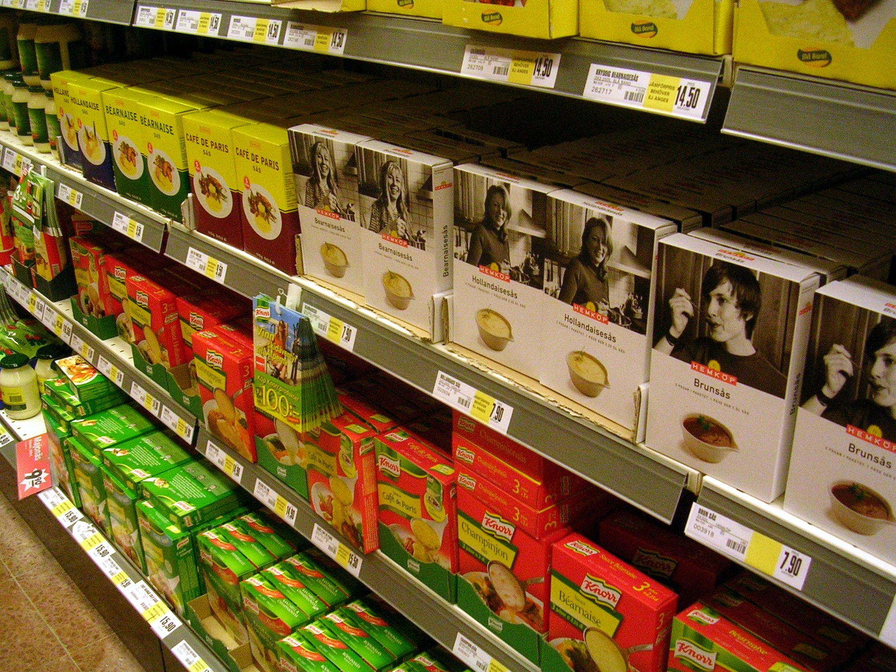

סל הקניות של משפחה ישראלית שוב מתייקר. בחודשים האחרונים הודיעו כמה מיצרניות המזון הגדולות במשק על סבב התייקרויות רוחבי, שמחזיר את סוגיית **מחירי המזון בישראל** לכותרות ולשולחן הדיונים הממשלתי. התשובה הקצרה לשאלה מדוע זה קורה: שילוב של עלויות תשומה גבוהות, פיחות בשקל בתקופות מסוימות, יוקר אנרגיה והובלה, ומבנה שוק ריכוזי שמקשה על תחרות אמיתית.

## מה מניע את גל ההתייקרויות?

יצרניות המזון מסבירות את ההעלאות בעלייה מתמשכת בעלויות חומרי הגלם בעולם, בייקור האנרגיה וההובלה, ובעלויות שכר וכוח אדם. חלק מהחברות מצביעות גם על תנודתיות בשער החליפין של השקל מול הדולר והאירו, שמייקרת יבוא של רכיבים ואריזות.

מנגד, ארגוני הצרכנים והרשתות טוענים כי חלק מההעלאות אינו מוצדק וכי הוא נועד לשמר שולי רווח גבוהים. הריכוזיות בשוק המזון הישראלי — שבו מספר קטן של יצרניות שולט בקטגוריות מרכזיות כמו מוצרי חלב, חטיפים, קפה ושימורים — מעניקה ליצרניות כוח תמחור משמעותי.

### תגובת הרשתות הגדולות

רשתות השיווק המובילות, ובהן שופרסל, רמי לוי וויקטורי, לא נותרות אדישות. בכמה מקרים בשנה החולפת הודיעו רשתות בפומבי כי יסרבו לקלוט התייקרויות, ואף איימו להוריד מוצרים מהמדף עד לחזרה למחיר המקורי. המהלכים הללו הפכו לכלי לחץ ציבורי, אך גם משקפים מאבק כוח מתמשך בין החוליות בשרשרת האספקה.

## איך זה משפיע על מדד המחירים לצרכן?

סעיף המזון הוא מרכיב כבד־משקל במדד המחירים לצרכן שמפרסמת הלשכה המרכזית לסטטיסטיקה. התייקרות רוחבית במזון תורמת ישירות לאינפלציה, ומשם הדרך קצרה להשפעה על מדיניות הריבית של בנק ישראל. כל עוד סעיף המזון והדיור ממשיכים ללחוץ את המדד כלפי מעלה, קטן הסיכוי להורדות ריבית מהירות.

במילים אחרות, ההתייקרות במדפים אינה רק כאב ראש צרכני — היא נתון מאקרו־כלכלי שמשפיע על כיס המשכנתה של מיליוני ישראלים.

## כיצד הצרכנים מגיבים?

הצרכן הישראלי למד להתגונן. שלוש מגמות בולטות:

- **מעבר למותג הפרטי** — מוצרי הרשתות עצמן, שמחירם נמוך לרוב בעשרות אחוזים ממוצרי המותג המוביל.
- **קניות מושכלות ואונליין** — השוואת מחירים דיגיטלית וניצול מבצעים.
- **יבוא מקביל וחלופות** — מוצרים מיובאים שמגדילים את התחרות מול היצרן המקומי.

## השוואת אפיקי חיסכון בסל הקניות

הטבלה הבאה ממחישה את פערי המחיר האופייניים בין החלופות העומדות בפני הצרכן (הערכות כלליות, משתנות בין רשתות וקטגוריות):

| חלופה | פער מחיר אופייני מול המותג המוביל | זמינות |
|---|---|---|
| מותג מוביל (יצרן מקומי) | מחיר בסיס | גבוהה מאוד |
| מותג פרטי של הרשת | זול בכ-20%-40% | גבוהה |
| מוצר מיובא / יבוא מקביל | זול בכ-10%-30% | בינונית |
| קנייה במבצע / כמות | חיסכון משתנה | תלוי־עיתוי |

## מה צפוי בהמשך?

הממשלה ומשרד הכלכלה ממשיכים לקדם צעדים להגברת התחרות, ובהם הקלות ביבוא, רפורמות בתקינה והורדת חסמים רגולטוריים. עם זאת, ההשפעה של צעדים אלה על המחירים בפועל היא הדרגתית. כל עוד מבנה השוק נותר ריכוזי ועלויות התשומה גבוהות, סביר שהלחץ על מחירי המזון יימשך.

עבור הצרכן הישראלי, המסקנה המעשית ברורה: הכוח לחסוך נמצא בידיים — בבחירה מושכלת בין מותג פרטי, יבוא ומבצעים, ובלחץ הצרכני שמאלץ את הרשתות והיצרניות להתחשב במחיר.
