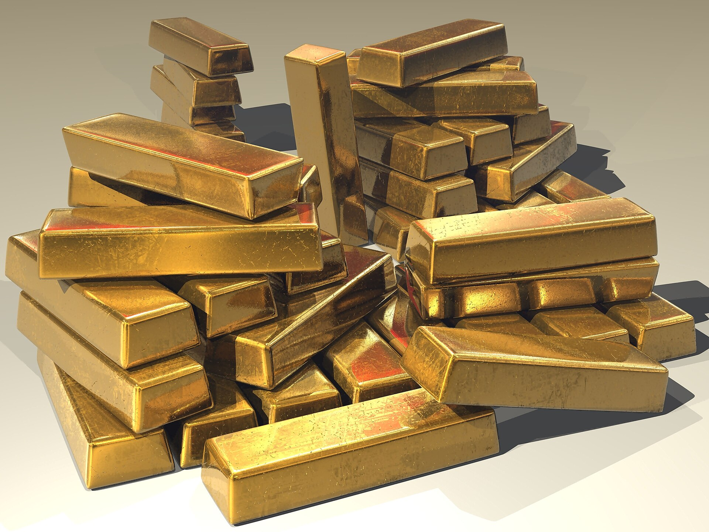

מחיר הזהב שבר בשנה החולפת שיאים היסטוריים וטיפס לרמות של סביב 4,000 דולר לאונקיה, מהלך שהפך את המתכת הצהובה לאחד הנכסים המבוקשים ביותר בעולם. מחיר הזהב, שנחשב מזה דורות לנכס מקלט קלאסי, נהנה משילוב נדיר של אי-ודאות גאופוליטית, רכישות מסיביות של בנקים מרכזיים וציפיות להורדות ריבית בארצות הברית. עבור המשקיע הישראלי, השאלה המרכזית היא האם מדובר בבועה חולפת או במגמה מבנית ארוכת טווח.

## מה מניע את הראלי בזהב?

הזינוק במחיר הזהב אינו נובע מגורם בודד אלא ממפגש של כמה כוחות בו-זמנית. ראשית, הבנקים המרכזיים ברחבי העולם — ובראשם אלה של סין, הודו וטורקיה — הגדילו באופן דרמטי את רכישות הזהב שלהם כחלק ממגמה של גיוון עתודות והפחתת התלות בדולר האמריקאי. מגמה זו, המכונה לעיתים "דה-דולריזציה", מספקת רצפת ביקוש יציבה למחיר.

שנית, אי-הוודאות הגאופוליטית — ממלחמות ועד מתחים מסחריים בין המעצמות — מזרימה כספים אל עבר נכסים בטוחים. באופן היסטורי, בכל פעם שהמשקיעים חוששים מזעזועים, הזהב נהנה מביקוש מוגבר. שלישית, הציפייה שהבנק הפדרלי בארצות הברית ימשיך בהורדות ריבית מפחיתה את האטרקטיביות של אפיקים סולידיים נושאי ריבית, ומטה את הכף לטובת הזהב.

### למה זהב נחשב "נכס מקלט"?

זהב אינו נושא ריבית ואינו מחלק דיבידנד — יתרונו טמון דווקא בכך שהוא אינו תלוי בביצועי חברה או ממשלה מסוימת. בתקופות של אינפלציה גבוהה, פיחות מטבעות או משברים פיננסיים, הזהב נתפס כשומר ערך. זו הסיבה שמשקיעים רבים רואים בו "ביטוח" לתיק ההשקעות, גם אם התשואה השוטפת ממנו אפסית.

## איך המשקיע הישראלי יכול להיחשף לזהב?

בניגוד לעבר, כיום אין צורך לרכוש מטילי זהב פיזיים כדי להיחשף למתכת. הבורסה בתל אביב והשווקים בחו"ל מציעים מגוון מוצרים פיננסיים העוקבים אחר מחיר הזהב. להלן השוואה בין הדרכים העיקריות:

| אפיק השקעה | יתרונות | חסרונות |
|---|---|---|
| קרנות סל עוקבות זהב | נזילות גבוהה, עמלות נמוכות, מסחר פשוט | חשיפה לשער הדולר-שקל |
| מטבעות ומטילים פיזיים | בעלות מוחשית, ללא סיכון צד נגדי | עלויות אחסון, פערי קנייה-מכירה |
| מניות חברות כרייה | מינוף על מחיר הזהב, פוטנציאל דיבידנד | תנודתיות גבוהה, סיכון תפעולי |
| חוזים עתידיים | מינוף גבוה, גמישות | מורכבות ומסוכן למשקיע הפרטי |

האפיק הפופולרי ביותר בקרב הציבור הרחב הוא קרנות הסל העוקבות, המאפשרות חשיפה למחיר הזהב בעלות נמוכה ובנזילות מלאה. עם זאת, חשוב לזכור שמכיוון שהזהב נסחר בדולרים, תנודות בשער הדולר-שקל משפיעות ישירות על התשואה השקלית — ייסוף השקל עלול לקזז חלק מהרווח.

## האם מאוחר מדי להצטרף?

זו שאלת מיליון הדולר. מצד אחד, ראלי שהניב עשרות אחוזים בתוך תקופה קצרה מעורר חשש טבעי מתיקון חד. מחירי שיא נוטים למשוך משקיעים בדיוק ברגע הלא נכון — פסיכולוגיית העדר עלולה לגרום לכניסה בשיא. מצד שני, הכוחות המבניים התומכים בזהב — רכישות הבנקים המרכזיים ומגמת הפחתת התלות בדולר — אינם צפויים להיעלם בקרוב.

מרבית המומחים ממליצים על גישה מאוזנת: הקצאת נתח מוגבל מהתיק לזהב, בדרך כלל בטווח של כמה אחוזים בודדים, כרכיב פיזור ולא כהימור מרכזי. ריכוז יתר במתכת בודדת, ותנודתית, עלול להזיק דווקא. הזהב אינו תחליף לתיק מנייתי מגוון או לחיסכון פנסיוני מסודר — אלא השלמה לו.

## מה הלאה?

המשך המגמה תלוי במידה רבה במדיניות הריבית של הבנק הפדרלי, בהתפתחויות הגאופוליטיות ובקצב רכישות הבנקים המרכזיים. אם הריבית בארצות הברית תמשיך לרדת והמתחים הגלובליים יימשכו, ייתכן שהזהב ישמור על מומנטום. אך היסטורית, הזהב ידע גם תקופות ארוכות של דשדוש ואף ירידות חדות — ולכן משקיע נבון צריך להיכנס בעיניים פקוחות ובאופק ארוך טווח.
