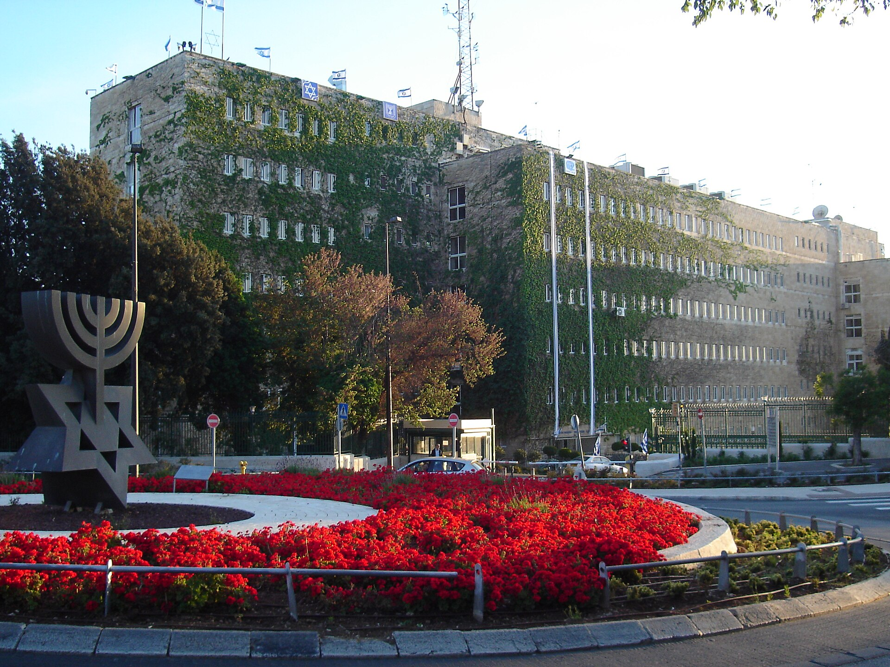

## מה קורה עם הגירעון התקציבי בישראל?

**הגירעון התקציבי** של ישראל, שזינק לרמות חריגות בשיא המלחמה, מצוי כעת במגמת צמצום ברורה — מהלך שמפתיע גם את חלק מהכלכלנים בקצב שלו. אחרי חודשים שבהם ההוצאות הביטחוניות והאזרחיות תפחו והכניסו את הקופה הציבורית ללחץ, שילוב של התאוששות בגביית המסים, האטה בהוצאות החירום ושיפור בפעילות הכלכלית מחזיר את המשק בהדרגה לעבר איזון פיסקלי. במשרד האוצר ובבנק ישראל רואים בכך סימן חשוב להתייצבות.

הגירעון נמדד כיחס בין ההוצאות שחורגות מההכנסות לבין התוצר המקומי הגולמי. בשיא, היחס נגע ברמות דו-ספרתיות בקירוב בחלק מהחודשים המצטברים, אך במהלך השנה האחרונה הוא ירד בהדרגה לכיוון יעד ממשלתי של סביב 4% תוצר.

## מה מניע את צמצום הגירעון?

כמה כוחות פועלים במקביל ומסבירים את השיפור:

- **התאוששות בהכנסות ממסים** — גביית מס הכנסה, מס ערך מוסף ומסים על שוק ההון עלתה על רקע שיפור בפעילות הכלכלית וראלי בבורסה בתל אביב.
- **ירידה בהוצאות החירום** — עם הפחתת עצימות הלחימה, ההוצאה הביטחונית והאזרחית החד-פעמית מתמתנת בהשוואה לשיא.
- **העלאות מסים ומהלכי התייעלות** — צעדי האוצר, ובהם העלאת מע"מ והקפאת עדכונים בסעיפים שונים, הגדילו את ההכנסות.
- **צמיחה חוזרת** — חזרה הדרגתית של המשק לפעילות מלאה מגדילה את בסיס המס.

### ההשפעה על שוק ההון ודירוג האשראי

צמצום הגירעון הוא בשורה מרכזית עבור **דירוג האשראי של ישראל**. חברות הדירוג הבינלאומיות הורידו את הדירוג ואת התחזית בתקופת המלחמה, ומגמת התכנסות פיסקלית ברורה היא תנאי חשוב לייצוב הדירוג ולשיפור התחזית. משקיעים זרים ומקומיים בוחנים את יחס החוב-תוצר של ישראל, ומסלול יורד של הגירעון מרגיע את החששות ותומך בירידת פרמיית הסיכון על אגרות החוב הממשלתיות.

## טבלה: שלבי הגירעון התקציבי — מגמה כללית

| תקופה | מגמת הגירעון (יחס לתוצר) | הגורם המרכזי |
|---|---|---|
| לפני המלחמה | נמוך יחסית, סביב יעד מאוזן | פעילות כלכלית יציבה |
| שיא המלחמה | זינוק חד לרמות גבוהות | הוצאות ביטחון ואזרח חד-פעמיות |
| השנה האחרונה | מגמת צמצום הדרגתית | התאוששות מסים והאטת הוצאות |
| יעד לטווח הקרוב | סביב 4% תוצר | משמעת פיסקלית וצמיחה |

*הנתונים מוצגים כמגמות כלליות ולא כערכים מדויקים.*

## איך זה משפיע על הריבית ועל הכיס של האזרח?

הקשר בין הגירעון לריבית עקיף אך משמעותי. גירעון מתכווץ ואמינות פיסקלית מחזקים את השקל ומרסנים את לחצי האינפלציה מצד עלות גיוס החוב. עבור **בנק ישראל**, תמונה פיסקלית משתפרת מפחיתה את החשש שהמדיניות התקציבית תלבה את האינפלציה, ובכך מרחיבה את מרחב התמרון להמשך הורדות ריבית בהמשך השנה — מהלך שיקל בהדרגה על נוטלי המשכנתאות והאשראי.

מנגד, חשוב לזכור שחלק מהשיפור נשען על **העלאות מסים** שכבר נגעו בכיס: העלאת מע"מ, מדרגות מס ותשלומים נוספים. במילים אחרות, איזון הקופה מושג בין היתר על גב הצרכן, ולא רק בזכות צמיחה.

### מה הסיכונים קדימה?

התמונה אינה חפה מסיכונים. הסלמה ביטחונית מחודשת עלולה להחזיר את ההוצאות למעלה במהירות. בנוסף, התלות בהכנסות ממסים תלויות-שוק — כמו מסים על ניירות ערך ועל הנדל"ן — הופכת את קצב הגבייה לתנודתי. גם הוצאות מבניות קשיחות, כמו קצבאות ותקציבים קואליציוניים, מקשות על צמצום מהיר של ההוצאה.

## שורה תחתונה

המסלול היורד של **הגירעון התקציבי** הוא אחת הבשורות הכלכליות החיוביות של השנה האחרונה: הוא מחזק את אמון המשקיעים, תומך בשקל ובדירוג האשראי, ומרחיב את מרחב התמרון של בנק ישראל. עם זאת, השמירה על המגמה תלויה ביציבות ביטחונית, בהמשך הצמיחה וביכולת הממשלה לרסן הוצאות מבלי להישען יתר על המידה על העלאות מסים נוספות.
