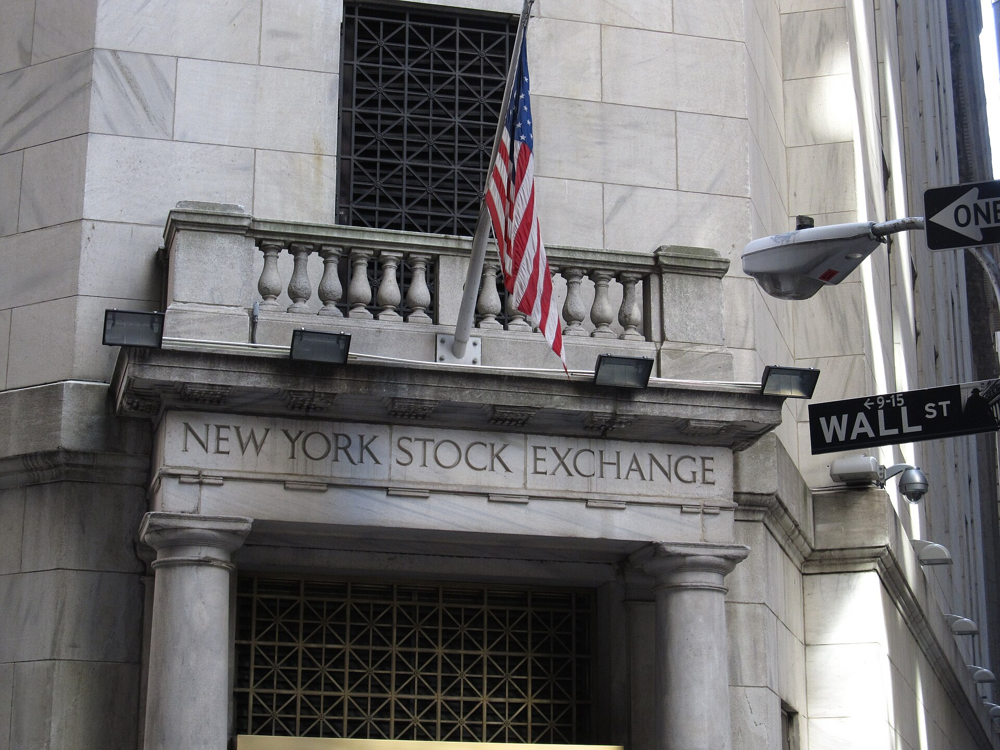

שוק ההנפקות הישראלי, שספג מכה קשה בשנים האחרונות, מתחיל להראות סימני חיים. אחרי כמעט שנתיים שבהן מספר ההנפקות הראשוניות (IPO) של חברות ישראליות בוול סטריט התכווץ כמעט לאפס, שילוב של ראלי במדדי המניות בארה"ב, ציפייה להורדות ריבית והצטברות של חברות טכנולוגיה בוגרות שממתינות ל"חלון" — מחזיר את הדיון על חזרת ההייטק הישראלי לבורסות הגדולות.

## למה שוק ההנפקות קרס מלכתחילה?

הגאות של 2020–2021 הביאה לגל חסר תקדים של הנפקות ישראליות בנאסד"ק ובניו יורק, לצד עסקאות מיזוג עם חברות SPAC. אלא שהמפנה במדיניות המוניטרית שינה את התמונה מן הקצה אל הקצה. כשהעלה הבנק המרכזי בארה"ב (הפדרל ריזרv) את הריבית בקצב מהיר, המשקיעים נטשו מניות צמיחה מסוכנות לטובת אפיקים סולידיים שהניבו תשואה נאה כמעט ללא סיכון.

התוצאה: שווי החברות (ולואציות) התרסק, חברות רבות שהונפקו בשיא איבדו עשרות אחוזים מערכן, ומייסדים ומשקיעים העדיפו לדחות הנפקות ולהמתין לימים טובים יותר. **שוק ההנפקות פשוט קפא**.

## מה מחזיר את המשקיעים עכשיו?

כמה כוחות פועלים בו-זמנית להפשרת הקרח:

- **ראלי במדדים המובילים:** נאסד"ק ומדד אס אנד פי 500 רשמו שיאים, מה שמחזיר תחושת ביטחון ותיאבון סיכון.
- **מפנה בריבית:** הציפייה שהפדרל ריזרv ימשיך במסלול של הורדות ריבית מוזילה את עלות ההון ומעלה את האטרקטיביות של מניות צמיחה.
- **גל הבינה המלאכותית:** ההתלהבות סביב חברות כמו אנבידיה משכה כסף רב אל מגזר הטכנולוגיה כולו.
- **לחץ מצטבר:** קרנות הון סיכון זקוקות ל"אקזיטים" כדי להחזיר כסף למשקיעים שלהן, מה שיוצר תמריץ להנפיק.

## מי הבאות בתור?

בשוק הישראלי מדובר בעיקר בחברות בוגרות בתחומי הסייבר, הפינטק והתוכנה הארגונית, שצברו הכנסות משמעותיות והגיעו לרווחיות או קרוב לכך. חברות כאלה נמצאות בעמדה טובה בהרבה מסטארט-אפים צעירים שנשענים על סיפור צמיחה בלבד — המשקיעים של היום דורשים מודל עסקי ברור ונתיב ברור לרווח.

במקביל, הבורסה בתל אביב מנסה לנצל את המומנטום. מדד ת"א 35 נסחר סביב שיאים, והבורסה משווקת את עצמה כזירת הנפקה חלופית לחברות בינוניות שאינן בשלות לוול סטריט או שמעדיפות שוק מקומי מוכר.

## נאסד"ק מול תל אביב: איפה כדאי להנפיק?

לכל זירה יתרונות וחסרונות שונים עבור חברות ישראליות. הטבלה הבאה ממחישה את השיקולים המרכזיים:

| פרמטר | נאסד"ק / ניו יורק | הבורסה בתל אביב |
|---|---|---|
| היקף גיוס אפשרי | גבוה מאוד | בינוני |
| נזילות המסחר | גבוהה | בינונית-נמוכה |
| שווי (ולואציה) | לרוב גבוה יותר לחברות טק | סביר, תלוי סקטור |
| עלויות ורגולציה | גבוהות ומורכבות | נמוכות יחסית |
| חשיפה למשקיעים גלובליים | רחבה | מוגבלת |

## מה הסיכונים?

למרות האופטימיות, כדאי לזכור שהתאוששות שוק ההנפקות שברירית. **חלון ההנפקות עלול להיסגר במהירות** אם יתחדשו החששות מאינפלציה, אם הריבית תיוותר גבוהה מהצפוי, או אם תתממש דאגה שמלווה את השוק — האם ההתלהבות סביב הבינה המלאכותית היא ראלי מוצדק או בועה שלפני תיקון חד.

גורם ייחודי לחברות ישראליות הוא גם פרמיית הסיכון הגיאופוליטית. משקיעים זרים בוחנים בקפידה את היציבות הביטחונית והכלכלית של ישראל, ודירוג האשראי של המדינה משפיע בעקיפין על התיאבון להשקיע בחברות מקומיות.

## שורה תחתונה

שוק ההנפקות הישראלי אינו חוזר לימי השיא של 2021, אבל הכיוון התהפך. אם הריבית תמשיך לרדת והמדדים בוול סטריט ישמרו על יציבות, סביר שנראה ב-2025 גל הדרגתי של הנפקות ישראליות — בעיקר של חברות טכנולוגיה איכותיות ורווחיות. עבור המשקיע הישראלי, זו הזדמנות שמצריכה בחירה סלקטיבית: לא כל הנפקה נולדה שווה.
