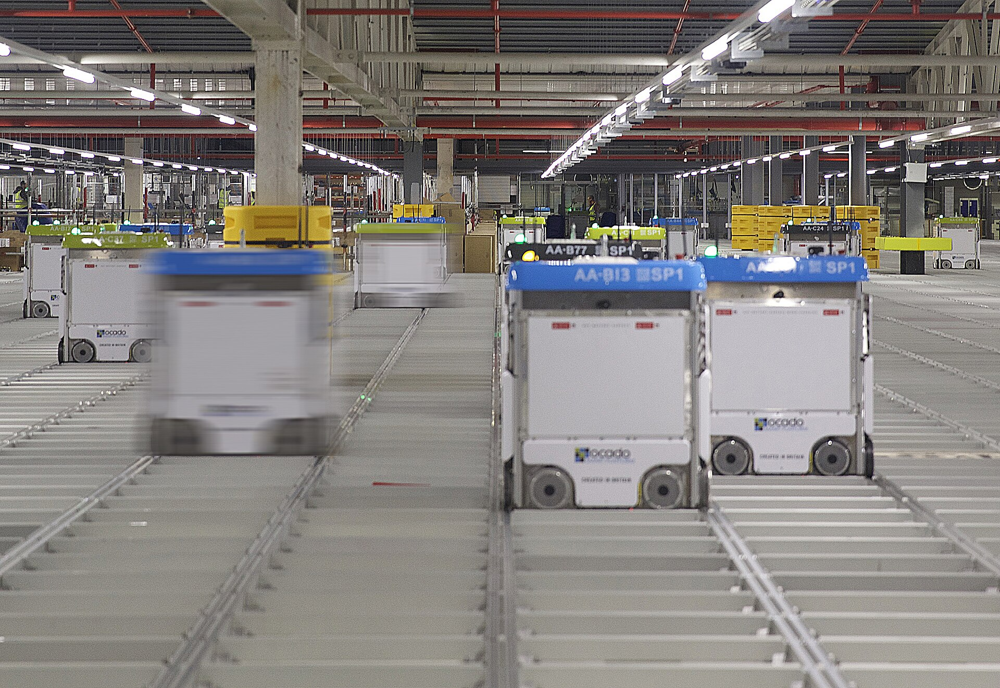

שוק הנדל"ן המניב בישראל עובר בשנים האחרונות שינוי מגמה שקט אך משמעותי: בעוד שוק המשרדים בתל אביב מתמודד עם עודף היצע ותפוסה יורדת, **הנדל"ן הלוגיסטי** — מחסנים, מרכזי הפצה ופארקים תעשייתיים — הפך לאחד האפיקים המבוקשים ביותר בקרב משקיעים פרטיים וגופים מוסדיים כאחד. המנוע המרכזי מאחורי המגמה ברור: זינוק מתמשך בהיקף המסחר המקוון והצורך הגובר של קמעונאים בשרשראות אספקה מהירות וקרובות ללקוח.

## מדוע הנדל"ן הלוגיסטי הפך לאפיק מבוקש?

המעבר ההמוני לקניות אונליין — שהואץ בתקופת הקורונה ולא נבלם מאז — יצר ביקוש עצום למרחבי אחסון ולוגיסטיקה. חברות כמו אמזון, עלי אקספרס וכן קמעונאים ישראליים ותיקים נדרשות למרכזי הפצה שמאפשרים אספקה מהירה, לעיתים באותו יום. כל הזמנה מקוונת דורשת שרשרת אחסון, מיון ומשלוח — וזו נשענת ישירות על נכסים לוגיסטיים.

התוצאה: דמי השכירות למ"ר במחסנים איכותיים באזורי הביקוש עלו בעקביות, ושיעורי התשואה על נכסים אלה נותרו אטרקטיביים ביחס לאפיקים מסורתיים. בניגוד למשרד, שדורש עיצוב יקר והתאמות תכופות, מחסן לוגיסטי הוא נכס פשוט יחסית לתחזוקה, עם חוזי שכירות ארוכים ושוכרים יציבים.

### היתרון של חוזים ארוכים ושוכרים חזקים

אחד הגורמים שמושכים משקיעים לתחום הוא טיב השוכרים. מרכזי הפצה מושכרים לרוב לחברות גדולות — רשתות שיווק, חברות שילוח, יבואנים — החותמות על חוזים לתקופות של 5 עד 10 שנים ואף יותר. יציבות זו מקטינה את סיכון הפינוי ומספקת תזרים מזומנים צפוי, בדיוק סוג הנכס שגופים מוסדיים כמו קרנות פנסיה וחברות ביטוח מחפשים.

## השוואת אפיקי נדל"ן מניב בישראל

הטבלה הבאה ממחישה את מיצובו של הנדל"ן הלוגיסטי ביחס לאפיקים המניבים המרכזיים (הנתונים מייצגים מגמות והערכות כלליות, לא נתונים מדויקים):

| אפיק נדל"ן מניב | רמת ביקוש נוכחית | שיעור תשואה יחסי | רמת סיכון |
|---|---|---|---|
| נדל"ן לוגיסטי | גבוהה ועולה | גבוה יחסית | נמוך-בינוני |
| משרדים בתל אביב | יורדת (עודף היצע) | בינוני | בינוני-גבוה |
| מרכזים מסחריים | יציבה | בינוני | בינוני |
| דיור להשכרה | גבוהה | נמוך יחסית | נמוך |

## אילו אתגרים ניצבים בפני התחום?

לצד ההזדמנות, קיימים חסמים משמעותיים. **המחסור בקרקע מתועשת** סמוך למרכזי הביקוש — גוש דן והציר המרכזי — מקשה על פיתוח פרויקטים חדשים. קרקע פנויה זמינה בעיקר בפריפריה, אך שם מרחק המשלוח פוגע ביתרון המהירות שמחפשים הקמעונאים.

גורם נוסף הוא עליית עלויות הבנייה והמימון. סביבת הריבית הגבוהה יחסית של השנים האחרונות ייקרה את מימון הפרויקטים, וגם אם בנק ישראל צפוי להתחיל בהורדות ריבית — ההשפעה על ענף הפיתוח תהיה הדרגתית. בנוסף, טכנולוגיות אוטומציה ורובוטיקה במחסנים דורשות מבנים בעלי מפרט גבוה, מה שמעלה את סף ההשקעה הראשוני.

## איך המשקיע הישראלי יכול להיחשף?

עבור המשקיע הפרטי, כניסה ישירה לתחום — רכישת מחסן או מרכז הפצה — דורשת הון עצום ומומחיות. לכן, מרבית החשיפה מתבצעת דרך אפיקים סחירים ומוסדיים:

- **קרנות ריט (קרנות נדל"ן מניב)** הנסחרות בבורסה בתל אביב, שחלקן מגדילות את משקל הנכסים הלוגיסטיים בתיק.
- **חברות נדל"ן ציבוריות** המתמחות בפיתוח פארקים לוגיסטיים ותעשייה.
- **גופים מוסדיים** — קרנות הפנסיה וחברות הביטוח — שמנתבים חלק מכספי החוסכים לנכסים אלה.

העניין הגובר בתחום משקף מגמה רחבה יותר: מעבר של הון מנכסים מניבים מסורתיים, שהתשואות בהם נשחקות, לעבר תשתיות הכלכלה הדיגיטלית. כל עוד המסחר המקוון ימשיך לצמוח, הנדל"ן שמאפשר אותו צפוי להישאר במרכז תשומת הלב של המשקיעים.

## שורה תחתונה

הנדל"ן הלוגיסטי מתמצב כאחד האפיקים המעניינים בשוק הנדל"ן המניב הישראלי — נהנה מרוח גבית מבנית של מהפכת המסחר המקוון, נתמך בשוכרים חזקים ובחוזים ארוכים, אך מוגבל בהיצע קרקע. עבור המשקיעים, האתגר יהיה למצוא נקודות כניסה במחירים שעדיין משאירים מרווח תשואה סביר.
