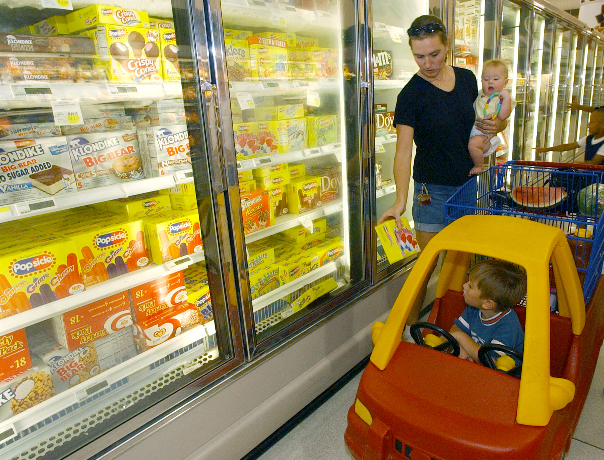

בשנה החולפת, על רקע יוקר המחיה המתמשך והלחץ על התקציב המשפחתי, ה**מותג הפרטי** הפך לאחד הכלים המרכזיים של הצרכן הישראלי לצמצום ההוצאה על מזון. מדובר במוצרים הנושאים את שמה של רשת השיווק עצמה — במקום מותג יצרן מוכר — ונמכרים במחיר נמוך משמעותית, לעיתים בפער של 20% עד 40%. התוצאה: יותר ויותר עגלות קנייה מתמלאות בפסטה, שימורים, מוצרי חלב ומוצרי ניקיון תחת המותג של הרשת.

## מה זה בעצם מותג פרטי, ולמה הוא זול יותר?

מותג פרטי הוא מוצר שרשת השיווק מזמינה מיצרן — לעיתים אותו יצרן שמייצר את המותג המוביל — וממתגת בשמה שלה. החיסכון נובע מכמה גורמים: היעדר הוצאות פרסום ושיווק כבדות, מיקוח על כמויות גדולות מול היצרן, ושרשרת אספקה קצרה יותר. הרשת שולטת בכל שלב, מהמדף ועד המחיר, ולכן יכולה למכור זול יותר ועדיין לשמור על שולי רווח נאים.

עבור הצרכן, המשמעות פשוטה: מוצר בסיסי — קמח, שמן, נייר טואלט, קורנפלקס — באיכות דומה, במחיר נמוך. עבור הרשתות, זהו מנוע רווחיות אסטרטגי שמחזק גם את הנאמנות: לקוח שהתרגל למותג הפרטי של רשת מסוימת יתקשה למצוא אותו אצל המתחרים.

## מלחמת הרשתות סביב המותג הפרטי

כל השחקניות הגדולות בשוק — שופרסל, רמי לוי, ויקטורי, יוחננוף ורשת חצי חינם — מרחיבות בשנים האחרונות את קווי המותג הפרטי שלהן, מעבר למוצרי הבסיס ואל קטגוריות פרמיום כמו קפה, חטיפים ומוצרים אורגניים. הכניסה של שחקניות בינלאומיות והלחץ הצרכני על יוקר המחיה רק מאיצים את המגמה.

העניין הזה אינו ייחודי לישראל, אך דווקא כאן נתח המותג הפרטי מסל הקניות נמוך יחסית למקובל במדינות מערב אירופה, שם הוא חוצה לא פעם את רף ה-40% מהמכירות. הפער הזה הוא בדיוק ההזדמנות שהרשתות מזהות — ומכאן ההערכה שהמגמה בישראל רק בתחילת הדרך.

## כמה באמת חוסכים? השוואה

כדי להמחיש את הפער, הנה השוואה עקרונית בין מותג מוביל למותג פרטי בקטגוריות נפוצות. המחירים להמחשה בלבד ומשקפים טווחים אופייניים בשוק:

| קטגוריה | מותג מוביל (טווח) | מותג פרטי (טווח) | חיסכון משוער |
|---|---|---|---|
| קורנפלקס 500 גרם | כ-18-24 ₪ | כ-11-15 ₪ | כ-30% |
| שמן קנולה 1 ליטר | כ-10-14 ₪ | כ-7-9 ₪ | כ-25% |
| נייר טואלט 32 גליל | כ-45-60 ₪ | כ-30-40 ₪ | כ-30% |
| שימורי טונה | כ-8-11 ₪ | כ-5-7 ₪ | כ-35% |
| מגבונים לחים | כ-12-16 ₪ | כ-7-10 ₪ | כ-35% |

במשפחה שמוציאה אלפי שקלים בחודש על מזון ומוצרי בית, מעבר חלקי למותג הפרטי יכול לתרגם לחיסכון של מאות שקלים בחודש.

## האם המותג הפרטי תמיד משתלם?

לא בהכרח. יש שלוש נקודות שכדאי לצרכן לשים לב אליהן:

- **השוואת מחיר ליחידת משקל:** לעיתים אריזה גדולה של מותג מוביל במבצע זולה יותר ליחידה מהמותג הפרטי. הסתכלו על המחיר לק"ג או לליטר, לא על מחיר האריזה.
- **איכות משתנה בין קטגוריות:** במוצרי בסיס הפער באיכות זניח, אך במוצרים מורכבים יותר — כמו קפה, שוקולד או מוצרי טיפוח — ההבדל עשוי להיות מורגש.
- **מבצעי המותגים המובילים:** יצרני המותגים מגיבים למותג הפרטי בהנחות אגרסיביות, כך שבתקופות מבצע הפער מצטמצם ולעיתים נסגר.

## מה זה אומר על שוק הצרכנות בישראל?

התחזקות המותג הפרטי היא סימפטום למגמה רחבה יותר: צרכן ישראלי רגיש-מחיר מתמיד, שלמד להשוות, לפצל קניות בין רשתות ולוותר על נאמנות עיוורת למותגים. עבור היצרנים הוותיקים זהו איום ממשי על נתח השוק ועל כוח התמחור; עבור הרשתות זהו נכס אסטרטגי; ועבור הצרכן — כלי חיסכון אמיתי, כל עוד הוא ממשיך להשוות.

השורה התחתונה: בעידן של יוקר מחיה, המותג הפרטי כבר אינו "הפתרון הזול והפחות טוב", אלא חלק לגיטימי ומרכזי בסל הקניות הישראלי — ובשנים הקרובות נתחו צפוי רק לגדול.
