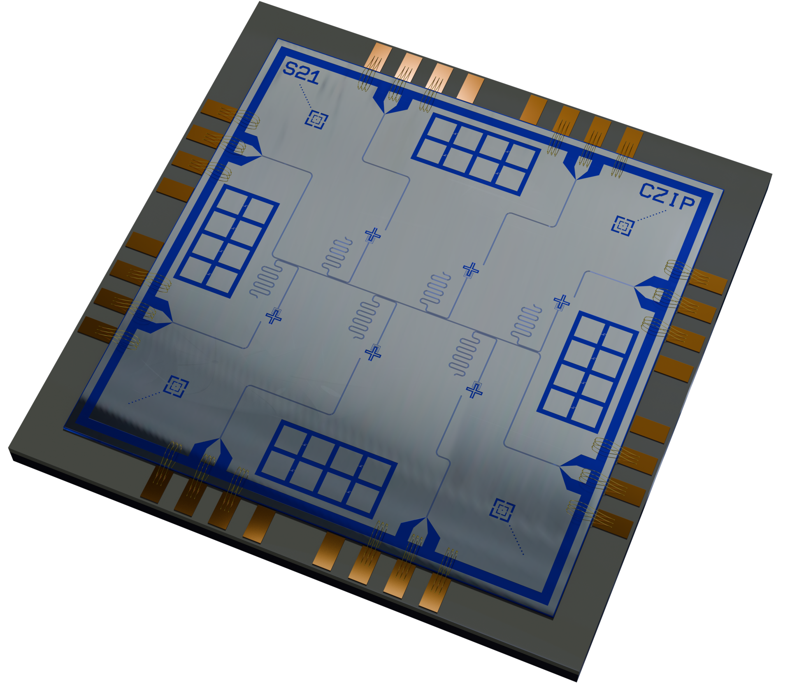

מחשוב קוונטי הוא ההימור הטכנולוגי הגדול הבא של ענף ההייטק, ואחרי גל הבינה המלאכותית הוא הופך במהירות לזירת התחרות החמה בין מעצמות וחברות ענק. בישראל, שילוב של מחקר אקדמי חזק, הון סיכון ותמיכה ממשלתית ממקם את המשק כשחקן רלוונטי במרוץ הגלובלי — גם אם הדרך ליישום מסחרי רחב עדיין ארוכה.

## מה זה מחשוב קוונטי ולמה זה משנה?

בניגוד למחשב רגיל, שמעבד מידע ביחידות בינאריות (0 או 1), מחשב קוונטי מבוסס על קיוביטים — יחידות שיכולות להימצא במספר מצבים בו-זמנית. התכונה הזו מאפשרת, בתיאוריה, לבצע חישובים מקבילים בקנה מידה עצום ולפתור בעיות שמחשבי-העל החזקים ביותר כיום אינם מסוגלים להתמודד עמן בזמן סביר.

היישומים הפוטנציאליים משתרעים על פני תחומים רבים: פיתוח תרופות וגילוי מולקולות חדשות, אופטימיזציה של שרשראות אספקה, מודלים פיננסיים מורכבים, וכן אתגרי הצפנה וסייבר. דווקא ההיבט הביטחוני-הצפנתי הוא שמדליק את המרוץ בין מדינות, שכן מחשב קוונטי בשל עלול לשבור בעתיד שיטות הצפנה נפוצות.

## איפה ישראל ניצבת במרוץ?

ישראל נכנסה לתחום עם יתרון מובנה: קהילת מחקר חזקה במוסדות כמו מכון ויצמן, האוניברסיטה העברית והטכניון, לצד תעשיית סייבר ובינה מלאכותית מהמתקדמות בעולם. הרשות לחדשנות והמדען הראשי הובילו בשנים האחרונות תוכנית לאומית למחשוב קוונטי בהיקף של מאות מיליוני שקלים, שכללה הקמת תשתית לאומית ומרכזי מו"פ.

במקביל צמחו בישראל סטארטאפים העוסקים בחומרה קוונטית, בתוכנה ובאלגוריתמים, וכן חברות המפתחות רכיבים תומכים — כמו מערכות קירור, בקרה ותקשורת — שהן חוליה קריטית בשרשרת. מודל זה מזכיר את הדרך שבה ההייטק הישראלי התמחה ברכיבים ובתוכנה סביב מהפכות טכנולוגיות קודמות, ולא בהכרח בהקמת הענקיות עצמן.

### מי השחקנים הגלובליים?

המרוץ העולמי נשלט בידי חברות הענק. **אנבידיה**, שהפכה לסמל של עידן הבינה המלאכותית, נכנסה גם היא לזירה הקוונטית עם פלטפורמות המחברות בין מעבדים קוונטיים למערכות מסורתיות. **גוגל** ו**אייביאם** מפרסמות אבני דרך בפיתוח מעבדים קוונטיים, ו**מיקרוסופט** ו**אמזון** מציעות גישה למחשוב קוונטי דרך שירותי הענן שלהן. התחרות בין הגישות הטכנולוגיות השונות עדיין פתוחה, ואף שחקן לא הכריע.

## מחשוב קוונטי מול מחשוב מסורתי

הטבלה הבאה ממחישה את ההבדלים המרכזיים בין הגישות:

| פרמטר | מחשוב מסורתי | מחשוב קוונטי |
|---|---|---|
| יחידת מידע | ביט (0 או 1) | קיוביט (מצבים מרובים) |
| סוגי בעיות | חישובים כלליים ויומיומיים | בעיות מורכבות במיוחד |
| בשלות מסחרית | מלאה ורחבה | בשלבים מוקדמים |
| תנאי הפעלה | סטנדרטיים | קירור קיצוני ובקרה מדויקת |
| שוק ישראלי | תעשייה מבוססת | מחקר וסטארטאפים בצמיחה |

## מתי נראה יישומים מסחריים?

כאן נדרשת זהירות. למרות ההייפ, מחשוב קוונטי עדיין בשלב מוקדם, והמערכות הקיימות סובלות מרעש ומשגיאות המגבילים את יכולתן המעשית. מרבית המומחים מעריכים כי יישומים מסחריים רחבים ובעלי ערך כלכלי מובהק יבשילו בהדרגה במהלך העשור הקרוב, ולא בטווח המיידי.

עם זאת, הזרם הפיננסי כבר כאן. קרנות הון סיכון מגדילות חשיפה לתחום, וממשלות מזרימות מיליארדים כחלק ממרוץ אסטרטגי. עבור המשקיע הישראלי, החשיפה כיום מגיעה בעיקר דרך מניות הענק הגלובליות שמובילות את הפיתוח, ופחות דרך חברות ציבוריות מקומיות ייעודיות.

## שורה תחתונה

מחשוב קוונטי אינו תחליף מיידי למחשוב הקיים אלא טכנולוגיה משלימה, שתשנה בהדרגה תעשיות שלמות. ישראל, עם התשתית המחקרית והתעשייתית שלה, ממוקמת היטב כדי ליהנות מהגל הבא — אך המבחן האמיתי יהיה ביכולת להפוך מצוינות מדעית לחברות מסחריות בעלות ערך. בינתיים, זהו סיפור של פוטנציאל ארוך-טווח יותר מאשר הזדמנות רווח מהירה.
