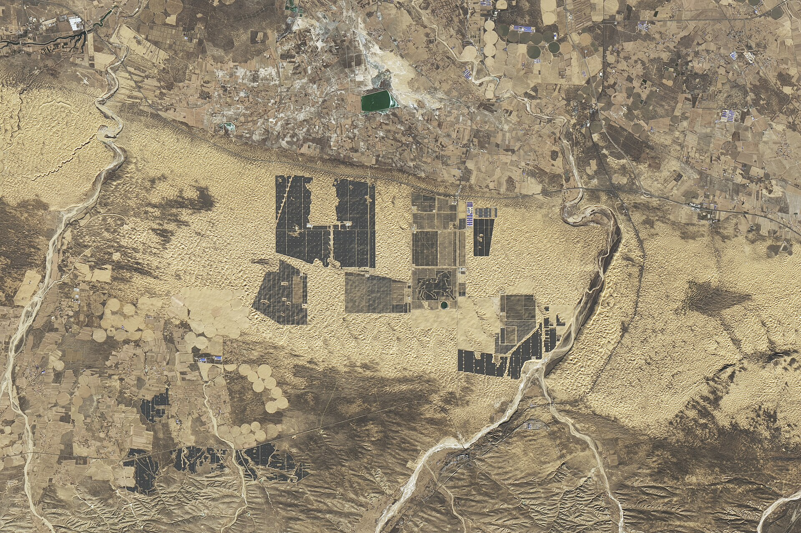

מניות האנרגיה המתחדשת חוזרות לקדמת הבמה בבורסה בתל אביב, אחרי כשנתיים שבהן ספגו ירידות חדות בשל סביבת הריבית הגבוהה. השילוב של ביקוש גובר לחשמל — בעיקר מצד מרכזי הנתונים והמעבר לבינה מלאכותית — יחד עם ציפייה לירידת ריבית, מחזיר את המשקיעים הישראלים אל מניות כמו אנלייט, אנרג'יקס ודוראל.

## מה מניע את הראלי במניות האנרגיה המתחדשת?

המנוע המרכזי הוא פשוט: העולם צורך יותר חשמל. ההתרחבות המהירה של מרכזי הנתונים, הביקוש ההולך וגובר לכוח מחשוב לצורכי בינה מלאכותית, והחשמול של התחבורה — כל אלה מגדילים את הצריכה הגלובלית של חשמל בקצב שלא נראה שנים. חברות האנרגיה המתחדשת, שמייצרות חשמל נקי ומוכרות אותו בחוזים ארוכי-טווח, נמצאות בדיוק בנקודת החיבור בין ההיצע לביקוש.

גורם שני, קריטי לא פחות, הוא הריבית. סקטור האנרגיה המתחדשת הוא עתיר הון וממונף מאוד — הקמת שדות סולאריים, חוות רוח ומערכות אגירה דורשת מימון כבד. כשהריבית עולה, עלות המימון מזנקת ושווי הפרויקטים העתידיים מתכווץ. לכן, כל סימן לירידת ריבית מצד בנק ישראל והבנקים המרכזיים בעולם מיתרגם כמעט מיידית לעלייה במניות הסקטור.

## מי הן החברות הבולטות בבורסה בתל אביב?

בבורסה בתל אביב פועלות כמה שחקניות מרכזיות שהפכו למייצגות של הסקטור:

- **אנלייט אנרגיה מתחדשת** — מהגדולות בתחום, עם פורטפוליו בינלאומי רחב הכולל פרויקטים סולאריים, רוח ואגירה באירופה ובארצות הברית. נכללת במדד ת"א 35.
- **אנרג'יקס** — פעילה בישראל, ארצות הברית ופולין, עם דגש על שילוב ייצור ואגירה.
- **דוראל אנרגיה** — צומחת במהירות, עם דגש על פרויקטים בישראל ובחו"ל.
- **נופר אנרג'י** — מתמקדת בעיקר בשוק המקומי ובגגות סולאריים.

## טבלת השוואה: אפיקי האנרגיה המתחדשת

| פרמטר | אנלייט | אנרג'יקס | דוראל |
|---|---|---|---|
| חשיפה גיאוגרפית | רחבה (אירופה, ארה"ב) | ישראל, ארה"ב, פולין | ישראל וחו"ל |
| מדד מוביל | ת"א 35 | ת"א 90 | ת"א 90 |
| דגש טכנולוגי | סולארי, רוח, אגירה | ייצור ואגירה | סולארי ואגירה |
| רגישות לריבית | גבוהה | גבוהה | גבוהה |

*החלוקה למדדים משתנה מעת לעת בהתאם לעדכוני הבורסה.*

## מה הסיכונים שצריך להכיר?

לצד הסיפור החיובי, חשוב לזכור שמדובר בסקטור תנודתי. הרגישות הגבוהה לריבית פועלת לשני הכיוונים: עלייה מפתיעה בתשואות האג"ח הממשלתי עלולה להפיל את המניות במהירות. בנוסף, החברות נושאות רמות חוב גבוהות, וכל התייקרות במימון פוגעת בשורה התחתונה.

גורמי סיכון נוספים כוללים שינויי רגולציה ותעריפי חשמל במדינות הפעילות, עיכובים בהקמת פרויקטים, ותלות בשרשראות אספקה גלובליות למרכיבים כמו פאנלים סולאריים וסוללות. חשיפה מטבעית לדולר ולאירו מוסיפה גם היא ממד של אי-ודאות לתוצאות.

## האם זו הזדמנות השקעה לטווח ארוך?

רבים מהאנליסטים רואים בסקטור האנרגיה המתחדשת סיפור צמיחה מבני ארוך-טווח — כלומר, מגמה שתימשך שנים ולא אופנה חולפת. המעבר העולמי לאנרגיה נקייה, יחד עם הביקוש הגואה לחשמל, יוצרים רוח גבית מבנית לחברות בעלות פורטפוליו איכותי ומאזן יציב.

עם זאת, בטווח הקצר התמחור רגיש מאוד לציפיות הריבית. משקיע שמעוניין בחשיפה לסקטור צריך לשקלל את התנודתיות הגבוהה, לבחון את רמות המינוף של כל חברה, ולהעדיף לרוב פיזור — למשל דרך קרנות סל על מדדי אנרגיה מתחדשת — על פני הימור על מניה בודדת. כמו בכל השקעה, אין תחליף להתאמת רמת הסיכון לפרופיל האישי ולאופק ההשקעה.
