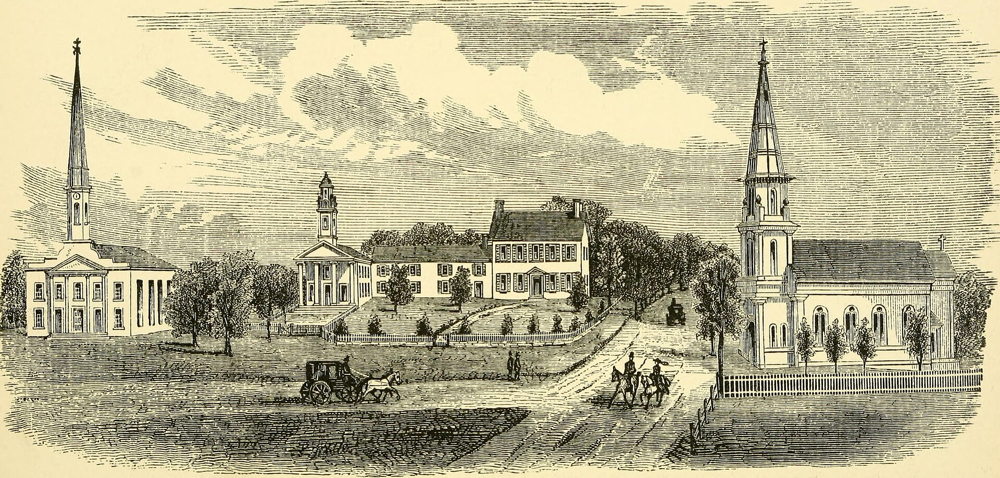

עליית מחירי הביטוח הפכה בחודשים האחרונים לאחת ההוצאות המכבידות ביותר על התקציב המשפחתי בישראל. פרמיות ביטוח הרכב, הדירה והבריאות רשמו עליות חדות, ומשקי בית רבים מגלים בעת חידוש הפוליסה שהמחיר קפץ בעשרות אחוזים לעומת השנה שעברה. מדובר במגמה רוחבית שנובעת משילוב של אינפלציה, התייקרות עלויות התיקון והבנייה, וסביבה ביטחונית מאתגרת.

## מדוע ביטוח הרכב התייקר כל כך?

הגורם המרכזי לעליית מחירי הביטוח בענף הרכב הוא זינוק בעלויות התיקון. חלקי חילוף רבים מיובאים ומושפעים משער הדולר והיורו, ומחירם עלה משמעותית. בנוסף, רכבים חדשים עמוסים בחיישנים, מצלמות ומערכות בטיחות מתקדמות — שכל פגיעה קלה בהם מייקרת את התיקון ביחס לעבר.

חברות הביטוח, ובהן הראל, כלל, מגדל, מנורה ופניקס, מדווחות על שחיקה ברווחיות ענף הרכב, ומגלגלות את העלויות אל הצרכן. גם עלייה במספר גניבות הרכב ובתביעות מהוות לחץ נוסף כלפי מעלה על הפרמיות.

### מה קורה בביטוח החובה?

גם בביטוח החובה, שמחירו מפוקח, ניכרת מגמת התייקרות מתונה יותר, בעיקר בשל עדכוני תעריפים ומאפייני הנהג. עם זאת, עיקר הזינוק מורגש דווקא בביטוח המקיף ובביטוח צד ג', שאינם מפוקחים ונקבעים לפי שיקולי החברות.

## ביטוח הדירה: עלויות הבנייה מכתיבות את המחיר

עליית מחירי הביטוח נוגעת גם לביטוח המבנה והתכולה. מחיר פוליסת ביטוח הדירה מושפע ישירות מעלות הבנייה — וזו זינקה בשנים האחרונות בשל התייקרות חומרי גלם, מחסור בעובדים והתמשכות הבנייה. כאשר עלות שחזור המבנה עולה, כך גם הפרמיה.

גורם נוסף הוא הסיכון הביטחוני והאקלימי. אירועי מזג אוויר קיצוניים, שיטפונות ונזקי טבע הפכו שכיחים יותר, וחברות הביטוח מתמחרות סיכון גבוה יותר. מומחים ממליצים לבחון היטב את סכום הביטוח כדי להימנע מ"ביטוח חסר" — מצב שבו הכיסוי נמוך מערך הנכס בפועל.

## כמה מתייקר ביטוח הבריאות הפרטי?

ביטוחי הבריאות הפרטיים ממשיכים במגמת התייקרות שנתית מובנית. הפרמיה עולה עם הגיל, וחלק מהפוליסות כוללות מנגנון עדכון מחירים תקופתי. הצרכן הישראלי, שרוכש לרוב גם ביטוח משלים בקופת החולים וגם פוליסה פרטית, מוצא את עצמו משלם כפל כיסויים ומאות שקלים בחודש.

רשות שוק ההון, ביטוח וחיסכון פועלת בשנים האחרונות לייצר שקיפות והשוואתיות בענף, אך הצרכן עדיין נדרש לבדיקה עצמאית כדי לוודא שהוא אינו משלם על כיסויים כפולים או מיותרים.

## השוואת מגמות: היכן העלייה החדה ביותר?

הטבלה הבאה מסכמת את המגמות המרכזיות בסוגי הביטוח הנפוצים למשק בית ישראלי (הערכות מגמה, לא מחירים מדויקים):

| סוג ביטוח | מגמת מחיר | הגורם המרכזי |
|---|---|---|
| ביטוח מקיף לרכב | עלייה חדה | התייקרות חלקי חילוף ותיקונים |
| ביטוח חובה | עלייה מתונה | תעריף מפוקח, מאפייני נהג |
| ביטוח מבנה ותכולה | עלייה בינונית-גבוהה | עליית עלויות הבנייה ונזקי טבע |
| ביטוח בריאות פרטי | עלייה שנתית קבועה | גיל המבוטח ועדכוני תעריף |

## איך הצרכן יכול לחסוך?

למרות מגמת עליית מחירי הביטוח, לצרכן יש כלים ממשיים לצמצום ההוצאה:

- **השוואת הצעות בזמן חידוש:** אין להאריך פוליסה אוטומטית. השוואה בין חברות עשויה לחסוך מאות שקלים בשנה.
- **התאמת הכיסוי לצרכים:** ביטול כיסויים כפולים או מיותרים, במיוחד בביטוחי בריאות ובביטוח נלווה למשכנתה.
- **הגדלת השתתפות עצמית:** בחירה בהשתתפות עצמית גבוהה יותר עשויה להוזיל את הפרמיה השוטפת.
- **שימוש בסוכן או במערכות דיגיטליות:** פלטפורמות ההשוואה המקוונות מסייעות לזהות פערי מחיר משמעותיים.

השורה התחתונה: עליית מחירי הביטוח היא מגמה רחבה שצפויה להימשך כל עוד עלויות התיקון והבנייה נותרות גבוהות. עם זאת, צרכן פעיל ומודע, שבודק את הפוליסות שלו מדי שנה, יכול לרסן את הזינוק בהוצאה ולהתאים את הכיסוי לצרכיו האמיתיים.
