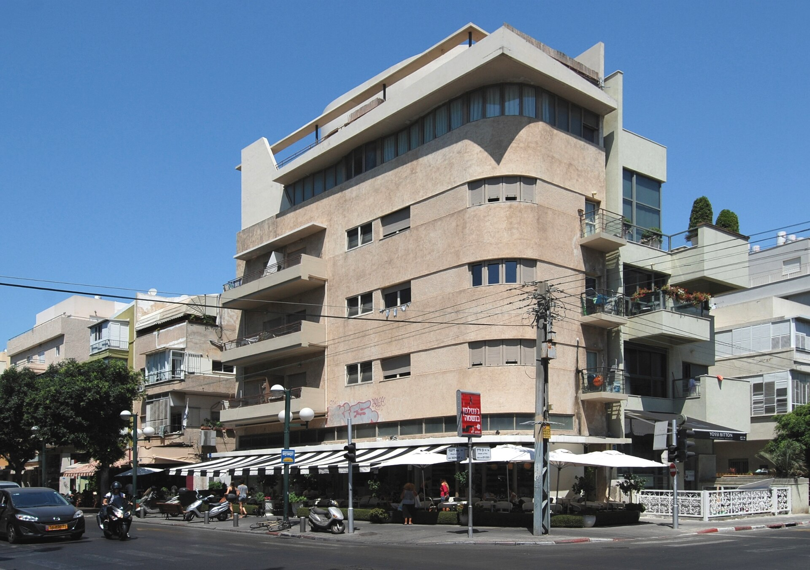

שוק **דירות יד שנייה** חוזר לתפוס נתח משמעותי מעסקאות הנדל"ן בישראל, לאחר תקופה ארוכה שבה שלטו הדירות החדשות בזכות מבצעי מימון אגרסיביים של הקבלנים. הצמצום ההדרגתי של מבצעי 20-80, לצד הידוק הפיקוח של בנק ישראל, מחזיר את יתרון המחיר האמיתי לצד המשני של השוק — והרוכשים מגיבים בהתאם.

## מדוע דירות יד שנייה חוזרות לאופנה?

בשנתיים האחרונות הצליחו הקבלנים למשוך רוכשים באמצעות מבצעי מימון שדחו את עיקר התשלום למועד קבלת המפתח. המבצעים הללו יצרו אשליה של נגישות: הרוכש שילם מעט בהתחלה, והקבלן ספג בפועל את עלות המימון הגבוהה — ולעיתים גילם אותה חזרה במחיר הדירה.

עם הידוק הפיקוח של בנק ישראל על מבצעי 20-80, מרווח התמרון של הקבלנים הצטמצם. התוצאה: הפער בין מחיר דירה חדשה למחיר דירה דומה יד שנייה באותו אזור חזר לבלוט לטובת השוק המשני. רוכשים רבים מגלים כי בדירה קיימת הם מקבלים שטח גדול יותר, מיקום מבוסס ולעיתים מחיר נמוך יותר.

## מה היתרונות והחסרונות מול דירה חדשה?

ההכרעה בין דירה חדשה לדירת יד שנייה אינה מסתכמת במחיר בלבד. לכל אפיק יתרונות וחסרונות משלו:

- **דירת יד שנייה** — כניסה מיידית, מיקום מבוסס עם תשתיות קיימות, שטח גדול יחסית, ולרוב מחיר נמוך יותר למ"ר. מנגד: עלויות שיפוץ, בלאי, והיעדר תקופת אחריות של קבלן.
- **דירה חדשה** — מפרט מודרני, תקן בנייה עדכני, אחריות קבלן ופטור מדמי תיווך. מנגד: המתנה ארוכה למסירה, סיכון קבלני, ומחיר גבוה יותר לאחר שקלול המבצעים.

## טבלת השוואה: דירה חדשה מול יד שנייה

| פרמטר | דירה חדשה | דירת יד שנייה |
|---|---|---|
| מועד כניסה | לרוב 2-4 שנים | מיידי |
| מחיר למ"ר | גבוה יותר | נמוך יותר בממוצע |
| מפרט טכני | מודרני ועדכני | תלוי בגיל הנכס |
| דמי תיווך | לרוב אין | לרוב כן |
| אחריות | אחריות קבלן | ללא |
| סיכון | חשיפה לעיכובים | נמוך יחסית |

## איך הריבית ומלאי הדירות משפיעים על השוק?

הריבית הגבוהה של בנק ישראל ממשיכה להעיב על החלטות הרוכשים ולייקר את החזרי המשכנתה. עם זאת, הצפי להורדות ריבית הדרגתיות עשוי לשחרר ביקושים כבושים ולהאיץ את היקף העסקאות בשני חלקי השוק.

במקביל, מלאי הדירות החדשות הלא מכורות מצוי בשיא, מה שמעצים את התחרות של הקבלנים על כל רוכש — אך גם מחזק את עמדת המיקוח של קונים בשוק יד שנייה, שנהנים מחלופה אמיתית וזמינה.

### מה זה אומר לרוכש הישראלי?

לרוכשים, המשמעות המרכזית היא שחשוב לבחון את **העלות הכוללת** ולא רק את התשלום ההתחלתי. מבצע מימון מפתה עלול להסתיר מחיר גבוה יותר לאורך זמן, בעוד דירת יד שנייה עשויה להציע תמורה טובה יותר לכסף — בעיקר באזורי ביקוש מבוססים.

## מבט קדימה

התפנית לטובת **דירות יד שנייה** משקפת התבגרות של השוק: הרוכשים לומדים לפענח את מבנה המחיר האמיתי מאחורי המבצעים. אם בנק ישראל אכן יתחיל במחזור הורדות ריבית, סביר שנראה התאוששות בהיקף העסקאות בשני האפיקים — כאשר השוק המשני ממשיך להוות עוגן יציב ותחרותי לצד ההיצע הגדול של דירות חדשות שממתין לרוכשים.
