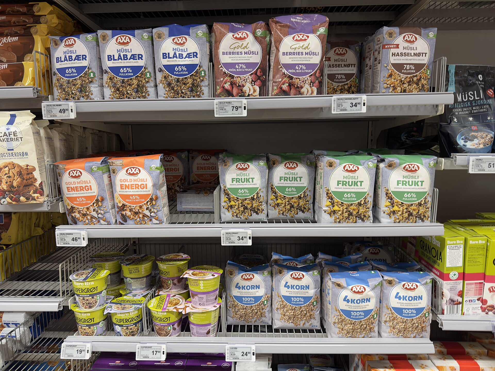

אינפלציית ההתכווצות (Shrinkflation) היא אחת התופעות הצרכניות הבולטות בשנה החולפת: היצרנים מקטינים בשקט את כמות המוצר באריזה — פחות גרמים בשוקולד, פחות סקוויזים בשקית, פחות מיליליטרים בבקבוק — בעוד המחיר על המדף נשאר זהה או עולה במעט. התוצאה היא התייקרות סמויה שהצרכן הישראלי משלם מבלי לשים לב, וזו בדיוק עוצמתה: היא אינה מופיעה בשלט האדום של המבצע, אלא נחבאת בין השורות הקטנות של משקל האריזה.

## מהי אינפלציית ההתכווצות ולמה היא כל כך אפקטיבית

מחקרים התנהגותיים מלמדים שצרכנים רגישים הרבה יותר לשינוי במחיר מאשר לשינוי בכמות. עלייה של שקל אחד במחיר גבינה עלולה להבריח קונים, אבל הורדה של עשרה גרמים מהאריזה כמעט ואינה מורגשת. היצרנים מנצלים את ההטיה הזו: הם משמרים את "נקודת המחיר" הפסיכולוגית שאליה הצרכן התרגל, ומצמצמים את התכולה.

התופעה בולטת במיוחד בקטגוריות שבהן קשה למדוד את הכמות בעין — חטיפים, דגני בוקר, מוצרי חלב, נייר טואלט ומשקאות. לעיתים ההקטנה מלווה בעיצוב אריזה מחודש, שמסיח את הדעת מהשינוי בתכולה.

## למה זה קורה דווקא עכשיו

הגל הנוכחי של אינפלציית ההתכווצות בישראל נובע משילוב לחצים. בשנים האחרונות התייקרו חומרי גלם חקלאיים כמו קקאו, קפה, סוכר ושמן, לצד עליית עלויות האנרגיה, ההובלה הימית והשכר. היצרנים, הלכודים בין עלויות מטפסות לבין תחרות מחירים מול הרשתות והמותג הפרטי, בוחרים לעיתים בהתכווצות במקום בהעלאת מחיר גלויה.

בנק ישראל, המנהל מאבק ממושך בהחזרת האינפלציה אל יעד היציבות, מודד את מדד המחירים לצרכן לפי מחיר ליחידת כמות — כך שבאופן תיאורטי ההתכווצות אמורה להיתפס במדד. בפועל, עבור הצרכן הבודד מדובר בשחיקה שקשה לכמת בזמן אמת.

## איך מזהים התכווצות מחירים בסל הקניות

הכלי המרכזי של הצרכן הוא **המחיר ליחידת מידה** — התווית הקטנה שמציגה כמה עולים 100 גרם או ליטר אחד. הרגולציה בישראל מחייבת את הרשתות להציג נתון זה, אך רוב הקונים מתעלמים ממנו ומסתכלים רק על המחיר הכולל.

הנה כמה סימנים מחשידים:

- **עיצוב אריזה חדש** ללא הסבר ברור — לעיתים מסמן שינוי בתכולה.
- **מחיר "עגול" ששרד שנים** בעוד המשקל ירד.
- **פער בין תחושת הכמות לזיכרון הישן** של המוצר.
- **תחתית אריזה קעורה יותר** או מיכל בעל דפנות עבות שמסתירות נפח קטן יותר.

### טבלה: התכווצות מול התייקרות גלויה

| פרמטר | התייקרות גלויה | אינפלציית ההתכווצות |
|---|---|---|
| שינוי במחיר המדף | עולה | נשאר זהה |
| שינוי בכמות | נשאר זהה | יורד |
| נראות לצרכן | גבוהה | נמוכה מאוד |
| השפעה על מדד המחירים | נמדדת ישירות | נמדדת דרך מחיר ליחידה |
| דרך ההתגוננות | השוואת מחירים | השוואת מחיר ליחידת מידה |

## מה עושים היצרנים והרשתות

היצרנים מצדם טוענים שאינפלציית ההתכווצות היא לעיתים הרע במיעוטו: העלאת מחיר חדה עלולה למוטט את הביקוש כליל, בעוד הקטנה מדודה של האריזה מאפשרת להם לשרוד את עליית העלויות מבלי לאבד נתח שוק. הרשתות, מצידן, מקדמות את המותג הפרטי כאלטרנטיבה זולה — מה שמגביר את הלחץ על יצרני המותגים המובילים ומאיץ את התופעה.

מנגד, ארגוני הצרכנים והרשות להגנת הצרכן קוראים לחייב סימון בולט של כל שינוי בתכולה על גבי האריזה, בדומה למגמות המתגבשות באיחוד האירופי, שם נבחנת חובת יידוע מפורשת של הצרכן על הקטנת מוצר.

## איך הצרכן הישראלי מתגונן

המפתח הוא מודעות. כמה כללי אצבע פשוטים:

1. **קראו את המחיר ליחידת מידה** בכל קנייה, לא את המחיר הכולל.
2. **צלמו והשוו** — שמירת תמונות של אריזות מוכרות מקלה לזהות שינוי לאורך זמן.
3. **שקלו מותג פרטי** — לעיתים המחיר ליחידה נמוך משמעותית.
4. **קנו באריזות גדולות** כשהמחיר ליחידה זול יותר ואין חשש לבזבוז.
5. **דווחו** על מקרים חשודים לארגוני הצרכנים כדי להגביר את השקיפות.

אינפלציית ההתכווצות אינה עתידה להיעלם כל עוד עלויות הייצור נותרות גבוהות והתחרות על ליבו של הצרכן חריפה. אך צרכן ער, שמסתכל על התווית הנכונה, יכול לצמצם משמעותית את השחיקה בכיסו — ולהחזיר לעצמו שליטה על סל הקניות.
