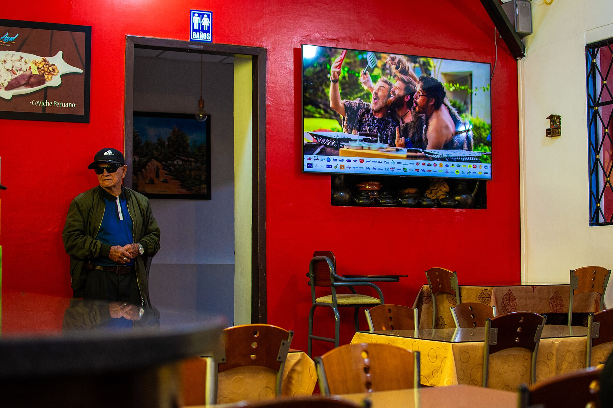

גל של **סגירת עסקים קטנים** מכה במשק הישראלי: בשנה החולפת מספר העסקים שנסגרו עלה משמעותית על מספר העסקים החדשים שנפתחו, בפעם הראשונה מזה שנים. השילוב של אשראי יקר, ירידה בביקושים המקומיים, עלויות שכר ושכר דירה מזנקות והעלאת המע"מ ל-18% יוצר לחץ בלתי-נסבל על מאות אלפי עצמאים ובעלי עסקים זעירים ברחבי הארץ.

העסקים הקטנים והבינוניים אינם שחקן שולי במשק: הם מהווים את הרוב המוחלט מכלל העסקים בישראל ומעסיקים כמחצית מהעובדים במגזר העסקי. לכן, כשגל סגירת העסקים הקטנים מתעצם, ההשלכות חורגות הרבה מעבר לבעל העסק הבודד — הן פוגעות בתעסוקה, בגביית המסים ובצמיחה הכוללת.

## מדוע העסקים הקטנים קורסים דווקא עכשיו?

משבר סגירת העסקים הקטנים אינו נובע מסיבה אחת אלא ממפגש של כמה כוחות שוחקים בו-זמנית. המלחמה ומשבר גיוס המילואים פגעו בתפעול השוטף של עסקים רבים, בעוד שהריבית הגבוהה של בנק ישראל, שנותרה סביב רמות של כ-4.5%, ייקרה דרמטית את עלות האשראי.

### הריבית מחניקה את התזרים

עבור עסק קטן, הלוואה או מסגרת אשראי בבנק היא לרוב חבל ההצלה שמאפשר לגשר על פערי תזרים. כשהריבית עולה, ההחזרים החודשיים מתנפחים, והבנקים — זהירים מטבעם — מהדקים את תנאי האשראי לעסקים שנתפסים כמסוכנים. התוצאה: עסקים רווחיים בבסיסם נקלעים לחדלות פירעון בשל בעיית נזילות בלבד.

### עלויות קבועות שמזנקות

שכר הדירה המסחרי, בעיקר באזורי הביקוש במרכז, המשיך לטפס. במקביל, עליית שכר המינימום ומחסור בעובדים ייקרו את עלות כוח האדם. העלאת המע"מ ל-18% בתחילת 2025 הוסיפה נטל נוסף — או שהעסק סופג אותה על חשבון הרווח, או שהוא מגלגל אותה לצרכן ומסתכן בירידה נוספת בביקוש.

## אילו ענפים נפגעים יותר מכולם?

לא כל הענפים נפגעים באותה מידה. החזית הקשה ביותר מתרכזת בעסקים שתלויים בהוצאה הפרטית של משקי הבית — זו שנשחקה עם עליית יוקר המחיה.

| ענף | עוצמת הפגיעה | הגורם המרכזי |
|---|---|---|
| מסעדנות ובתי קפה | גבוהה מאוד | ירידה בבילויים, עלויות מזון ושכר |
| מסחר קמעונאי קטן | גבוהה | תחרות מול רשתות ואונליין זול |
| בנייה וקבלנות משנה | גבוהה | האטה בנדל"ן ויוקר האשראי |
| שירותים אישיים | בינונית | צמצום בהוצאה הפרטית |
| מקצועות חופשיים | נמוכה-בינונית | יציבות יחסית בביקוש |

ענף המסעדנות מוביל את הסטטיסטיקה העגומה: שרשרת סגירות של מסעדות ובתי קפה ותיקים המחישה עד כמה השילוב של עלויות תפעול גבוהות וירידה בתדירות הבילויים הפך את המודל העסקי ללא-כדאי עבור רבים.

## מה עושים במדינה ובמערכת הבנקאית?

הממשלה והמערכת הבנקאית מפעילות כלים שנועדו לרכך את המכה, אך רבים בשטח טוענים שהם אינם מספיקים. קרנות ההלוואות בערבות מדינה מרחיבות את היקף האשראי הזמין לעסקים קטנים ובינוניים, ומאפשרות מימון בתנאים נוחים יותר ממסלול בנקאי רגיל. במקביל, נשמעות קריאות להקלות רגולטוריות ולהפחתת הנטל הבירוקרטי המכביד במיוחד על העסק הזעיר.

עם זאת, הכלי המשמעותי ביותר נמצא בידי בנק ישראל: הורדת ריבית עתידית. ככל שהאינפלציה תמשיך להתמתן ותאפשר לבנק המרכזי להתחיל במחזור הפחתות ריבית, כך יוקל נטל האשראי על העצמאים — אך זהו תהליך הדרגתי שלא יפתור את המצוקה בטווח המיידי.

## מה המשמעות למשק הישראלי כולו?

גל סגירת העסקים הקטנים הוא נורת אזהרה למצב הצרכן הישראלי ולחוסנו של המגזר העסקי. עסק שנסגר מייצר גל הדף: עובדים מפוטרים, ספקים לא מקבלים תשלום, וגביית המסים של המדינה נפגעת. מבחינת המשקיעים בבורסה בתל אביב, בריאות העסקים הקטנים משפיעה בעקיפין על הבנקים — שנחשפים לאשראי בעייתי — ועל חברות הצריכה המקומיות.

השורה התחתונה: עתיד גל הסגירות תלוי בשלושה משתנים מרכזיים — קצב הורדת הריבית, התאוששות הביקושים המקומיים והיקף הסיוע הממשלתי. עד שאלה יתיישרו, העצמאים בישראל יישארו בחזית הלחץ הכלכלי.
