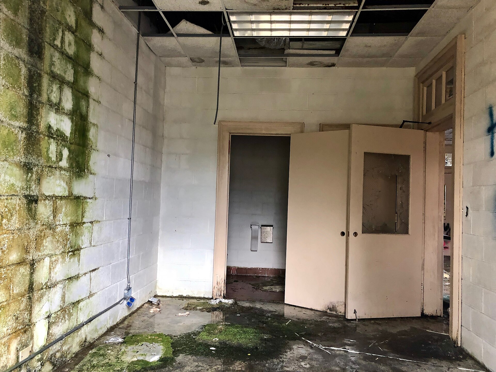

שוק המשרדים בישראל, ובפרט במטרופולין תל אביב, נכנס לתקופה מאתגרת: שילוב של עודף היצע היסטורי, האטה בגיוסי ההייטק ומעבר מבני לעבודה היברידית מייצר לחץ הולך וגובר על שיעורי התפוסה ועל דמי השכירות. אחרי עשור של פריחה, שבו מגדלי משרדים צצו כפטריות לאורך צירי הזכוכית של תל אביב, רמת גן והרצליה, המטוטלת מתחילה לנוע בכיוון ההפוך — ולראשונה מזה שנים מדברים בענף על סיכון לשחיקה במחירים.

## מה קורה בשוק המשרדים כרגע?

במשך שנים ארוכות היה שוק המשרדים בתל אביב אחד המנועים החזקים של הנדל"ן המניב בישראל. הביקוש חסר הרוויה מצד חברות ההייטק, קרנות ההון ותאגידי הפיננסים דחף את דמי השכירות לשיאים, והביא יזמים להזרים היקפי בנייה עצומים. אלא שהתזמון התברר כבעייתי: חלק ניכר מהפרויקטים שיצאו לדרך בשנות הגאות מגיעים כעת לשלב האכלוס — בדיוק כשהביקוש מתקרר.

התוצאה היא **פער גדל בין ההיצע לביקוש**. עשרות אלפי מטרים רבועים של שטחי משרדים חדשים צפויים להתווסף לשוק בגוש דן בשנים הקרובות, בעוד שהחברות שאמורות לאכלס אותם נמצאות במגמת התייעלות, צמצום כוח אדם או האטה בקצב הגיוסים.

## מדוע הביקוש למשרדים נחלש?

שלושה כוחות מרכזיים פועלים במקביל על שוק המשרדים:

- **ההאטה בהייטק:** ענף ההייטק, שהיה הצרכן הגדול ביותר של שטחי משרדים, עבר תקופה של ריסון. סבבי גיוס איטיים יותר, פיטורים בחברות מסוימות ומיקוד ברווחיות במקום בצמיחה מהירה — כולם צמצמו את התיאבון לשטחים.
- **העבודה ההיברידית:** מודל העבודה שהתקבע מאז מגפת הקורונה שינה את משוואת השטח לעובד. חברות רבות מחזיקות כיום פחות מטרים רבועים לכל עובד, ומעדיפות שטחים גמישים על פני חוזים ארוכי טווח.
- **עלות המימון:** סביבת הריבית הגבוהה של השנתיים האחרונות ייקרה את המימון של יזמים ומשקיעים, והקשתה על עסקאות בשוק הנדל"ן המסחרי.

## מי נפגע ומי מחזיק מעמד?

הפגיעה בשוק אינה אחידה. הפער בין נכסים חדשים ומשודרגים לבין מבנים ישנים הולך ומתרחב — תופעה שמכונה בענף "טיסה לאיכות". חברות שמחפשות משרדים מעדיפות מגדלים חדשים, יעילים אנרגטית ובעלי סטנדרט גבוה, ומוכנות אף לשלם עליהם פרמיה. לעומת זאת, מבנים ישנים יותר, ללא שדרוג, מתקשים למשוך שוכרים ונאלצים להוריד מחירים או להישאר ריקים.

חברות הנדל"ן המניב הגדולות בבורסה בתל אביב — בהן שיכון ובינוי נדל"ן, מליסרון, עזריאלי, אמות וגב ים — מחזיקות בתיקי נכסים מגוונים שמספקים כרית ביטחון מסוימת, אך גם הן חשופות לשחיקה בשוק המשרדים. במקביל, ריבוי השטחים הפנויים מחזק את כוח המיקוח של השוכרים, שדורשים כיום הטבות, תקופות שכירות ללא תשלום ותרומה לעלויות ההתאמה.

### השוואה: מגמות בשוק הנדל"ן המסחרי

| פרמטר | מגדלים חדשים ומשודרגים | מבנים ישנים |
|---|---|---|
| ביקוש מצד שוכרים | יציב עד גבוה | נחלש |
| מגמת דמי שכירות | יציבות יחסית | לחץ כלפי מטה |
| שיעור שטחים פנויים | נמוך-בינוני | גבוה ועולה |
| הטבות לשוכרים | מוגבלות | נדיבות |
| כדאיות השקעה | בינונית-גבוהה | תלוית שדרוג |

## כיצד מגיבות חברות הנדל"ן?

מול הלחץ, חברות הנדל"ן המניב מאמצות כמה אסטרטגיות. הראשונה היא **הטבות לשוכרים** — תמריצים כספיים ותקופות חסד שנועדו לשמר תפוסה גבוהה גם במחיר של פגיעה בתשואה בטווח הקצר. השנייה היא **שדרוג מבנים קיימים**, כדי לצמצם את הפער מול הנכסים החדשים. השלישית היא מעבר למודלים של **שטחים גמישים** ומרחבי עבודה משותפים, המתאימים לחברות קטנות וסטארט-אפים שאינם מעוניינים בהתחייבות ארוכת טווח.

חלק מהיזמים בוחנים אף **המרת ייעוד** — הפיכת מבני משרדים למגורים או לשימושים מעורבים, מהלך מורכב מבחינה תכנונית אך שעשוי להפוך לרלוונטי יותר אם עודף ההיצע יימשך.

## מה צפוי בהמשך?

עתיד שוק המשרדים תלוי בעיקר בקצב ההתאוששות של ההייטק ובכיוון הריבית. התאוששות בגיוסי ההון בענף, לצד הורדות ריבית מצד בנק ישראל, עשויות להחזיר את הביקוש לשטחים ולייצב את המחירים. מנגד, אם ההאטה תימשך במקביל להמשך כניסת פרויקטים חדשים, שוק המשרדים עלול להיכנס לתקופה ממושכת של עודף היצע ושחיקת מחירים.

בשורה התחתונה, השוק עובר תהליך של מיון ובידול: הנכסים האיכותיים יישארו מבוקשים, בעוד המבנים הישנים ייאלצו להשתדרג או להסתגל. עבור משקיעים ושוכרים כאחד, זו תקופה שבה איכות הנכס ומיקומו הופכים למשמעותיים מאי פעם.
