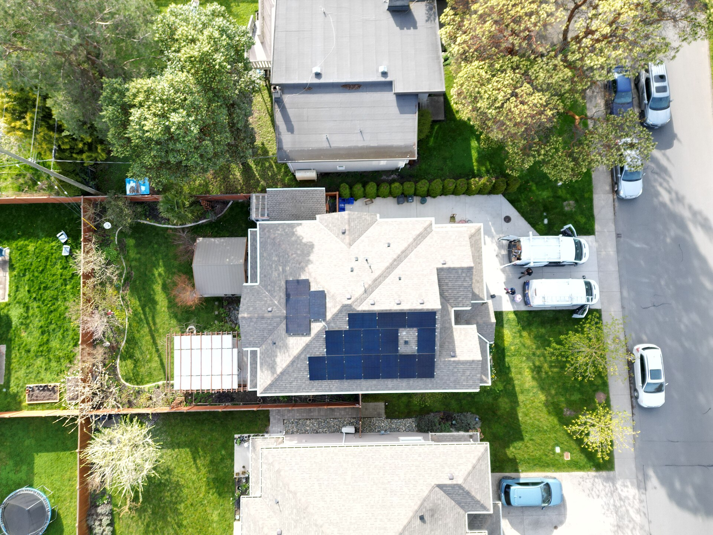

עדכון **תעריף החשמל** בישראל שב אל כותרות הצרכנות, ומשקי הבית שואלים את עצמם כמה עוד יעלה החשבון החודשי. התשובה הישירה: רשות החשמל מעדכנת את התעריף מדי שנה בהתאם לעלויות הייצור, מחירי הדלק והגז, השכר ועלויות תחזוקת רשת ההולכה — וכל התייקרות של אחוזים בודדים מיתרגמת לעשרות שקלים בשנה עבור משפחה ממוצעת. במקביל, נפתחות בפני הצרכנים אפשרויות חדשות לחתוך את ההוצאה.

## מדוע תעריף החשמל ממשיך לעלות?

המחיר שאנחנו משלמים עבור קילוואט-שעה אינו נקבע בשוק חופשי אלא מפוקח על ידי רשות החשמל. הרשות בונה את התעריף מכמה רכיבים מרכזיים: עלות ייצור החשמל (בעיקר גז טבעי), עלות ההולכה והחלוקה ברשת של חברת החשמל, ורכיבי שכר ופנסיה של עובדי המערכת.

בשנים האחרונות פעלו כמה כוחות שדחפו את התעריף כלפי מעלה: התנודתיות במחירי האנרגיה בעולם, ההשקעות הכבדות הנדרשות בשדרוג רשת ההולכה הישנה, והצורך לחבר אליה יותר ויותר מקורות אנרגיה מתחדשת. מנגד, המעבר מפחם לגז טבעי ולאנרגיה סולארית מרסן חלק מהעלייה לאורך זמן.

## כמה זה עולה למשק בית ממוצע?

משק בית ישראלי ממוצע צורך בין 600 ל-800 קילוואט-שעה בחודש, כאשר בחודשי הקיץ והחורף — שיא השימוש במזגנים — הצריכה מזנקת. לכן, גם התייקרות של אחוזים בודדים מורגשת היטב בחשבון הדו-חודשי המגיע לבית.

הטבלה הבאה ממחישה כיצד רמות צריכה שונות מושפעות מהתעריף (הנתונים להמחשה בלבד ומבוססים על טווחי צריכה טיפוסיים):

| פרופיל צריכה | צריכה חודשית משוערת | הערכת עלות חודשית |
|---|---|---|
| דירה קטנה / זוג | כ-350 קוט"ש | סביב 210 ש"ח |
| משפחה ממוצעת | כ-650 קוט"ש | סביב 390 ש"ח |
| בית פרטי גדול | כ-1,100 קוט"ש | סביב 660 ש"ח |

המסקנה ברורה: ככל שהצריכה גבוהה יותר, כך גם ההשפעה השקלית של כל עדכון תעריף גדולה יותר — ולכן דווקא משקי הבית הגדולים הם שיכולים לחסוך הכי הרבה.

## איך אפשר לחתוך את חשבון החשמל?

לצד המחאה על עליית התעריף, יש כמה מהלכים מעשיים שהצרכן הישראלי יכול לבצע כדי לרסן את ההוצאה:

- **מעבר לתעריף לפי שעות (מונה חכם):** חברת החשמל וספקים פרטיים מציעים מסלולים שבהם מחיר הקילוואט משתנה לפי שעות היממה. משפחות שמפעילות מדיח, מכונת כביסה ומייבש בשעות הזולות (בדרך כלל בלילה) יכולות לחסוך משמעותית.
- **מעבר לספק חשמל פרטי:** מאז פתיחת שוק החשמל לתחרות, ספקים כמו אלקטרה פאוור, פזגז ואחרים מציעים הנחות של אחוזים בודדים על תעריף חברת החשמל. ההנחה קטנה לכאורה, אך מצטברת לחיסכון שנתי.
- **התייעלות אנרגטית:** מזגנים בעלי דירוג אנרגטי גבוה, מעבר לתאורת לד וכיבוי מכשירים במצב המתנה מפחיתים את הצריכה הבסיסית.

### האם כדאי להתקין מערכת סולארית ביתית?

אחת המגמות הבולטות בקרב צרכנים פרטיים היא התקנת פאנלים סולאריים על גג הבית. במסלולי "מונה נטו" ו"צריכה עצמית", משק הבית מייצר חשמל לשימושו העצמי ומקטין דרמטית את התלות בתעריף חברת החשמל. ככל שתעריף החשמל עולה, כך תקופת ההחזר על ההשקעה בפאנלים מתקצרת — מה שהופך את ההשקעה לאטרקטיבית יותר עבור בעלי בתים פרטיים וגגות פרטיים.

## מה צפוי בהמשך?

המגמה ארוכת הטווח היא של מעבר הדרגתי לאנרגיה מתחדשת ולרשת חשמל חכמה. בטווח הקצר, הצרכן צפוי להמשיך לספוג עדכוני תעריף שנתיים, אך בטווח הבינוני התחרות בין ספקי החשמל הפרטיים והירידה בעלויות הטכנולוגיה הסולארית עשויות למתן את קצב ההתייקרות. בשורה התחתונה: בעוד שעל גובה תעריף החשמל לצרכן הביתי יש לצרכן שליטה מוגבלת, על גובה חשבון החשמל שלו יש לו הרבה יותר השפעה ממה שנדמה.
