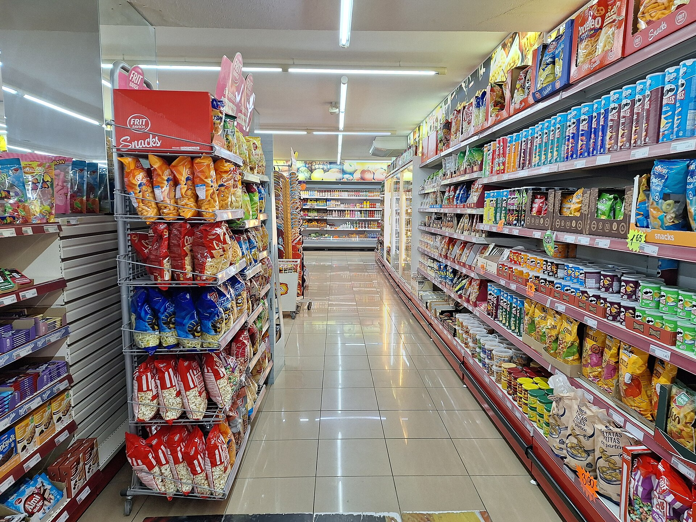

אינפלציית ההתכווצות (התכווצות האריזות) הפכה בשנה החולפת לאחת התופעות המדוברות ביותר בקרב צרכנים ישראלים: המחיר על המדף נשאר זהה, אך כמות המוצר באריזה קטנה בשקט. התוצאה היא התייקרות סמויה, שקשה לזהות במבט חטוף, ושמאפשרת ליצרנים ולרשתות לשמור על תדמית של יציבות מחירים בזמן שהעלות האמיתית לצרכן עולה.

התופעה אינה ייחודית לישראל, אך היא בולטת כאן במיוחד על רקע גל ההתייקרויות במוצרי המזון ולחצי האינפלציה שמלווים את המשק. בעוד בנק ישראל עוקב אחר מדד המחירים לצרכן, חלק ניכר מההתייקרות בפועל "מתחבא" בין השורות — לא בעליית מחיר, אלא בירידת כמות.

## מהי אינפלציית ההתכווצות ולמה היא כל כך יעילה ליצרנים?

העיקרון פשוט: במקום להעלות את מחיר חבילת החטיפים משבעה שקלים לשמונה — פעולה שהצרכן מבחין בה מיד — היצרן משאיר את המחיר על שבעה שקלים, אך מקטין את התכולה מ-200 גרם ל-170 גרם. בפועל, המחיר ליחידת מוצר עלה בכ-15%, אך המדבקה על המדף כמעט ואינה משתנה.

מחקרים התנהגותיים מלמדים שצרכנים רגישים הרבה יותר לשינויי מחיר מאשר לשינויי כמות. אנחנו זוכרים ש"החטיף עולה שבעה שקלים", אבל כמעט אף אחד לא זוכר בעל פה כמה גרם היו באריזה בפעם הקודמת. זו בדיוק נקודת התורפה שהתופעה מנצלת.

### באילו מוצרים התופעה נפוצה במיוחד?

ההתכווצות בולטת במיוחד במוצרים שבהם קשה לצרכן לזכור את הכמות המדויקת: חטיפים ותפוצ'יפס, טבלאות שוקולד, גבינות ומוצרי חלב, שמן, קפה נמס, נייר טואלט ומגבונים. באלה, שינוי של כמה עשרות גרמים או כמה יחידות בגליל כמעט בלתי מורגש — אך משמעותי מאוד לאורך זמן.

## כמה זה באמת עולה לצרכן הישראלי?

כדי להמחיש את הפער, נבחן דוגמה תיאורטית של מוצר שמחירו נשאר קבוע בזמן שהאריזה מצטמצמת. הטבלה הבאה ממחישה כיצד "מחיר יציב" מסתיר התייקרות אמיתית:

| פרמטר | לפני ההתכווצות | אחרי ההתכווצות | שינוי בפועל |
|---|---|---|---|
| מחיר האריזה | 7.0 ₪ | 7.0 ₪ | ללא שינוי לכאורה |
| כמות באריזה | 200 גרם | 170 גרם | ‏-15% |
| מחיר ל-100 גרם | 3.5 ₪ | ‏4.12 ₪ | ‏+18% |
| התייקרות שנתית מוסתרת | — | — | עשרות שקלים למוצר |

כאשר מכפילים תופעה כזו על עשרות מוצרים בסל קניות חודשי, ההשפעה המצטברת על ההוצאה המשפחתית עלולה להסתכם במאות שקלים בשנה — מבלי שהצרכן "הרגיש" ולו התייקרות אחת.

## איך מזהים את התופעה ומגנים על הכיס?

הכלי החשוב ביותר של הצרכן הוא **המחיר ליחידת מידה**. על פי הרגולציה בישראל, רשתות השיווק מחויבות להציג לצד המחיר הכולל גם את המחיר ל-100 גרם, לק"ג או לליטר. זהו הנתון היחיד שמאפשר להשוות "תפוחים לתפוחים" בין אריזות בגדלים שונים ובין מותגים מתחרים.

- **הסתכלו על המחיר ליחידת מידה, לא על מחיר האריזה.** אריזה זולה יותר לא בהכרח משתלמת יותר.
- **השוו בין מותגים ומותגים פרטיים.** לעיתים המותג הפרטי של הרשת מציע יחס כמות-מחיר עדיף.
- **חשדו כשהאריזה "התחדשה".** עיצוב חדש מלווה לא פעם בהקטנת תכולה.
- **עקבו אחרי מוצרי הבסיס שאתם קונים באופן קבוע** — שם קל יותר לזהות שינוי.

## מה עושה הרגולטור?

משרד הכלכלה והרשות להגנת הצרכן מגבירים בשנים האחרונות את הדרישות לשקיפות, בעיקר סביב סימון המחיר ליחידת מידה והבלטתו על התווית. עם זאת, אין בישראל חובה גורפת ליידע את הצרכן באופן אקטיבי כאשר תכולת מוצר קטֵנה — כפי שנשקל במדינות אירופה שונות. בפועל, נטל הזיהוי נותר בעיקר על כתפי הצרכן.

מומחי צרכנות מעריכים כי כל עוד לחצי העלויות על היצרנים נמשכים — מחירי חומרי גלם, אנרגיה והובלה — אינפלציית ההתכווצות תישאר כלי מרכזי לשמירה על שולי הרווח מבלי להבהיל את הצרכן במחיר גבוה יותר. המשמעות ברורה: הקנייה החכמה מחייבת מבט מתחת לפני השטח, אל הכמות עצמה.
