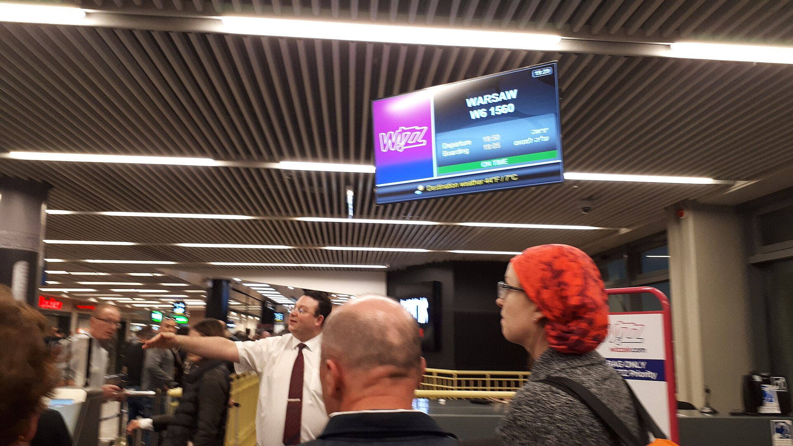
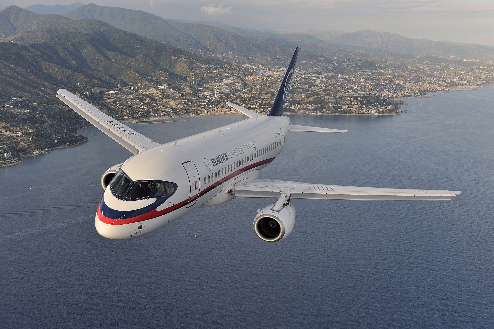

מחירי הטיסות לחו"ל מנמל התעופה בן-גוריון נותרו גבוהים באופן ניכר לעומת התקופה שקדמה למלחמה, וזאת אף שחברות התעופה הזרות חוזרות בהדרגה להפעיל קווים לישראל. הצרכן הישראלי, שהתרגל בשנים שלפני 2023 לכרטיסים זולים ליעדים באירופה, מגלה כעת שהמחירים בעונת השיא עדיין רחוקים מהרמות שהכיר — אך המגמה, לראשונה מזה זמן רב, מתחילה להתהפך.

הסיבה המרכזית היא פשוטה: כלכלה של היצע וביקוש. במהלך המלחמה עזבו רוב חברות התעופה הזרות את השוק הישראלי, ואל על וחברות מקומיות נוספות נותרו כמעט לבדן בזירה. התוצאה הייתה זינוק חד במחירים. כיום, עם חזרת הענקיות הזרות, ההיצע גדל — אך הביקוש הכבוש של הישראלים לחופשות בחו"ל שומר על התמחור ברמה גבוהה.

## מה מייקר את מחירי הטיסות?

כמה גורמים מרכזיים מרכיבים את מחיר הכרטיס שאתם משלמים, ולא כולם בשליטת חברת התעופה:

- **היטלי ביטחון ואבטחה**: הטיסה לישראל וממנה כרוכה בעלויות אבטחה גבוהות, שמגולגלות לצרכן.
- **מחירי הדלק (הג'ט)**: מרכיב מהותי בעלות התפעולית, הנתון לתנודות בשוק הנפט העולמי.
- **ביטוחי מלחמה**: פרמיות הביטוח על טיסות בקווים לישראל עלו משמעותית מאז אוקטובר 2023.
- **עומס ביקוש**: בעונות השיא — חגים, חופש גדול ותקופות גשר — הביקוש מרקיע והמחיר עולה בהתאם.

### עד כמה יקר יותר לטוס היום?

הערכות בענף מצביעות על כך שכרטיס טיסה ליעד אירופי פופולרי בעונת השיא עשוי לעלות בעשרות אחוזים לעומת רמות המחירים של 2019. ככל שחברות נוספות מחזירות טיסות, הפער הזה מצטמצם, בעיקר בעונות הביניים ובימי חול.

## טבלת השוואה: אפיקי חיסכון בהזמנת טיסה

| שיטה | פוטנציאל החיסכון | למי מתאים |
|---|---|---|
| הזמנה מוקדמת (3-6 חודשים) | בינוני-גבוה | מתכננים מראש |
| גמישות בתאריכים (טיסות אמצע שבוע) | גבוה | ללא מסגרת קשיחה |
| חברות תעופה זולות (לואו קוסט) | גבוה | נוסעים ללא מזוודה |
| שדות תעופה משניים | בינוני | מוכנים לנסיעה נוספת |
| שימוש בנקודות ומועדוני נוסע מתמיד | משתנה | טסים בתדירות גבוהה |

## איך חוסכים במחירי הטיסות?

המפתח לחיסכון הוא **גמישות**. נוסע שיכול להזיז את תאריכי הטיסה ביום-יומיים, לעיתים ימצא הפרשי מחירים של מאות שקלים. טיסות באמצע השבוע כמעט תמיד זולות יותר מטיסות בסופי שבוע.

כדאי גם להשוות בין חברות התעופה השונות — כולל הזרות שחזרו — ולא להסתפק בבדיקה בודדת. אתרי השוואת מחירים וחיפוש בטווח תאריכים רחב הם כלי בסיסי לכל צרכן חכם. עבור נוסעים ליעדים קרובים באירופה, חברות הלואו קוסט מציעות לרוב את המחיר הבסיסי הזול ביותר — ובלבד שנוסעים קלים ומוותרים על מזוודה במטען.

טיפ נוסף: בדקו את מחיר הטיסה גם משדות תעופה משניים ביעד. לעיתים נחיתה בשדה מרוחק מעט ממרכז העיר חוסכת סכום משמעותי, ששווה גם לאחר עלות ההסעה.

## מה צפוי בהמשך?

המגמה ברורה: ככל שחברות התעופה הזרות ירחיבו את פעילותן בישראל, כך תתחזק התחרות ומחירי הטיסות צפויים להמשיך ולרדת בהדרגה. עם זאת, גורמים חיצוניים — כמו מחירי הדלק העולמיים והמצב הביטחוני — ימשיכו להשפיע על התמחור. הצרכן הישראלי, שרגיל לחפש עסקות, ייהנה מכל חברה נוספת שנוחתת מחדש בנתב"ג.

בשורה התחתונה, מחירי הטיסות לחו"ל עדיין גבוהים מהרגלים שהכרנו, אך התחזית האופטימית היא שהתחרות המתחדשת תיטיב עם הכיס. עד אז, תכנון מוקדם וגמישות הם הנשק הטוב ביותר של הנוסע החוסך.
