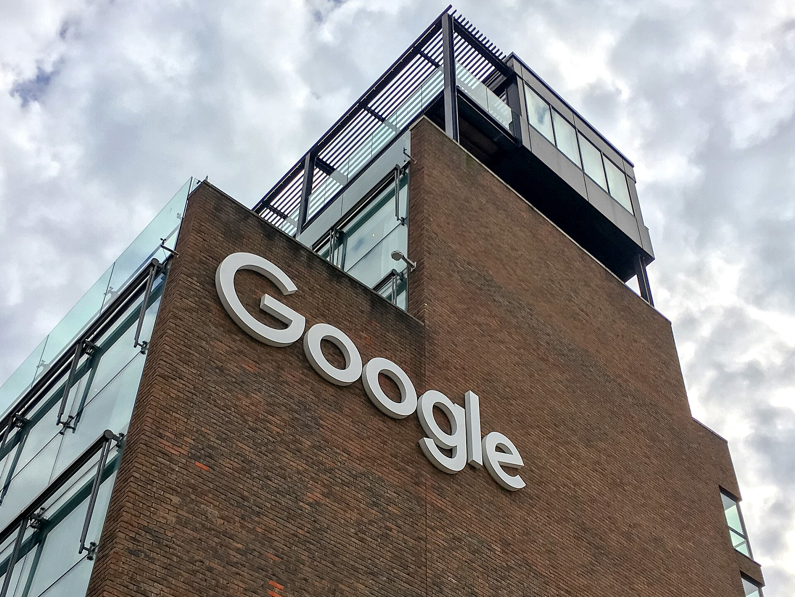

רכישת וויז (Wiz) בידי גוגל, בעסקה הנאמדת בכ-32 מיליארד דולר, היא האקזיט הגדול ביותר בתולדות ההייטק הישראלי — ומהלך שמסמן את התבגרותו של ענף הסייבר המקומי לכדי מעצמה עולמית. חברת אבטחת הענן, שהוקמה רק בשנת 2020, הצליחה בתוך פחות מחמש שנים להפוך לאחת החברות המבוקשות ביותר בעולם, במחיר שמנפץ את כל התקדימים הקודמים.

רכישת וויז אינה רק סיפור הצלחה של ארבעה יזמים ישראלים — היא עדות למקומה של ישראל במפת החדשנות העולמית, ולעוצמתו של ענף הסייבר שממשיך למשוך את הענקיות הגדולות בעולם.

## מי עומד מאחורי וויז?

וויז הוקמה בידי צוות מייסדים בראשות אסף רפפורט, יחד עם שותפיו יינון קוסטיקה, עמי לוטבק וroy רזניק — צוות שכבר הוכיח את עצמו בעבר עם החברה אדלום (Adallom), שנמכרה למיקרוסופט. לאחר שנים בענקית התוכנה, החליטו המייסדים לצאת לדרך עצמאית ולתקוף את אחד האתגרים המרכזיים של העידן הדיגיטלי: אבטחת סביבות הענן.

החברה פיתחה פלטפורמה שמאפשרת לארגונים לזהות ולתעדף סיכוני אבטחה בסביבות ענן מורכבות, ובכך צמחה במהירות חסרת תקדים. תוך זמן קצר היא צברה מאות לקוחות ארגוניים גדולים והגיעה להכנסות שנתיות חוזרות של מאות מיליוני דולרים.

## מדוע גוגל שילמה סכום כה גבוה?

העניין של גוגל בוויז נובע מהצורך של ענקית הטכנולוגיה לחזק את מערך הענן שלה, גוגל קלאוד, מול המתחרות אמזון ומיקרוסופט. אבטחת מידע הפכה לזירת קרב מרכזית במלחמת הענן העולמית, ורכישת וויז מעניקה לגוגל יתרון טכנולוגי משמעותי.

זו אינה הפעם הראשונה שגוגל מנסה לרכוש את וויז — ניסיון קודם בשנת 2024 נכשל לאחר שהמייסדים בחרו להמשיך בדרך העצמאית ולשאוף להנפקה. העובדה שהעסקה יצאה לפועל בסופו של דבר, ובמחיר גבוה משמעותית, מדגישה עד כמה החברה קריטית לאסטרטגיית הענן של גוגל.

### השוואה: האקזיטים הגדולים בהייטק הישראלי

| חברה | רוכשת | היקף עסקה (מוערך) | תחום |
|------|--------|-------------------|------|
| וויז | גוגל | כ-32 מיליארד דולר | אבטחת ענן |
| מובילאיי | אינטל | כ-15 מיליארד דולר | רכב אוטונומי |
| מלאנוקס | אנבידיה | כ-7 מיליארד דולר | תשתיות רשת |
| אנוביס (Annapurna) | אמזון | כ-350 מיליון דולר | שבבים |

## מה המשמעות עבור הכלכלה הישראלית?

אקזיט בסדר גודל כזה משפיע הרבה מעבר למייסדים ולמשקיעים. חלק ניכר מההון צפוי לזרום חזרה אל האקוסיסטם המקומי — עובדים שמימשו אופציות, יזמים שיקימו חברות חדשות, וקרנות הון סיכון שיגייסו כספים נוספים.

עם זאת, לעסקה יש גם היבט מורכב: מכירת חברות דגל לענקיות זרות מעוררת מחדש את הדיון על "סינדרום האקזיט" — האם ישראל מסתפקת בהקמת חברות ומכירתן מוקדם, במקום לבנות חברות ענק עצמאיות שיישארו ציבוריות בבורסה? מנגד, וויז נמכרה בשלב מתקדם יחסית ובשווי אדיר, מה שמעיד על בשלות הענף.

## מה הלאה לענף הסייבר הישראלי?

ישראל ממשיכה להיות אחת ממעצמות הסייבר המובילות בעולם, עם עשרות חברות פעילות ומאות מיליוני דולרים בגיוסים מדי שנה. הצלחתה של וויז צפויה לעודד גל חדש של יזמים לתחום, ולמשוך משקיעים זרים נוספים לשוק המקומי.

במקביל, העסקה מחזקת את המגמה שבה ענקיות הטכנולוגיה העולמיות רואות בישראל מקור מרכזי לטכנולוגיה מתקדמת בתחומי הסייבר, הבינה המלאכותית ותשתיות הענן. עבור המשקיע הישראלי, מדובר בתזכורת לכך שהחדשנות המקומית ממשיכה לייצר ערך כלכלי עצום, גם בתקופות של אי-ודאות בשווקים.
