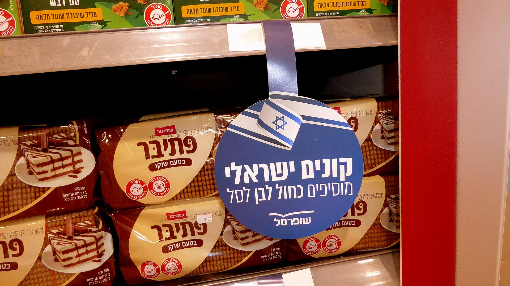

הצרכן הישראלי מחפש דרכים לחתוך את הוצאות המזון, והתשובה הבולטת ביותר שנמצאה על המדף היא **המותגים הפרטיים** של רשתות השיווק. אלו מוצרים הנושאים את שם הרשת — שופרסל, רמי לוי, ויקטורי, יינות ביתן ואחרות — ונמכרים במחיר נמוך משמעותית מהמותגים המובילים, לעיתים בפער של 20%-40%. על רקע יוקר המחיה וגל ההתייקרויות בסל המזון, המותגים הפרטיים הפכו ממוצר שולי למנוע החיסכון המרכזי של משק הבית.

## למה המותגים הפרטיים זולים יותר?

הפער המחירי אינו מקרי. המותג הפרטי חוסך שרשרת שלמה של עלויות: אין השקעה עצומה בפרסום ובשיווק, אין מרווח למותג היצרן, והרשת מזמינה ישירות מיצרנים — לעיתים אותם מפעלים שמייצרים גם את המותגים המובילים. התוצאה היא מוצר דומה, ולעיתים זהה כמעט לחלוטין, במחיר נמוך יותר.

הרשתות מצדן דוחפות את הקו הפרטי כי הוא משפר את שולי הרווח שלהן ומחזק את נאמנות הלקוחות. ככל שהצרכן מתרגל למותג הפרטי של רשת מסוימת, כך גדל הסיכוי שיחזור אליה.

## כמה באמת חוסכים? השוואת קטגוריות

החיסכון משתנה מאוד לפי סוג המוצר. בקטגוריות בסיס — מוצרי ניקיון, קטניות, שימורים, נייר טואלט ומוצרי חלב בסיסיים — הפער עשוי להיות דרמטי. במוצרים ממותגים חזק, כמו חטיפים או משקאות מוגזים, הצרכן לעיתים מעדיף דווקא את המותג המוכר.

| קטגוריה | מותג מוביל (הערכה) | מותג פרטי (הערכה) | חיסכון משוער |
|---|---|---|---|
| נייר טואלט | ₪28 | ₪17 | כ-40% |
| קטניות ושימורים | ₪7 | ₪4.5 | כ-35% |
| מוצרי ניקיון | ₪18 | ₪11 | כ-38% |
| מוצרי חלב בסיסיים | ₪7 | ₪5.5 | כ-20% |
| חטיפים ומתוקים | ₪12 | ₪9 | כ-25% |

*הנתונים הם הערכות להמחשה בלבד ומשתנים בין רשתות ומבצעים.*

## האם האיכות נפגעת?

זו השאלה שמעסיקה את הצרכנים יותר מכל. התשובה תלויה בקטגוריה. במוצרים "פשוטים" — סוכר, קמח, נייר, קטניות — כמעט אין הבדל מורגש, והמעבר למותג הפרטי הוא כמעט חסר סיכון. לעומת זאת, במוצרים שבהם המרכיב, הטעם או המרקם משמעותיים, כמו קפה, שוקולד או מוצרי בשר מעובדים, יש שיטענו שהמותג המוביל עדיין מוביל בטעם.

המלצת המומחים פשוטה: לבחון קטגוריה-קטגוריה. אפשר להתחיל ממוצרי הבסיס, שם החיסכון גדול והסיכון קטן, ולהשאיר את המותגים המובילים למוצרים שבהם ההעדפה האישית חשובה.

## המגמה: נתח השוק גדל

בשנים האחרונות נתח המותגים הפרטיים בסל הישראלי צומח בעקביות, אם כי הוא עדיין נמוך ביחס למדינות מערב אירופה, שם המותג הפרטי תופס לעיתים כשליש ואף יותר מהמכירות. הפוטנציאל לצמיחה גדול, והרשתות מזהות זאת — הן מרחיבות את קווי המוצרים הפרטיים, כולל קווי "פרימיום" שמנסים להתחרות באיכות ולא רק במחיר.

התחרות בין הרשתות על נאמנות הצרכן, יחד עם כניסתן של רשתות דיסקאונט וחיזוק הרכישות המקוונות, צפויה להאיץ את המגמה. עבור הצרכן הישראלי, המשמעות היא יותר אפשרויות זולות על המדף — ובלבד שיידע לבחור נכון.

## איך לקנות חכם עם מותגים פרטיים

- **התחילו ממוצרי בסיס**: ניקיון, קטניות, נייר — שם החיסכון גדול והפער באיכות זניח.
- **השוו מחיר ליחידה**, לא מחיר לאריזה — לעיתים אריזה גדולה של מותג פרטי משתלמת במיוחד.
- **בדקו את היצרן**: לא פעם המותג הפרטי מיוצר במפעל של המותג המוביל.
- **אל תתפשרו על טעם**: אם קטגוריה מסוימת חשובה לכם, שמרו על המותג המוכר ותחסכו במקום אחר.
