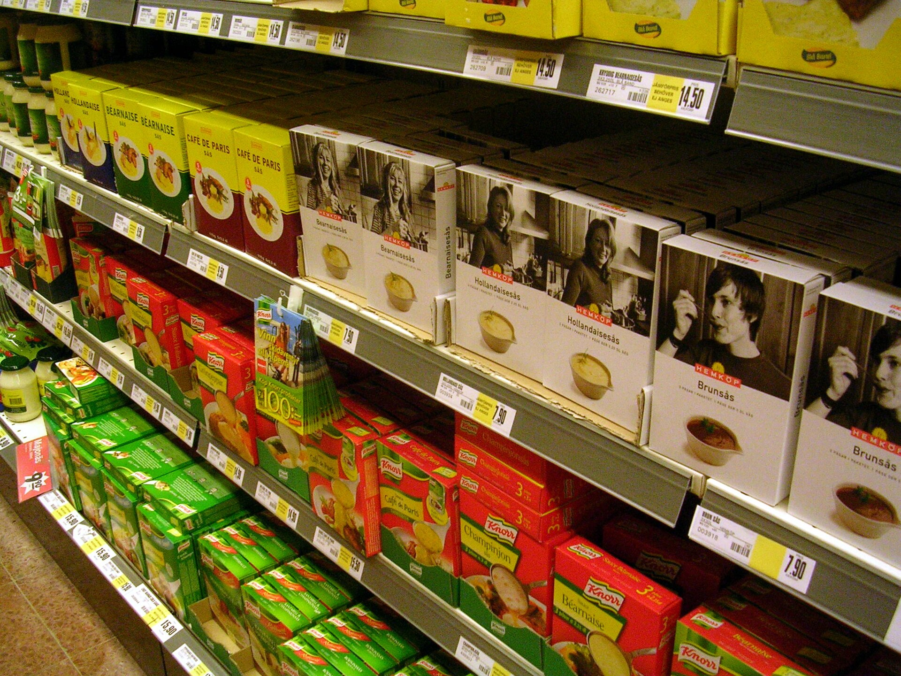

על רקע יוקר המחיה המתמשך וגל התייקרויות במדפים, **מוצרי המותג הפרטי** של רשתות המזון הפכו לכלי החיסכון הבולט ביותר של הצרכן הישראלי. מדובר במוצרים הנושאים את שם הרשת (או מותג ייעודי שלה) במקום שם של יצרן מוכר, ומחירם נמוך בדרך כלל ב-20% עד 50% ממקבילותיהם ה"ממותגות" — בלי שהאיכות נופלת בהכרח.

## מה זה בעצם מותג פרטי?

מותג פרטי הוא קו מוצרים שהרשת הקמעונאית מזמינה מיצרנים — לעיתים מאותם מפעלים שמייצרים את המותגים המובילים — ומוכרת תחת השם שלה. הרשת חוסכת את עלויות הפרסום, השיווק והמיתוג שהיצרן הגדול מגלגל על הצרכן, ומעבירה חלק מהחיסכון למחיר המדף.

בשנים האחרונות הפכו סדרות אלה מ"מוצרי מדף תחתון" זולים ואפורים לקטגוריה שלמה ומתוחכמת. שופרסל עם המותגים שלה, רמי לוי, ויקטורי, יינות ביתן, אושר עד וטיב טעם — כולן הרחיבו משמעותית את מגוון המותג הפרטי, מפסטה ושימורים ועד מוצרי טיפוח, ניקוי ומזון מעובד.

## כמה באמת אפשר לחסוך?

הפער המשמעותי ביותר מופיע דווקא במוצרים הבסיסיים, שבהם הצרכן פחות רגיש למותג: קטניות, שימורים, נייר טואלט, מוצרי ניקוי ומוצרי חלב בסיסיים. בקטגוריות אלה החיסכון יכול להגיע לחצי מהמחיר.

להלן השוואה כללית להמחשת סדרי הגודל (המחירים הם הערכה בלבד ומשתנים בין רשתות ומבצעים):

| קטגוריה | מותג מוביל (הערכה) | מותג פרטי (הערכה) | חיסכון משוער |
|---|---|---|---|
| קופסת קורנפלקס | כ-22 ש"ח | כ-13 ש"ח | כ-40% |
| חבילת נייר טואלט | כ-30 ש"ח | כ-18 ש"ח | כ-40% |
| שימורי טונה (מארז) | כ-25 ש"ח | כ-15 ש"ח | כ-40% |
| נוזל כלים | כ-15 ש"ח | כ-8 ש"ח | כ-45% |
| פסטה (חבילה) | כ-8 ש"ח | כ-4 ש"ח | כ-50% |

על בסיס סל קניות חודשי ממוצע, מעבר של חלק ניכר מהמוצרים למותג הפרטי יכול לחסוך למשפחה מאות שקלים בחודש — סכום שמצטבר לאלפי שקלים בשנה.

## האם האיכות נמוכה יותר?

זו השאלה המרכזית, והתשובה מורכבת. במוצרים גנריים רבים — מלח, סוכר, קטניות, נייר — כמעט שאין הבדל, ולעיתים מדובר במוצר זהה מאותו פס ייצור. לעומת זאת, בקטגוריות שבהן הטעם או המרקם קריטיים (שוקולד, קפה, חטיפים, מוצרי בשר מעובד) הפער האיכותי עשוי להיות מורגש יותר.

ההמלצה הצרכנית הפרקטית: לעבור למותג הפרטי בהדרגה, מוצר-מוצר, ולבחון מה עובד עבורכם. בבסיסיים כדאי כמעט תמיד; במוצרי הפינוק — לטעום ולהחליט.

### מדוע הרשתות דוחפות את המותג הפרטי?

מבחינת הרשתות, מוצרי **המותג הפרטי** אינם רק כלי לחיסכון של הלקוח — הם מכשיר עסקי מרכזי. שולי הרווח של הרשת על מותג פרטי גבוהים לרוב מאלה שהיא מרוויחה ממכירת מותג של יצרן חיצוני, גם כשהמחיר לצרכן נמוך יותר. בנוסף, המותג הפרטי מחזק את נאמנות הלקוח לרשת ומקטין את התלות ביצרנים הגדולים.

התוצאה היא מלחמת שיווק שקטה: הרשתות מציבות את מוצרי המותג הפרטי בגובה העיניים, לצד מבצעים אגרסיביים, כדי להטות את בחירת הצרכן.

## מה חשוב לבדוק לפני שממלאים את העגלה

- **מחיר ליחידת מידה** — לא תמיד המוצר הזול בעגלה זול לק"ג או לליטר. בדקו את המחיר ל-100 גרם או לליטר.
- **רשימת רכיבים** — לעיתים המותג הפרטי חוסך גם ברכיבים; שווה השוואה, במיוחד לבעלי רגישויות.
- **מבצעים על מותגים מובילים** — לעיתים מבצע חד על מותג מוכר מוזיל אותו מתחת למותג הפרטי; שווה השוואה נקודתית.
- **חנויות דיסקאונט וסיטונאיות** — שם הפער בין מותג פרטי למוביל עשוי להצטמצם.

## שורה תחתונה

עבור צרכן שמחפש לחתוך את הוצאות המזון בלי לוותר על כמות, מוצרי המותג הפרטי הם ההזדמנות הברורה ביותר במדף. בקטגוריות הבסיסיות מדובר כמעט בהחלטה אוטומטית, ובקטגוריות הטעם — בעניין של ניסוי אישי. בעידן שבו כל אחוז ביוקר המחיה מורגש בארנק, מעבר מושכל למותג הפרטי הוא אחד הצעדים הפשוטים והמשתלמים ביותר שהמשפחה הישראלית יכולה לעשות.
