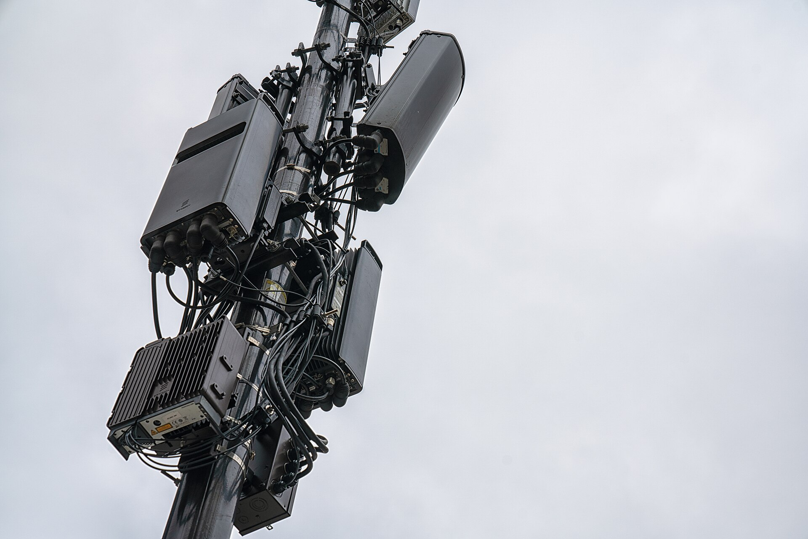

מחירי הסלולר בישראל שבים למרכז הבמה הצרכנית, כשמלחמת מחירים מחודשת בין המפעילות הגדולות והקטנות מציפה את השוק במבצעי היכרות אגרסיביים. השורה התחתונה לצרכן: מי שמוכן לבדוק, להשוות ולעבור ספק יכול לחסוך עשרות שקלים בחודש — מאות שקלים בשנה — על אותה כמות גלישה בדיוק.

שוק הסלולר הישראלי נחשב כבר שנים לאחד התחרותיים והזולים בעולם המפותח, מאז הרפורמה שפתחה אותו לתחרות בתחילת העשור הקודם. אלא שגם בתוך המחירים הנמוכים הללו נפער פער עצום בין הלקוחות ה"ותיקים", שמשלמים לעיתים סכומים גבוהים על חבילות ישנות, לבין לקוחות חדשים שנהנים ממבצעי היכרות.

## מה מניע את מלחמת מחירי הסלולר בישראל?

התחרות בשוק חריפה במיוחד בשל ריבוי השחקנים: לצד המפעילות הגדולות פועלות מפעילות וירטואליות (חברות המשווקות זמן אוויר על גבי רשתות קיימות) שמושכות את המחירים כלפי מטה. כל אחת נלחמת על נתח שוק בענף שבו קשה מאוד לגדול — כמעט לכל ישראלי כבר יש קו פעיל.

המנוע העיקרי כיום הוא המעבר לדור החמישי. המפעילות השקיעו מיליארדים בפריסת רשתות מהירות, וכעת הן מנסות להצדיק את ההשקעה על ידי משיכת לקוחות לחבילות גדולות יותר. התוצאה: מבצעים שמציעים נפחי גלישה אדירים — לעיתים "ללא הגבלה" — במחירים נמוכים.

## איפה מסתתרים המלכודות במבצעי הסלולר?

המלכודת הנפוצה ביותר היא **מבצע היכרות מוגבל בזמן**. חבילה שמפורסמת בעשרות שקלים בודדים תקפה לרוב לתקופה של שנה עד שנתיים, ולאחר מכן המחיר מזנק אוטומטית. חברות רבות מסתמכות על כך שהלקוח "ישכח" לבדוק את החשבון ויישאר לשלם את המחיר המלא.

נקודות נוספות שכדאי לבדוק:

- **התחייבות מול גמישות** — רוב החבילות כיום ללא התחייבות, אך מכשירים במימון עשויים לכבול אתכם.
- **נפח גלישה אמיתי** — "ללא הגבלה" לעיתים כולל האטת מהירות לאחר צריכה מסוימת.
- **שיחות ונדידה לחו"ל** — תוספת שיכולה לייקר משמעותית את החשבון.
- **דמי הקמה או עלויות נלוות** — לרוב מבוטלים, אך כדאי לוודא.

## השוואת סוגי חבילות סלולר

הטבלה הבאה ממחישה את טווחי המחירים המקובלים בשוק הישראלי (הערכות כלליות, לא כולל מבצעים נקודתיים):

| סוג חבילה | טווח מחיר חודשי משוער | למי מתאים |
|---|---|---|
| חבילה בסיסית (גלישה מוגבלת) | כ-10-20 ש"ח | משתמשים קלים, קו משני |
| חבילה סטנדרטית (נפח גדול) | כ-20-40 ש"ח | המשתמש הממוצע |
| חבילת דור חמישי מלאה | כ-40-70 ש"ח | גולשים כבדים, סטרימינג |
| חבילה משפחתית (מספר קווים) | כ-60-120 ש"ח | משפחות, חיסכון לקו |

## כך תחסכו בהוצאות הסלולר

הצעד הראשון והחשוב ביותר הוא פשוט **לבדוק כמה אתם משלמים היום**. צרכנים רבים מופתעים לגלות שהם משלמים פי שניים ואף יותר מהמחיר שמוצע ללקוחות חדשים על אותה חבילה בדיוק.

המעבר בין מפעילות הפך מהיר ופשוט: ניתן להעביר את מספר הטלפון תוך זמן קצר וללא עלות, וזהו כלי המיקוח החזק ביותר של הצרכן. גם אם אינכם מעוניינים לעבור, עצם האיום לעזוב מוביל פעמים רבות את מוקד השימור של החברה להציע הנחה משמעותית.

טיפ נוסף: **חבילות משפחתיות** מוזילות משמעותית את העלות לקו כשמאגדים מספר בני משפחה תחת חשבון אחד. כדאי גם להתאים את החבילה לצריכה האמיתית — אין טעם לשלם על נפח גלישה עצום אם רוב הזמן אתם מחוברים לרשת אלחוטית בבית ובעבודה.

## מה צפוי בהמשך?

הצפי הוא שהתחרות תישאר עזה, במיוחד סביב הרחבת הדור החמישי ושירותים נלווים כמו קווי אינטרנט ביתי ותכני סטרימינג הנמכרים בחבילה אחת. עבור הצרכן, המשמעות ברורה: אין סיבה להישאר "נאמן" לחבילה יקרה. שוק הסלולר הוא אחד המקומות הבודדים שבהם בדיקה של רבע שעה יכולה להניב חיסכון של מאות שקלים בשנה, ללא כל פגיעה באיכות השירות.
