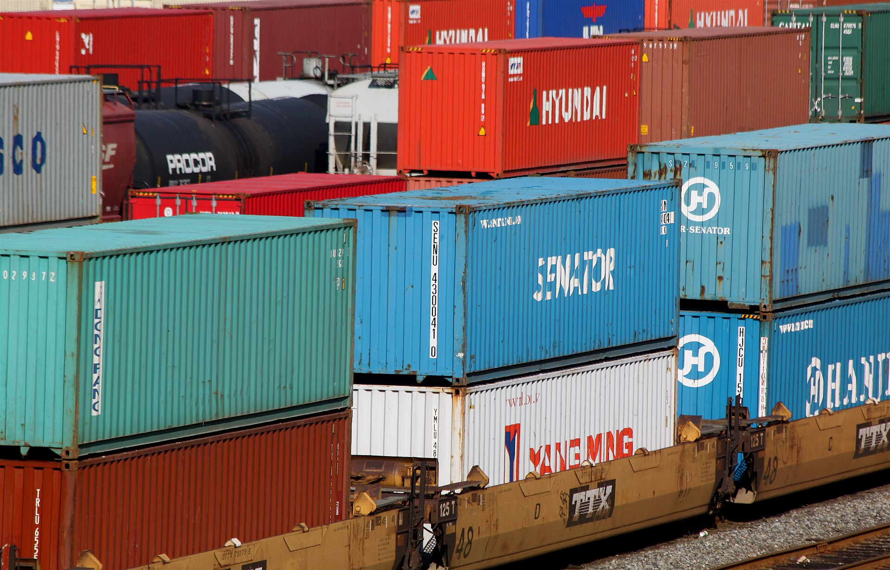

גל הקניות אונליין מחו"ל שוטף את ישראל בעוצמה חסרת תקדים: מיליוני חבילות זולות מגיעות מדי חודש מהזירות הסיניות טמו, שיין ועלי אקספרס, כשהן מציעות לצרכן הישראלי מוצרים במחירים שהקמעונאות המקומית מתקשה להתחרות בהם. התופעה, שהאיצה בשנתיים האחרונות, הפכה את הקנייה מחו"ל מהרגל של מעטים למגמת צריכה רוחבית שמשנה את דפוסי הצריכה במשק.

## מדוע קניות אונליין מחו"ל מזנקות?

הסיבה המרכזית פשוטה: מחיר. פלטפורמות כמו טמו ושיין מוכרות ישירות מהיצרן לצרכן, מדלגות על שרשרת מתווכים ארוכה, ונהנות מעלויות ייצור ושילוח נמוכות. התוצאה היא מוצרי אופנה, אלקטרוניקה, אביזרי בית וגאדג'טים במחירים שלעיתים נמוכים בעשרות אחוזים ממחירם בישראל.

גורם מאיץ נוסף הוא **פטור המכס על ייבוא אישי** עד סכום של 75 דולר, שהופך רכישות קטנות לכדאיות במיוחד — ללא מכס וללא מס קנייה. בתוספת ממשקי משתמש ממכרים, מבצעים אגרסיביים והתראות "מלאי אוזל", הזירות הסיניות בנו מכונת שיווק שממכרת את הצרכן הישראלי לקנייה תכופה.

## מי מרוויח ומי מפסיד

הצרכן, לכאורה, המרוויח הגדול: נגישות למגוון עצום במחירים נמוכים. אך התמונה מורכבת. הקמעונאות הישראלית — מרשתות האופנה ועד חנויות האלקטרוניקה — טוענת לתחרות לא הוגנת, שכן היא כפופה למכס, מע"מ, תקינה ורגולציה מחמירה, בעוד המשלוחים הישירים מחו"ל נהנים מפטורים והקלות.

### עמדת הרגולטור

במשרד האוצר ובגורמי המסחר נבחנת בשנה החולפת האפשרות לצמצם או לבטל את פטור המכס, כפי שנעשה במדינות אחרות. באיחוד האירופי ובארה"ב מתקדמות יוזמות דומות לצמצום פטורי הייבוא הזעיר, מתוך רצון להגן על השוק המקומי ולהגדיל את הכנסות המדינה.

## טבלת השוואה: קנייה מקומית מול קנייה מחו"ל

| פרמטר | קנייה בישראל | קנייה מהזירות הסיניות |
|---|---|---|
| מחיר | גבוה יותר | נמוך משמעותית |
| זמן אספקה | ימים בודדים | שבועיים עד חודש |
| החזרות ואחריות | נוחות, לפי חוק הגנת הצרכן | מסובכות ולעיתים בלתי אפשריות |
| תקינה ובטיחות | פיקוח מלא | חלקי או חסר |
| מיסוי | מע"מ ומכס מלאים | פטור עד 75 דולר |

## הסיכונים שמאחורי המחיר הזול

לצד ההזדמנות, הצרכן חשוף לסיכונים. איכות המוצרים אינה אחידה, פערים בין התמונה למוצר בפועל שכיחים, ותהליכי החזרה כרוכים לרוב בשליחה חזרה יקרה ומורכבת לסין. בנוסף, מוצרי חשמל ואלקטרוניקה עלולים שלא לעמוד בתקן הישראלי, מה שמעלה חשש בטיחותי.

גם היבט הפרטיות עולה לכותרת: זירות הסחר אוספות כמויות עצומות של מידע על הרגלי הצריכה, ורגולטורים במערב הביעו חשש משימוש במידע זה.

## מה צפוי בהמשך?

המגמה צפויה להעמיק, אך גם להיתקל ברגולציה מתהדקת. אם יבוטל פטור המכס או יוקטן, מחירי הקנייה מחו"ל יתייקרו, ופער המחירים מול השוק המקומי יצטמצם. במקביל, קמעונאים ישראלים משקיעים בזירות מסחר מקוונות משלהם ובשיפור חוויית הקנייה, כדי לשמר נתח שוק.

בשורה התחתונה, **קניות אונליין מחו"ל** הפכו לחלק בלתי נפרד מהצריכה הישראלית — אך על הצרכן לשקלל לא רק את המחיר, אלא גם את האיכות, זמני האספקה, האחריות והסיכונים הנלווים.
