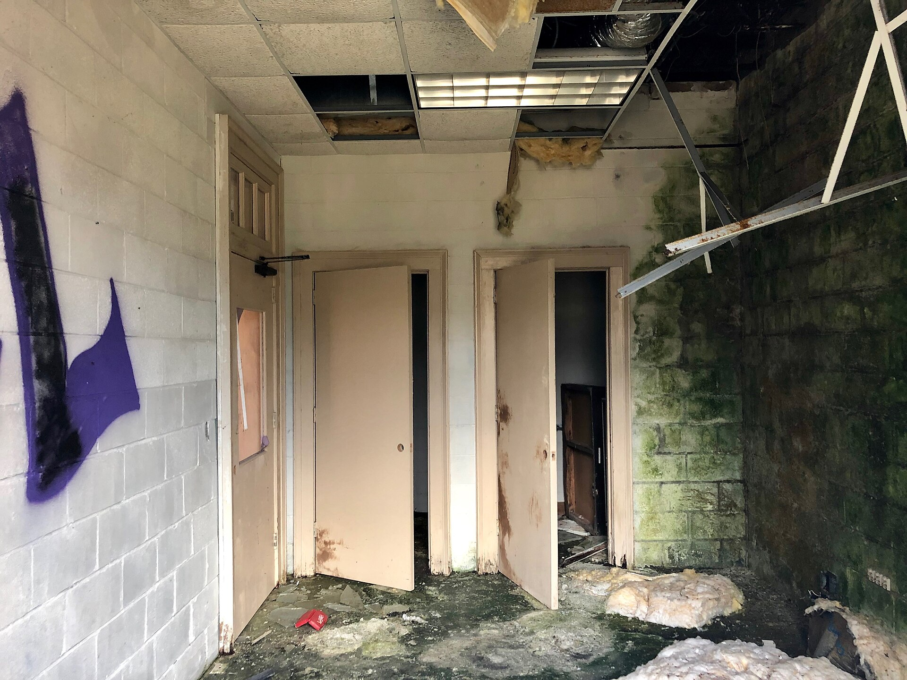

שוק המשרדים בישראל נמצא בנקודת מפנה: לאחר שנים של ביקוש גואה ובנייה קדחתנית של מגדלים, שיעור השטחים הריקים בגוש דן ובמוקדי התעסוקה המרכזיים נמצא במגמת עלייה. השילוב של האטה בענף ההיי-טק, התבססות מודל העבודה ההיברידית וכניסת היצע חדש ומאסיבי לשוק — יצר עודף שטחים שמפעיל לחץ על דמי השכירות ומעורר סימני שאלה בקרב משקיעים ומנהלי נכסים.

## למה מתרבים השטחים הריקים במשרדים?

מספר גורמים מצטלבים מסבירים את השינוי בשוק המשרדים בישראל. ראשית, ענף ההיי-טק — הצרכן הגדול ביותר של שטחי משרדים איכותיים — עבר תקופה של התייעלות, פיטורים וצמצום בגיוסי הון. חברות שגייסו עובדים בקצב מהיר בשנים 2021–2022, וחתמו על חוזי שכירות ארוכי טווח לשטחים גדולים, מצאו את עצמן עם מטרים מיותרים.

שנית, מודל העבודה ההיברידית הפך לנורמה. כאשר חלק ניכר מהעובדים מגיעים למשרד שלושה ימים בשבוע בלבד, החברות מגלות שהן זקוקות לפחות מטרים לעובד. רבות מהן מוותרות על קומות שלמות או עוברות לשטחי עבודה גמישים במקום חוזים קשיחים.

שלישית, וזה אולי הגורם הדרמטי ביותר, הוא ההיצע. עשרות פרויקטים של מגדלי משרדים שיצאו לדרך בשנות הגאות מגיעים כעת לסיום בנייה ונכנסים לשוק בו-זמנית — בדיוק כשהביקוש מתקרר.

### היכן הלחץ מורגש יותר?

התמונה אינה אחידה. באזורי הביקוש המובהקים, כמו לב תל אביב וקרבת צירי הרכבת הקלה, התפוסה נותרה גבוהה יחסית. לעומת זאת, בפריפריה העסקית ובמגדלים חדשים שטרם התמלאו, שיעור השטחים הפנויים גבוה משמעותית, והמשכירים נאלצים להציע תמריצים — חודשי שכירות ללא תשלום, השתתפות בעלויות התאמה ותנאים גמישים.

## איך זה משפיע על דמי השכירות?

הכלל בשוק הנדל"ן המניב פשוט: כאשר ההיצע עולה על הביקוש, המחירים יורדים. בפועל, במקום להוריד את המחיר "על הנייר" ולפגוע בשווי הנכס בספרים, בעלי הנכסים מעדיפים לרוב להעניק הטבות עקיפות שמפחיתות את דמי השכירות האפקטיביים. כך נשמר המחיר המוצהר, אך העלות בפועל לשוכר יורדת.

| פרמטר | תקופת הגאות (2021–2022) | המצב הנוכחי |
|---|---|---|
| שיעור שטחים ריקים | נמוך מאוד | במגמת עלייה |
| כוח מיקוח | לטובת המשכיר | לטובת השוכר |
| תמריצים לשוכר | מעטים | נפוצים |
| היצע חדש נכנס לשוק | מתון | גבוה |
| ביקוש מצד היי-טק | גואה | מתון |

## מה המשמעות למשקיעים ולבורסה?

הקרנות המניבות הנסחרות בבורסה בתל אביב, המחזיקות תיקי נכסים מסחריים גדולים, רגישות מאוד לשני משתנים: שיעור התפוסה וגובה דמי השכירות. ירידה בתפוסה או שחיקה בדמי השכירות פוגעות בהכנסה התפעולית הנקייה ובשווי הנכסים. במקביל, סביבת הריבית הגבוהה של השנים האחרונות ייקרה את המימון ולחצה על שווי הנכסים המניבים בכל העולם.

עם זאת, חשוב לשמור על פרופורציות. שוק המשרדים הישראלי רחוק מהמשבר החריף שפוקד ערים כמו סן פרנסיסקו או ניו יורק, שם שיעורי השטחים הריקים הגיעו לרמות דו-ספרתיות גבוהות. הביקוש המבני בישראל, לצד צמיחת האוכלוסייה והריכוזיות הגיאוגרפית, מעניקים לשוק המקומי כרית ביטחון.

## מה צפוי בהמשך?

רוב הגורמים בענף מעריכים שהשנים הקרובות יתאפיינו ב"עיכול" ההיצע החדש. ככל שההיי-טק יתאושש והריבית תרד, הביקוש עשוי לחזור ולספוג את השטחים הפנויים. במקביל, צפויה האטה ביציאה לפרויקטים חדשים, מה שיאזן את השוק לאורך זמן.

המגמה הבולטת שתישאר היא הביקוש ל"משרדים איכותיים": בניינים חדשים, ירוקים, עם נגישות תחבורתית מעולה ומרחבי עבודה מודרניים. נכסים ישנים ומרוחקים יתקשו יותר להתמלא, ובעליהם ייאלצו לשקול השבחה או המרת ייעוד. עבור שוכרים, זהו חלון הזדמנויות נדיר לשדרג מיקום ותנאים במחיר אטרקטיבי.
