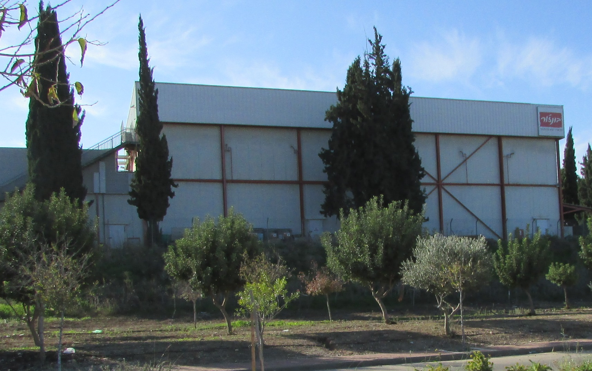

ענקית השבבים האמריקאית **אינטל**, אחת מהמעסיקות הפרטיות הגדולות בישראל ועוגן מרכזי של ההייטק המקומי, ניצבת בצומת דרכים. אינטל בישראל מפעילה מרכזי פיתוח ותכן מהמתקדמים בעולם ואת מפעל הייצור בקריית גת, אך על רקע הקשיים הפיננסיים של החברה-האם, עתיד ההשקעות בישראל הפך לשאלה שמטרידה את המשק כולו.

## מדוע אינטל בישראל כל כך חשובה למשק?

אינטל פועלת בישראל כבר עשרות שנים, ומהווה נדבך מרכזי בייצוא הטכנולוגי של המדינה. החברה מעסיקה אלפי עובדים במרכזי פיתוח בחיפה, בפתח תקווה ובירושלים, וכן במפעל השבבים בקריית גת — אחד המתקנים המשמעותיים ביותר של החברה מחוץ לארצות הברית.

המשמעות הכלכלית עצומה: אינטל היא אחת היצואניות הגדולות בישראל, ותורמת מיליארדי דולרים בשנה לייצוא. בנוסף, סביב המפעל בקריית גת התפתחה כלכלה מקומית שלמה — מקבלני משנה, דרך ספקי שירותים ועד נדל"ן למגורים. כל שינוי בהיקף הפעילות עלול לגלוש הרבה מעבר לשערי המפעל.

## מה מקור הקשיים של אינטל?

אינטל, שנחשבה במשך שנים לשליטה הבלתי-מעורערת בשוק המעבדים, איבדה בשנים האחרונות נתח שוק משמעותי. מספר גורמים התכנסו יחד:

- **פספוס מהפכת הבינה המלאכותית** — בעוד אנבידיה זינקה לשווי של טריליוני דולרים על גב הביקוש למעבדים גרפיים, אינטל נותרה מאחור.
- **תחרות עזה** — איי-אם-די כרסמה בנתח השוק של אינטל במעבדים, בעוד טי-אס-אם-סי הטייוואנית מובילה בייצור שבבים במיקור חוץ.
- **לחץ על הרווחיות** — מרווחי הרווח של החברה נשחקו, והמניה נסחרת בנאסד"ק הרחק משיאיה.

כחלק מתוכנית התייעלות גלובלית, אינטל הכריזה על קיצוצים נרחבים בכוח האדם ובהוצאות ההון ברחבי העולם, ובחינה מחדש של פרויקטי הרחבה — ובהם ההשקעה הענקית שתוכננה בקריית גת.

## אינטל בישראל מול המתחרות: תמונת מצב

כדי להבין את מיקומה של אינטל, כדאי להשוות אותה לשחקניות המרכזיות בתעשיית השבבים הגלובלית:

| חברה | תחום התמחות עיקרי | מעמד בשוק כיום |
|------|-------------------|----------------|
| אינטל | מעבדים למחשבים ולשרתים, ייצור עצמי | מובילה היסטורית, תחת לחץ תחרותי |
| אנבידיה | מעבדים גרפיים לבינה מלאכותית | בשיא, מנועת הביקוש למרכזי נתונים |
| טי-אס-אם-סי | ייצור שבבים במיקור חוץ | יצרנית השבבים הגדולה בעולם |
| איי-אם-די | מעבדים ומעבדים גרפיים | צוברת נתח שוק מהיר |

הטבלה ממחישה את האתגר: אינטל היא מהחברות הבודדות שגם מתכננת וגם מייצרת שבבים בעצמה, אך דווקא היתרון הזה הפך לנטל תזרימי בעידן שבו התכן והייצור מופרדים.

## מה עתיד ההשקעה בקריית גת?

לפני מספר שנים הכריזה אינטל על תוכנית להרחבה דרמטית של המפעל בקריית גת, מהלך שלווה בהתחייבות למענקים והטבות ממשלתיות. אולם על רקע הקיצוצים הגלובליים, לוחות הזמנים והיקף ההשקעה נבחנים מחדש.

עבור ישראל, מדובר בסוגיה רגישה. מצד אחד, המדינה התחייבה לתמרוץ בהיקף משמעותי; מצד שני, האטה בפרויקט עלולה לפגוע בתעסוקה ובצמיחה באזור הדרום. בנק ישראל ומשרד האוצר עוקבים מקרוב אחר ההתפתחויות, שכן לחברה משקל ניכר בנתוני הייצוא הלאומיים.

## מי עשוי להרוויח מהמשבר?

היחלשות של אינטל אינה בהכרח חדשות רעות לכלל ההייטק הישראלי. חברות שבבים אחרות, ובהן ענקיות בינלאומיות המפעילות מרכזי פיתוח בישראל, עשויות לקלוט מהנדסים מנוסים אם יתרחשו פיטורים. גם סטארטאפים ישראליים בתחום השבבים עשויים ליהנות מזמינות כישרונות.

עם זאת, המומחים מזהירים: אינטל אינה רק מעסיק אלא גם אבן שואבת לכל האקוסיסטם. פגיעה עמוקה בפעילותה בישראל תשלח גלים אל שרשרת ספקים שלמה, ותשליך על מוניטין ישראל כיעד להשקעות זרות בתעשיית הייצור המתקדם.

## שורה תחתונה

גורלה של אינטל בישראל שזור בגורל החברה-האם. אם אינטל תצליח להשתקם ולחזור למרוץ מול אנבידיה ואיי-אם-די, המפעל בקריית פורח יוכל להוות מנוע צמיחה לשנים. אם הקשיים יעמיקו, ישראל עלולה להידרש לחשיבה מחדש על מקומה בשרשרת האספקה העולמית של השבבים.
