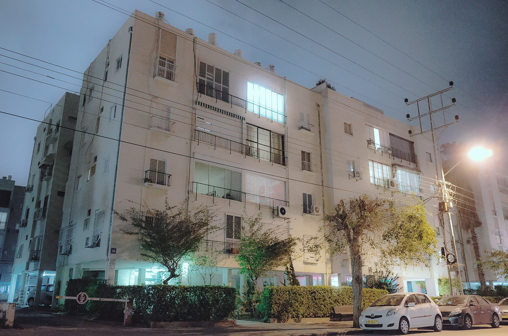

שכר הדירה בישראל ממשיך לטפס בקצב מהיר, כשבשנה החולפת נרשמו עליות דו-ספרתיות בשכירות בערים המרכזיות. הצירוף של ריבית גבוהה, האטה בהתחלות הבנייה וביקוש עקבי מצד משפחות שנדחקו מרכישת דירה — יצר לחץ מתמשך כלפי מעלה על מחירי השכירות, והפך את שוק השכירות לאחד המוקדים הבוערים ביותר בכלכלה הישראלית.

## מדוע שכר הדירה מזנק דווקא עכשיו?

הסיבה המרכזית לעליית שכר הדירה היא פער מבני בין היצע לביקוש. בשנים האחרונות ירד קצב התחלות הבנייה, בין היתר בשל עליית עלויות המימון לקבלנים, מחסור בכוח אדם בענף הבנייה, וסביבת ריבית גבוהה שמייקרת את הפרויקטים. במקביל, הריבית הגבוהה שהותיר בנק ישראל דחקה משקי בית רבים מחוץ לשוק רכישת הדירות — משכנתה הפכה יקרה, וזוגות צעירים רבים בחרו (או נאלצו) להישאר בשכירות.

התוצאה: יותר ביקוש לדירות להשכרה, מול היצע שאינו מתרחב באותו קצב. במצב כזה, בעלי הדירות נהנים מכוח תמחור גבוה, ושכר הדירה מטפס.

### השפעת המלחמה והתזוזות הפנימיות

גם התנועה הפנימית של אוכלוסייה תרמה ללחץ. מפונים ומשפחות שעברו ממוקדי סיכון אל מרכז הארץ הגבירו את הביקוש לדירות בערים מסוימות, מה שיצר "נקודות חמות" של התייקרות מהירה. באזורים אלה נרשמו קפיצות חדות במיוחד בשכר הדירה בפרקי זמן קצרים.

## אילו ערים מובילות את ההתייקרות?

המגמה אינה אחידה. תל אביב נותרה היקרה ביותר, אך דווקא בערי הלוויין ובמוקדי הביקוש במרכז ובשרון נרשמו לעיתים אחוזי עלייה מהירים יותר, ככל שהביקוש "נשפך" מהמרכז היקר אל הפריפריה הקרובה.

| אזור | מאפיין שוק השכירות | מגמה בשנה החולפת |
|---|---|---|
| תל אביב והמרכז | שכר דירה גבוה, ביקוש עקבי | עלייה מתונה עד בינונית |
| ערי השרון והשפלה | ביקוש גובר ממשפחות | עלייה מהירה |
| ירושלים | שוק יציב, ביקוש מוסדי וסטודנטיאלי | עלייה בינונית |
| חיפה והצפון | מחירים נמוכים יחסית | עלייה מתונה |
| פריפריה דרומית | היצע גדול יותר | עלייה מתונה |

*הנתונים מייצגים מגמות כלליות ולא מחירים ספציפיים.*

## איך שכר הדירה משפיע על האינפלציה?

רכיב הדיור, ובכללו שכר הדירה, הוא אחד המשקלים הכבדים ביותר במדד המחירים לצרכן שמפרסמת הלשכה המרכזית לסטטיסטיקה. כשסעיף הדיור מטפס, הוא מושך את האינפלציה כלפי מעלה — וזה בדיוק מה שמקשה על בנק ישראל להוריד את הריבית.

כך נוצרת לולאה: הריבית הגבוהה דוחקת אנשים לשכירות, השכירות מייקרת את המדד, והמדד הגבוה מקשה על הורדת ריבית שתקל בסופו של דבר על שוק הרכישה. שבירת המעגל הזה תלויה בעיקר בהגדלת היצע הדירות.

## מה זה אומר למשקיעים בנדל"ן?

עבור בעלי דירות להשקעה, עליית שכר הדירה משפרת את התשואה השוטפת, אך תמונה מלאה חייבת לכלול גם את עלויות המימון. מי שרכש דירה במשכנתה יקרה עשוי לגלות שהתשואה נטו נשחקת. עם זאת, בסביבה של ריבית שצפויה לרדת בהדרגה, נדל"ן למגורים ממשיך להיחשב אפיק מבוקש, במיוחד אל מול תנודתיות בשוקי המניות.

חלופה שצוברת עניין היא השקעה עקיפה דרך קרנות נדל"ן (ריט) הנסחרות בבורסה בתל אביב, המאפשרות חשיפה לנדל"ן מניב ללא רכישת נכס פיזי ועם נזילות גבוהה.

## כיצד שוכרים יכולים להתגונן מפני ההתייקרות?

- **חוזים ארוכים:** חוזה שכירות רב-שנתי עם מנגנון הצמדה מתון יכול לקבע עלויות ולמנוע קפיצות שנתיות.
- **גמישות גיאוגרפית:** מעבר מספר תחנות מאזורי הביקוש החמים עשוי לחסוך מאות שקלים בחודש.
- **התארגנות מוקדמת:** חיפוש דירה מבעוד מועד, לפני תקופות השיא (כמו תחילת שנת הלימודים), משפר את כוח המיקוח.
- **בדיקת עלויות נלוות:** ארנונה, ועד בית ותחזוקה יכולים לשנות משמעותית את העלות הכוללת.

## לאן צפוי שוק השכירות?

כל עוד היצע הדירות החדשות אינו מדביק את הביקוש, הלחץ על שכר הדירה צפוי להימשך. הורדות ריבית עתידיות עשויות להחזיר חלק מהשוכרים אל שוק הרכישה ולהקל מעט על הביקוש להשכרה, אך ההשפעה תהיה הדרגתית. הפתרון המבני היחיד נותר האצת הבנייה — יעד שממשלות ישראל מתקשות לעמוד בו כבר שנים.
