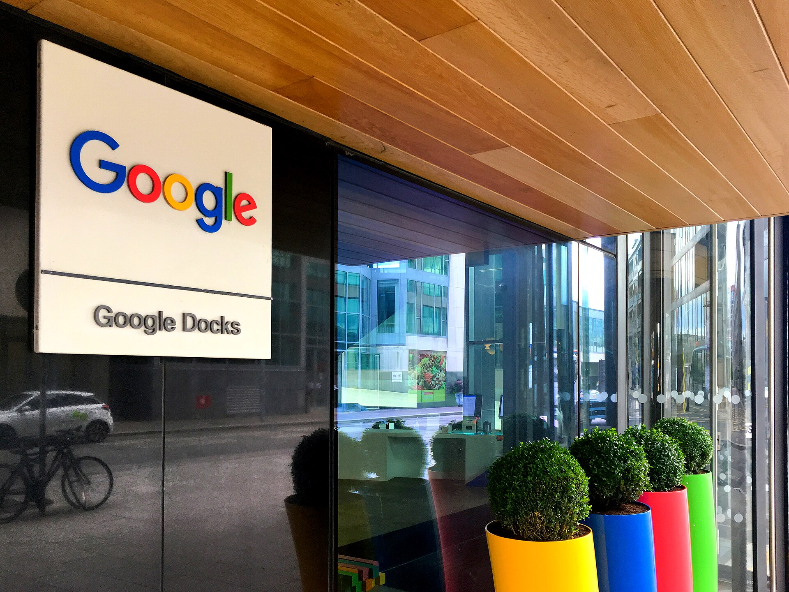

רכישת וויז בידי גוגל, בעסקה המוערכת בכ-32 מיליארד דולר, היא העסקה הגדולה ביותר בתולדות ההייטק הישראלי — ואירוע מכונן עבור ענף הסייבר המקומי. מדובר ברכישה במזומן של חברת אבטחת הענן שנוסדה רק ב-2020, מהלך שממצב את גוגל כשחקן מוביל בזירת אבטחת המידע בענן ומחדד את מעמדה של ישראל כמעצמת סייבר עולמית.

## מה עומד מאחורי רכישת וויז בידי גוגל?

וויז (Wiz) הוקמה בידי צוות יזמים ישראלי בראשות אסף רפפורט, שהגיע מרקע של חברת הסייבר אדאלום שנמכרה בעבר למיקרוסופט. החברה פיתחה פלטפורמה שמאפשרת לארגונים לזהות ולתקן פרצות אבטחה בסביבות ענן — תחום שהפך קריטי ככל שחברות מעבירות את פעילותן לתשתיות של אמזון, מיקרוסופט וגוגל.

המהירות שבה צמחה וויז חסרת תקדים: תוך פחות מחמש שנים היא הפכה לאחת מחברות התוכנה הצומחות ביותר בעולם, עם הכנסות שנתיות חוזרות שנאמדות במאות מיליוני דולרים ובסיס לקוחות הכולל חלק ניכר מחברות ה"פורצ'ן 500".

## למה גוגל משלמת סכום כה גבוה?

עבור גוגל, שמפעילה את חטיבת הענן שלה (גוגל קלאוד) בתחרות עזה מול אמזון ומיקרוסופט, אבטחת המידע היא נדבך אסטרטגי. שילוב הטכנולוגיה של וויז אמור לחזק את הצעת הערך של גוגל קלאוד מול לקוחות ארגוניים, ולסגור פער מול המתחרות בתחום אבטחת הענן.

חשוב לזכור: זו אינה הפעם הראשונה שגוגל מנסה לרכוש את וויז. בשנה שעברה דחתה החברה הישראלית הצעה מוקדמת יותר, כשהעדיפה מסלול עצמאי לקראת הנפקה בבורסה. החזרה לשולחן המשא ומתן, בשווי גבוה משמעותית, מעידה על הביקוש העז לנכסי סייבר איכותיים.

### טבלת השוואה: עסקאות הענק בהייטק הישראלי

| חברה | רוכשת | שווי משוער | שנה |
|---|---|---|---|
| וויז | גוגל | כ-32 מיליארד דולר | 2025 |
| מובילאיי | אינטל | כ-15 מיליארד דולר | 2017 |
| מלאנוקס | אנבידיה | כ-7 מיליארד דולר | 2019 |
| אבטחת סייבר שונות | שחקנים גלובליים | מיליארדים בודדים | לאורך העשור |

## מה המשמעות לענף הסייבר הישראלי?

רכישת וויז בידי גוגל צפויה להשפיע על האקוסיסטם המקומי בכמה מישורים. ראשית, היא מזרימה הון עתק לכיסיהם של מייסדים, עובדים ומשקיעים ישראלים — הון שחלקו יופנה בחזרה להקמת סטארטאפים חדשים ולהשקעות אנג'לים.

שנית, העסקה משדרת אות אמון של הענקיות הגלובליות בכישרון הישראלי, גם על רקע התקופה המאתגרת שעבר הענף בשנים האחרונות. מעבר לכך, היא עשויה להצית גל חדש של יזמות בתחום אבטחת הענן והבינה המלאכותית.

מנגד, יש מי שמזהיר מפני "בריחת מוחות" — התופעה שבה החברות הבולטות נמכרות לתאגידים זרים בשלב מוקדם, במקום לצמוח לחברות ענק עצמאיות שנסחרות בבורסה ומעגנות מטה ושרשרת ערך בישראל.

## מה הלאה? אישורים רגולטוריים

כמו בכל עסקה בסדר גודל כזה, השלמת הרכישה מותנית באישורים רגולטוריים במספר תחומי שיפוט, ובראשם רשויות ההגבלים העסקיים בארה"ב ובאירופה. גוגל, שכבר נמצאת תחת עינם הבוחנת של הרגולטורים בסוגיות של כוח שוק, עשויה להיתקל בבחינה מדוקדקת. מקורות בענף מעריכים כי השלמת העסקה עשויה להימשך זמן רב, ואף לכלול תנאים מגבילים.

גם אם הדרך ארוכה, המסר כבר הופנם בשוק: הסייבר הישראלי נותר אחד המנועים החזקים של הכלכלה המקומית, ורכישת וויז בידי גוגל מסמנת רף חדש לשאיפות של יזמי ההייטק בישראל.
