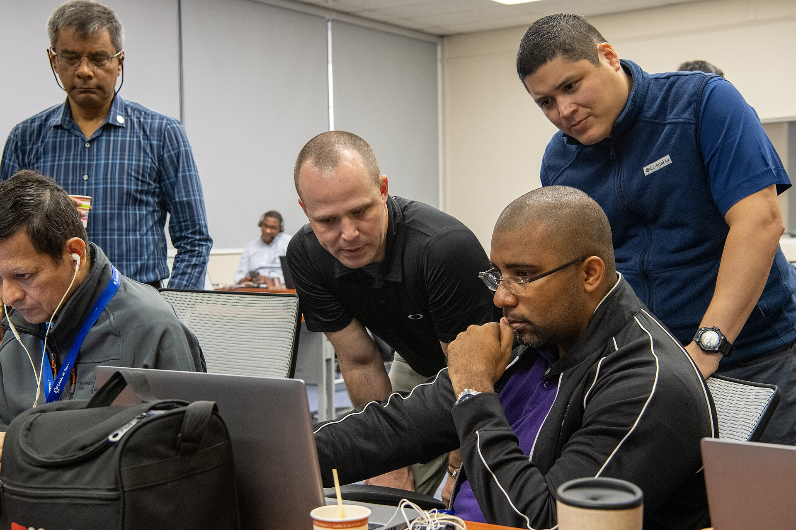

**שוק הסייבר הישראלי** חזר להיות הכוכב של ההיי-טק המקומי. אחרי כשנתיים של האטה בגיוסים ובאקזיטים, ענף אבטחת המידע רושם גל עסקאות ענק — רכישות, מיזוגים וסבבי גיוס במיליארדי דולרים — שממצב אותו כמנוע הצמיחה הבולט של הכלכלה הישראלית. התשובה הקצרה לשאלה "למה דווקא עכשיו": שילוב של איום סייבר מתרחב, מעבר מהיר לענן, ומרוץ הבינה המלאכותית שמייצר צורך חדש לחלוטין בהגנה.

## למה שוק הסייבר הישראלי בorech? 

ישראל נחשבת מזה שנים למעצמת סייבר, עם צנרת כישרונות שמגיעה מיחידות המודיעין הטכנולוגיות של צה"ל. בשנה החולפת התחדדה המגמה: תקציבי אבטחת המידע של ארגונים גדולים בעולם ממשיכים לצמוח גם כשתקציבי טכנולוגיה אחרים מקוצצים, משום שהגנת סייבר נתפסת כהוצאה הכרחית ולא כמותרות.

שלושה מנועים מרכזיים דוחפים את הביקוש:

- **התרחבות מתקפות הכופר (Ransomware):** תדירות וחומרת המתקפות על תשתיות, בתי חולים וגופים פיננסיים זינקו.
- **הגירה לענן:** ככל שארגונים מעבירים נתונים לענן, גדל הצורך בכלי הגנה ייעודיים לסביבות ענן.
- **אבטחת בינה מלאכותית:** גל מערכות הבינה המלאכותית פותח חזית סיכונים חדשה — הרעלת מודלים, דליפת נתונים והתקפות על מנועי שפה — ומייצר קטגוריית מוצרים שלמה.

## גל האקזיטים: הענקיות קונות ישראלי

החודשים האחרונים התאפיינו בשורת מהלכים דרמטית. חברות ענק זרות — בהן גוגל, פאלו אלטו נטוורקס, סיסקו וקראודסטרייק — פועלות לרכישת טכנולוגיה ישראלית במחירים שלא נראו מאז שיא 2021. הרכישה המדוברת ביותר היתה עסקת הענק של גוגל לרכישת חברת הסייבר הישראלית וויז, שהפכה לאחת מעסקאות ההיי-טק הגדולות בתולדות המדינה.

במקביל, חברות סייבר ישראליות ותיקות הנסחרות בוול סטריט, כמו צ'ק פוינט, סנטינל וקבוצות נוספות, נהנות מהתעניינות מחודשת של משקיעים. הצמיחה בהכנסות והמעבר למודל מבוסס מנויים (SaaS) מייצרים זרם הכנסות צפוי שמושך משקיעים מוסדיים.

### מדוע הרוכשות מוכנות לשלם פרמיה?

עבור ענקיות הטכנולוגיה, רכישת סטארטאפ ישראלי בשל היא קיצור דרך: במקום לפתח טכנולוגיה מאפס, הן קונות צוות מנוסה, פטנטים ובסיס לקוחות. בשוק שבו הזמן קריטי, פרמיית הרכישה משתלמת.

## השוואה: מנועי הצמיחה בשוק הסייבר

הטבלה הבאה מסכמת את תחומי הסייבר החמים ואת פוטנציאל הצמיחה שלהם, על פי מגמות השוק:

| תחום | מניע עיקרי | רמת ביקוש | שחקניות בולטות |
|---|---|---|---|
| אבטחת ענן | הגירה לענן | גבוהה מאוד | וויז, פאלו אלטו |
| אבטחת בינה מלאכותית | גל המודלים | מתפרצת | סטארטאפים חדשים |
| הגנה על נקודות קצה | עבודה מרחוק | גבוהה | קראודסטרייק, סנטינל |
| ניהול זהויות | רגולציה מחמירה | יציבה-עולה | חברות מבוססות |

## מה זה אומר למשקיע הישראלי?

למשקיע המקומי, גל הסייבר מציע חשיפה דרך כמה ערוצים. הראשון הוא המניות הדואליות — חברות ישראליות הנסחרות גם בתל אביב וגם בנאסד"ק. השני הוא קרנות סל (ETF) ייעודיות לתחום הסייבר העולמי, שמפזרות את הסיכון בין עשרות חברות.

עם זאת, חשוב לזכור שני סיכונים מרכזיים:

1. **תמחור גבוה:** חלק ממניות הסייבר נסחרות במכפילים גבוהים, שמגלמים ציפיות צמיחה אגרסיביות. אכזבה בדוחות עלולה להוביל לתיקון חד.
2. **ריכוזיות:** ההצלחה של הענף הישראלי נשענת על מספר מצומצם של חברות גדולות. תלות זו יוצרת פגיעוּת אם אחת מהן תיתקל בקשיים.

## שוק העבודה: מלחמה על הכישרונות

גל הצמיחה מקרין ישירות על שוק התעסוקה. הביקוש למהנדסי סייבר, חוקרי אבטחה ומומחי בינה מלאכותית חזר להיות חם, והחברות מתחרות זו בזו על עובדים איכותיים באמצעות שכר ובונוסים. עבור בוגרי היחידות הטכנולוגיות, זהו שוק של מוכרים.

מנגד, התחרות מייקרת את מבנה העלויות של החברות ומאתגרת סטארטאפים צעירים, שמתקשים להתחרות בחבילות השכר של הענקיות. התוצאה: מגמת קונסולידציה, שבה הגדולות ממשיכות לבלוע את הקטנות.

## סיכום: מנוע צמיחה עם סימני שאלה

שוק הסייבר הישראלי מוכיח שוב את חוסנו וממצב את ישראל בחזית הגלובלית של התחום. עבור הכלכלה המקומית, מדובר במקור הכנסות, מיסים ותעסוקה קריטי. אך המשקיעים נדרשים לזהירות: תמחור גבוה וריכוזיות הופכים את הענף לרגיש לתנודות. כמו בכל מגמה חמה — ההזדמנות גדולה, אך גם הסיכון.
