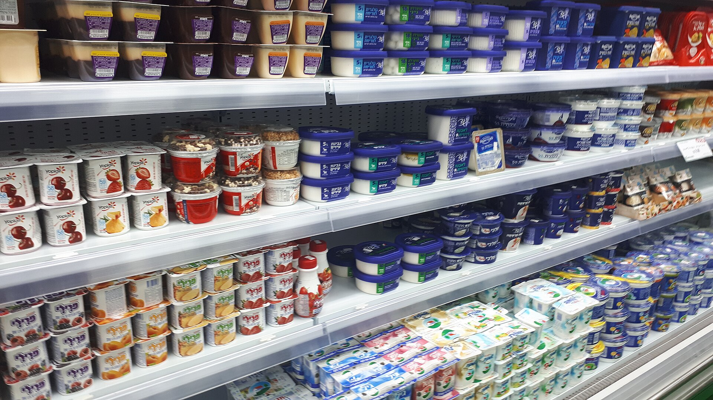

על רקע יוקר המחיה המתמשך, **המותג הפרטי** של רשתות המזון הפך בשנה החולפת לאחד הכלים המשמעותיים ביותר של הצרכן הישראלי לחיסכון בסל הקניות. מוצרים הנושאים את שם הרשת — משופרסל דרך רמי לוי ועד Victory ו-yellow — מציעים לרוב מחיר נמוך בעשרות אחוזים לעומת מותגי היצרן המובילים, והם צוברים נתח שוק במהירות.

## למה המותג הפרטי הופך לכל כך פופולרי?

הסיבה המרכזית פשוטה: מחיר. כשמחירי המזון בישראל נמצאים בלחץ מתמשך והשכר הריאלי מתקשה להדביק את הפער, הצרכן מחפש חלופות זולות מבלי לוותר על איכות סבירה. המותג הפרטי, שמדלג על עלויות השיווק, הפרסום והמיתוג הכבדות של היצרניות הגדולות, מאפשר לרשת למכור מוצר דומה במחיר נמוך משמעותית.

בשנים האחרונות חל גם שינוי תפיסתי. אם בעבר נתפס המותג הפרטי כ"מוצר זול ופחות איכותי", הרי שכיום הפער האיכותי הצטמצם דרמטית בקטגוריות רבות — ממוצרי חלב וקטניות ועד מוצרי ניקיון ונייר. במקרים לא מעטים, אותו מפעל בדיוק מייצר גם את המותג המוביל וגם את המותג הפרטי של הרשת.

### כמה באמת חוסכים?

ההערכות בענף מדברות על חיסכון ממוצע של **20% עד 40%** במעבר ממותג מוביל למותג פרטי מקביל. בקטגוריות מסוימות, כמו שימורים, מים מינרליים ומוצרי בסיס, הפער עשוי להיות גבוה אף יותר.

## השוואת מחירים: מותג מוביל מול מותג פרטי

הטבלה הבאה ממחישה את סדרי הגודל של הפער המחירי בקטגוריות נפוצות (מחירים להמחשה בלבד, כמגמה):

| קטגוריה | מותג יצרן מוביל | מותג פרטי | חיסכון משוער |
|---|---|---|---|
| קורנפלקס | כ-18 ש"ח | כ-11 ש"ח | כ-38% |
| שמן זית | כ-45 ש"ח | כ-30 ש"ח | כ-33% |
| נייר טואלט | כ-30 ש"ח | כ-20 ש"ח | כ-33% |
| קטשופ | כ-14 ש"ח | כ-9 ש"ח | כ-36% |
| חלב עמיד | כ-7 ש"ח | כ-5 ש"ח | כ-28% |

## מדוע דווקא בישראל יש עוד לאן לצמוח?

למרות הצמיחה המהירה, נתח המותג הפרטי בישראל עדיין נמוך משמעותית מהממוצע באירופה, שם הוא חוצה במדינות רבות את רף ה-40% מסך המכירות. באירופה, רשתות דיסקאונט כמו לידל ואלדי בנו את כל המודל העסקי שלהן סביב מותג פרטי דומיננטי. בישראל, לעומת זאת, שוק הקמעונאות עדיין נשלט בחלקו הגדול על ידי מותגי היצרן החזקים.

המשמעות ברורה: יש עוד מרווח גדול לצמיחה. רשתות כמו שופרסל, רמי לוי, Victory ו-yellow מרחיבות בהתמדה את מגוון המותג הפרטי שלהן, כולל מוצרי פרימיום ומוצרי בריאות — ולא רק מוצרי בסיס זולים.

## איך זה משפיע על היצרנים הגדולים?

עבור יצרניות המזון הוותיקות, עליית המותג הפרטי היא איום אסטרטגי של ממש. ככל שהצרכן מתרגל לחלופה הזולה, נשחקת נאמנות המותג — הנכס היקר ביותר של חברות כמו תנובה, אסם, שטראוס ועלית. התוצאה: היצרניות נאלצות להגיב באמצעות מבצעים אגרסיביים, הורדות מחיר נקודתיות והשקת קווי מוצרים חדשים.

חלק מהיצרנים בוחרים בגישה כפולה — לייצר במקביל גם את המותג הפרטי של הרשתות, כדי לא לאבד נפחי ייצור. אחרים מהמרים על חדשנות ובידול כדי להצדיק את פער המחיר.

### מה כדאי לצרכן לבדוק?

- **השוו רכיבים ולא רק מחיר** — לעיתים איכות המותג הפרטי זהה, ולעיתים לא.
- **בדקו מחיר ליחידה** (ל-100 גרם או ליטר) ולא את מחיר האריזה בלבד.
- **התחילו מקטגוריות בסיס** — קטניות, שימורים, נייר ומוצרי ניקיון, שבהן הפער האיכותי זניח.
- **אל תוותרו על מותג מוביל** בקטגוריות שבהן הטעם או המרקם קריטיים עבורכם.

## שורה תחתונה

המותג הפרטי הפך מכלי שולי למנוע חיסכון מרכזי בסל הקניות הישראלי. בעידן של יוקר מחיה מתמשך, מעבר מושכל למותג פרטי בחלק מהקטגוריות יכול לחסוך למשק בית ממוצע מאות שקלים בחודש — בלי לפגוע משמעותית באיכות.
