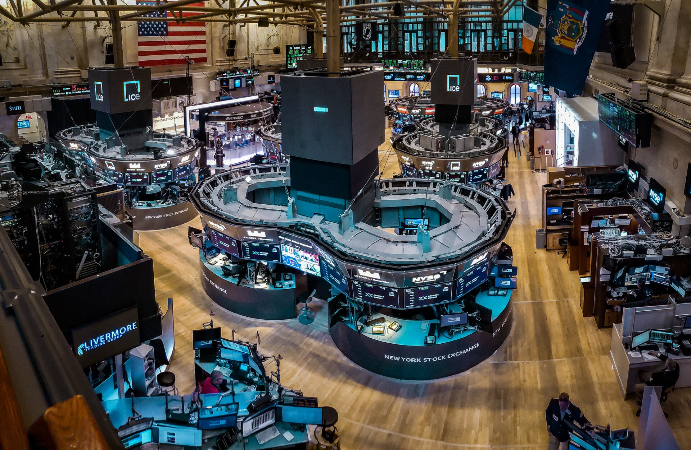

החיפוש הישראלי אחר תשואה מצא לו בשנים האחרונות כתובת ברורה: **קרנות מחקות אס אנד פי 500**. מדובר במכשירי השקעה פסיביים שעוקבים אחר מדד 500 החברות הגדולות בבורסות ארה"ב, והם הפכו לאפיק המועדף על מאות אלפי חוסכים ישראלים — בקרנות ההשתלמות, בקופות הגמל להשקעה ובתיקי המסחר העצמאיים. הסיבה פשוטה: פיזור רחב, עלות נמוכה ותשואה היסטורית מרשימה.

## מדוע קרנות מחקות אס אנד פי 500 סוחפות את החוסכים?

הגל אינו מקרי. שילוב של כמה גורמים דחף את הכסף הישראלי מערבה. ראשית, **דמי הניהול הנמוכים**: בעוד מסלולים מנוהלים אקטיבית גובים לעיתים אחוז שלם ויותר, קרן מחקה עשויה לגבות שברירי אחוז בלבד. שנית, **הביצועים**: המדד האמריקאי, הנשען על ענקיות כמו אנבידיה, אפל, מיקרוסופט ואלפאבית, רשם עשור יוצא דופן שבו הטכנולוגיה הובילה את הראלי.

גורם שלישי הוא **הנגישות**. כיום כמעט כל בית השקעות ישראלי, וכן הבנקים הדיגיטליים והוותיקים, מציעים מסלול עוקב מדד אמריקאי בלחיצת כפתור. חוסך שבעבר נדרש לפתוח חשבון מסחר מורכב יכול היום לבחור במסלול כזה גם בקרן ההשתלמות שלו.

## היתרונות: פיזור, עלות ושקיפות

היתרון הבולט הוא **הפיזור**. במקום להמר על מניה בודדת, המשקיע רוכש חשיפה ל-500 החברות המובילות במשק האמריקאי, על פני מגוון ענפים — טכנולוגיה, פיננסים, בריאות, אנרגיה ותעשייה. כשחברה אחת נחלשת, אחרות עשויות לפצות.

יתרון שני הוא **השקיפות**: ההרכב ידוע וברור, והמדד אינו תלוי בהחלטות של מנהל השקעות ספציפי. שלישית, לאורך זמן, מרבית המנהלים האקטיביים מתקשים לעקוף את המדד — עובדה שהפכה את ההשקעה הפסיבית לפילוסופיה שלמה בעולם ההשקעות.

## מהם הסיכונים שחשוב להכיר?

לצד הזוהר, ישנם סיכונים ממשיים שחוסכים רבים מתעלמים מהם.

- **ריכוזיות גבוהה**: משקל חברות הטכנולוגיה הגדולות במדד תפח משמעותית. למעשה, קומץ מניות אחראי לחלק ניכר מתנועת המדד — כך שהפיזור "הרחב" מרוכז יותר משנדמה.
- **חשיפה מטבעית**: השקעה בשקלים במדד דולרי חושפת את החוסך הישראלי לתנודות **שער הדולר-שקל**. התחזקות של השקל יכולה לכרסם בתשואה גם כשהמדד עצמו עולה.
- **סיכון תמחור**: אחרי שנים של עליות, מכפילי הרווח בוול סטריט גבוהים היסטורית, מה שמעורר שאלות לגבי פוטנציאל התשואה קדימה.

## מדד ת"א 35 מול המדד האמריקאי

בתוך ההתלהבות מוול סטריט, רבים מפספסים את הביצועים החזקים של **הבורסה בתל אביב**. מדד ת"א 35, בהובלת הבנקים והחברות הביטחוניות, רשם בשנה החולפת עליות נאות והפך לחלופה מקומית מפתיעה — ללא סיכון מטבעי לחוסך השקלי.

| פרמטר | קרן מחקה אס אנד פי 500 | קרן מחקה ת"א 35 |
|---|---|---|
| חשיפה גאוגרפית | ארה"ב | ישראל |
| ריכוזיות ענפית | טכנולוגיה גבוהה | בנקים וביטחון |
| סיכון מטבעי | חשיפה מלאה לדולר | ללא (שקלי) |
| דמי ניהול טיפוסיים | נמוכים מאוד | נמוכים |
| פיזור מספר חברות | 500 | 35 |

השוואה זו אינה קובעת מנצח מוחלט — אלא ממחישה שגיוון בין השווקים עשוי להפחית סיכון כולל בתיק.

## איך בוחרים קרן מחקה נכונה?

לפני שמשקיעים, כדאי לבדוק כמה פרמטרים מרכזיים:

1. **דמי ניהול ודמי ניהול מהצבירה** — הפרשים קטנים מצטברים לסכומים משמעותיים לאורך עשורים.
2. **טעות עקיבה** — עד כמה הקרן צמודה בפועל למדד שאותו היא אמורה לחקות.
3. **מיסוי** — מסלול פנסיוני נהנה מהטבות מס, בעוד תיק השקעות רגיל חשוף למס רווחי הון.
4. **הגנה מטבעית** — קיימות קרנות "מנוטרלות מט"ח" למי שמעדיף להפחית את החשיפה לדולר.

## שורה תחתונה

קרנות מחקות אס אנד פי 500 מציעות דרך פשוטה, זולה ומפוזרת להשקיע בכלכלה האמריקאית, ואין פלא שהן כבשו את לב החוסכים הישראלים. עם זאת, ריכוזיות הטכנולוגיה, התמחור הגבוה והחשיפה הדולרית מחייבים זהירות. הכלל הוותיק בעינו עומד: פיזור בין שווקים, אפיקים ומטבעות — ולא הימור על סיפור אחד, מוצלח ככל שיהיה.
