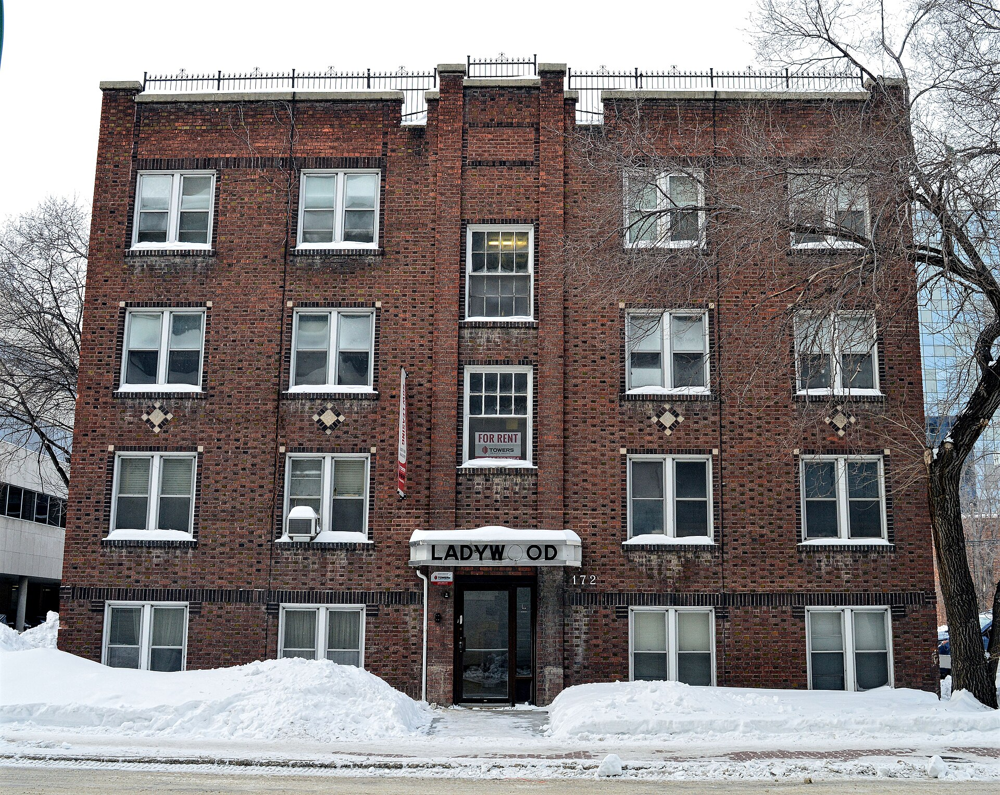

שוק הנדל"ן הישראלי מוכר בעיקר בזכות מחירי הרכישה המרקיעים, אך בשנה החולפת עברה נקודת הכובד של המשבר אל השוכרים: **מחירי השכירות** בערים המרכזיות מזנקים בקצב שנתי דו-ספרתי, מהיר משמעותית מקצב האינפלציה במשק. השילוב של ריבית גבוהה שמרתיעה רוכשים, קיפאון בהתחלות הבנייה וביקוש מתמשך יוצר לחץ כבד על ציבור השוכרים, שרבים מהם נאלצים להקדיש חלק הולך וגדל מהכנסתם החודשית לשכר דירה.

## מדוע מחירי השכירות עולים כל כך מהר?

הסיבה המרכזית טמונה במעבר של ביקושים משוק הרכישה לשוק השכירות. הריבית הגבוהה שקבע בנק ישראל ייקרה את המשכנתאות באופן דרמטי, וזוגות צעירים רבים שדחו את רכישת הדירה נותרו בשוק השכירות לתקופה ממושכת יותר. במקביל, ההיצע אינו מדביק את הפער: מספר התחלות הבנייה ירד, בין היתר בשל מחסור בפועלים בענף הבנייה והתייקרות עלויות המימון והחומרים.

התוצאה היא שוק שכירות "הדוק" — מעט דירות פנויות מול ביקוש גובר. בעלי דירות מנצלים את המצב כדי להעלות את דמי השכירות בחידושי חוזים, ולעיתים אף מקצרים את תקופות ההתחייבות כדי לשמור על גמישות לעדכוני מחיר.

## אילו ערים מובילות את הזינוק?

המוקד הבוער ביותר נותר תל אביב וגוש דן, שם דמי השכירות לדירת שלושה חדרים ממוצעת כבר מזמן חצו רף שמתקשה להתאים למשכורת של שכיר בודד. אולם התופעה מתרחבת גם לערים סובבות ולפריפריה הקרובה — חיפה, באר שבע וערי השרון — שאליהן זולגים שוכרים המחפשים חלופה זולה יותר, ובכך מייקרים גם אותן.

| אזור | מגמת מחירי השכירות בשנה החולפת | לחץ הביקוש |
|---|---|---|
| תל אביב וגוש דן | עלייה חדה | גבוה מאוד |
| השרון והמרכז | עלייה בינונית-גבוהה | גבוה |
| חיפה והצפון | עלייה מתונה | בינוני |
| באר שבע והדרום | עלייה מתונה-גבוהה | בינוני-גבוה |

*הטבלה מתארת מגמות כלליות ואינה מהווה ציטוט מחירים מדויק.*

## איך זה משפיע על השוכרים?

עבור משקי בית רבים, שכר הדירה הפך למרכיב ההוצאה הגדול ביותר בתקציב החודשי. כלכלנים מזהירים כי כאשר נטל השכירות חוצה כשליש מההכנסה הפנויה, נשחקת היכולת לחסוך — ובכך נדחית עוד יותר האפשרות לצבור הון עצמי לרכישת דירה. נוצר מעגל קסמים: מי שנתקע בשכירות מתקשה לחסוך, וכך נשאר בשכירות זמן ארוך יותר, מה שמזין מחדש את הביקוש.

### מה עם הדיור להשכרה המוסדי?

אחד הפתרונות שמקדמת המדינה הוא הדיור להשכרה לטווח ארוך — פרויקטים שבהם גוף מוסדי מחזיק במבנה שלם ומשכיר דירות בחוזים יציבים וארוכים, לעיתים בפיקוח מחיר. חברות כמו קרנות הנדל"ן והגופים המוסדיים נכנסות לתחום, אך היקף הדירות המוצע עדיין קטן מכדי לרסן את המחירים ברמה הארצית. עד שהמלאי יגדל משמעותית, השפעתו על שוק השכירות הרחב תישאר שולית.

## מה צופה ההמשך?

המשתנה הקריטי הוא הריבית. אם בנק ישראל יתחיל במחזור הורדות ריבית, חלק מהשוכרים עשויים לחזור לשוק הרכישה, מה שעשוי להקל מעט על הלחץ בשוק השכירות. מנגד, כל עוד התחלות הבנייה נותרות נמוכות, ההיצע ימשיך לפגר אחר הביקוש — ומחירי השכירות עשויים להמשיך לעלות גם אם קצב העלייה יתמתן.

בשורה התחתונה: משבר הדיור בישראל אינו עוד סיפור של רוכשים בלבד. הזינוק ב**מחירי השכירות** הופך את השוכרים לחזית החדשה של המשבר, ומחייב מענה מדיניות מהיר — בין אם בהאצת הבנייה, בהרחבת הדיור המוסדי או בכלים לייצוב חוזי השכירות.

## מה השוכרים יכולים לעשות?

- **לחתום על חוזים ארוכים** עם מנגנון עדכון מחיר ידוע מראש, כדי להימנע מהפתעות.
- **לבחון אזורים מתפתחים** בפריפריה של המטרופולינים, שבהם היחס בין מחיר לאיכות חיים אטרקטיבי יותר.
- **לעקוב אחר פרויקטים של דיור מוסדי** ומחיר מפוקח, שמציעים יציבות ארוכת טווח.
