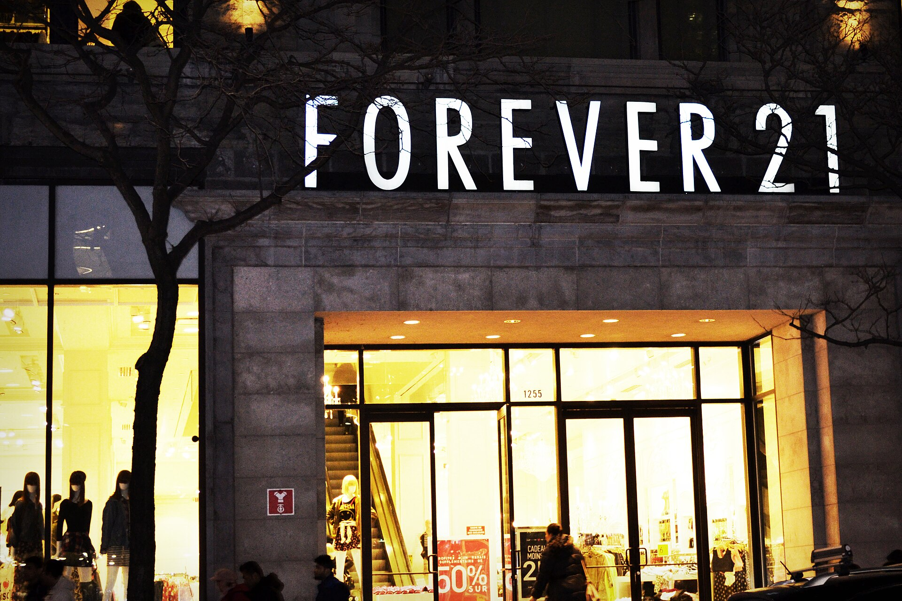

הזירות הסיניות **טמו ושיין בישראל** הפכו בתוך פחות משנתיים משחקניות שוליות לכוח צרכני מרכזי, שמסיט מיליארדי שקלים מהמסחר המקומי אל משלוחים ישירים ממחסנים בסין. התשובה הקצרה לשאלה מדוע זה קורה פשוטה: מחירים נמוכים בעשרות אחוזים, מבחר עצום ופטור ממס על יבוא אישי — שילוב שהפך את הרכישה בזירות הללו לברירת מחדל עבור מיליוני ישראלים.

## מדוע טמו ושיין כה זולות?

המודל של טמו (בבעלות ענקית המסחר הסינית פינדואודואו) ושל שיין מבוסס על חיתוך אגרסיבי של כל שלב בשרשרת האספקה. במקום רשת חנויות, מחסנים אזוריים ומתווכים, המוצר נשלח ישירות מהיצרן בסין אל דלת הצרכן. התוצאה היא מבנה עלויות שאף קמעונאי ישראלי מתקשה להשוות אליו.

גורם קריטי נוסף הוא **הפטור ממע"מ וממכס על יבוא אישי** בעסקאות עד 75 דולר. בעוד שמוצר זהה על מדף בישראל נושא מע"מ של 18% ומרווחי שיווק, החבילה מסין מגיעה נקייה ממס. פער זה, לצד עלויות משלוח מסובסדות, יוצר תחושת מחיר "בלתי אפשרי" שמניעה את גל הרכישות.

### מה קונים הישראלים?

בתחילת הדרך נתפסו הזירות כמקור לביגוד מהיר ואביזרים זולים. כיום ההיצע התרחב דרמטית: אלקטרוניקה, כלי בית, צעצועים, מוצרי טיפוח, אביזרי רכב וגאדג'טים. שיין ממוקדת בעיקר באופנה מהירה במחירים נמוכים במיוחד, בעוד טמו הפכה ל"סופרמרקט של הכול" — מגרביים ועד רחפנים.

## איך זה משפיע על המסחר הישראלי?

השפעת הזירות הסיניות ניכרת היטב אצל הקמעונאים המקומיים, מרשתות האופנה ועד חנויות הגאדג'טים והצעצועים. הלחץ על המחירים והנתח ההולך וגדל של הצריכה שעובר ישירות לחו"ל מאיימים על מודל העסקים המסורתי.

המסחר המקומי טוען זה זמן ל**חוסר שוויון רגולטורי**: היבואן הישראלי משלם מכס, מע"מ, עמידה בתקני בטיחות ותשלומי מיסוי מלאים, בעוד המשלוח הישיר מסין נהנה מפטורים ומפיקוח מקל. ארגוני הצרכנות והמסחר לוחצים על משרד האוצר לצמצם את סף הפטור, בדומה למגמה באיחוד האירופי ובארצות הברית.

| פרמטר | קנייה מטמו/שיין | קנייה בקמעונאות מקומית |
|---|---|---|
| מחיר בסיס | נמוך מאוד | גבוה יותר |
| מע"מ ומכס (עד 75$) | פטור | 18% מע"מ מלא |
| זמן אספקה | כשבוע עד שלושה | מיידי / יום-יומיים |
| החזרות ושירות | מורכב, מרחוק | פשוט, מקומי |
| אחריות ותקינה | חלקית ולא ודאית | מלאה לפי חוק |

## מה המחיר הנסתר לצרכן?

לצד החיסכון, הרכישה בזירות הסיניות טומנת בחובה סיכונים שכדאי להכיר:

- **איכות ובטיחות**: לא אחת מתפרסמות אזהרות על מוצרי חשמל, צעצועים וקוסמטיקה שאינם עומדים בתקני הבטיחות הישראליים או האירופיים.
- **פרטיות מידע**: אפליקציות הקנייה אוספות כמות עצומה של נתונים על המשתמשים, ורגולטורים במערב הביעו חשש מאופן השימוש במידע.
- **החזרות מסובכות**: החזרת מוצר פגום לסין עלולה להיות יקרה או בלתי כדאית ביחס למחיר.
- **עלות סביבתית**: מודל האופנה המהירה והמשלוחים הבודדים מייצר טביעת רגל פחמנית ופסולת משמעותית.

## לאן פני העתיד?

המגמה העולמית ברורה: ממשלות רבות מהדקות את הפיקוח על הזירות הסיניות. האיחוד האירופי מקדם ביטול הפטור ממכס על משלוחים זולים, וארצות הברית כבר צמצמה הקלות דומות. גם בישראל צפוי דיון מחודש בסף הפטור ובאכיפת התקינה — מהלך שעשוי לצמצם משמעותית את פער המחירים.

בינתיים, עבור הצרכן הישראלי הכלל פשוט: **טמו ושיין משתלמות עבור מוצרים זולים, לא-קריטיים ולא-דחופים**, שבהם פער המחיר עצום והסיכון נמוך. לעומת זאת, במוצרי חשמל, בטיחות ובמוצרים שדורשים שירות ואחריות — היתרון של הקמעונאות המקומית עדיין ברור.

השורה התחתונה: הזירות הסיניות שינו את כללי המשחק בצריכה הישראלית, אך המחיר הזול אינו תמיד המחיר האמיתי. צרכן חכם ישקלל לא רק את המספר על המסך, אלא גם את האיכות, הזמן, האחריות והסיכון.
