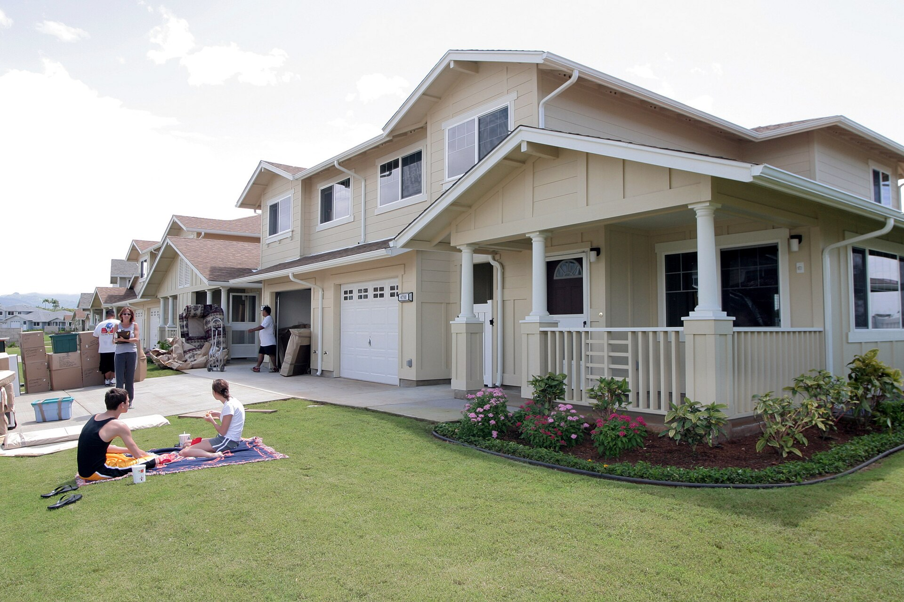

תעריף החשמל הביתי בישראל ממשיך לטפס, ומחירי החשמל הפכו לאחד הסעיפים הבולטים בהתייקרות יוקר המחיה של משקי הבית. העלייה נובעת בעיקר מהתייקרות הדלקים המשמשים לייצור, מעלויות תשתית ומהצמדה למדד — והתוצאה היא חשבון דו-חודשי גבוה יותר כמעט לכל בית בישראל. הבשורה הטובה: קיימים כלים צרכניים פשוטים שיכולים לחתוך מאות שקלים בשנה.

## מה עומד מאחורי עליית מחירי החשמל?

תעריף החשמל נקבע מדי שנה על ידי **רשות החשמל**, ומורכב מכמה רכיבים: עלות ייצור האנרגיה, הולכה, חלוקה ושירותי מערכת. הרכיב התנודתי ביותר הוא עלות הדלקים — גז טבעי, פחם וסולר — שמושפעת ישירות ממחירי האנרגיה בעולם ומשער הדולר-שקל.

בשנה החולפת נרשמה עלייה מצטברת בתעריף, על רקע התייקרות הדלקים, השקעות נרחבות בשדרוג רשת החשמל ומעבר מתמשך לאנרגיות מתחדשות. במקביל, גל החום והביקוש הגובר למיזוג בקיץ ולחימום בחורף מגדילים את הצריכה — ומכפילים את ההשפעה על החשבון.

## כמה באמת עולה החשמל למשק בית?

משק בית ישראלי ממוצע צורך כמה אלפי קילוואט-שעה בשנה, כאשר עיקר הצריכה מיוחסת למיזוג אוויר, דוד חשמלי, מקרר ומכונת כביסה. עלייה של אחוזים בודדים בתעריף עשויה להיראות זניחה, אך במונחים שנתיים היא מסתכמת במאות שקלים לבית ממוצע — ואף יותר במשפחות עם צריכה גבוהה.

המשמעות הצרכנית ברורה: ככל שהתעריף עולה, כדאי להשקיע מאמץ בהפחתת הצריכה ובבחירת ספק זול יותר.

## ספק חשמל פרטי מול חברת החשמל: מה עדיף?

רפורמת התחרות בענף החשמל אפשרה לצרכנים לעבור מ**חברת החשמל** לספקים פרטיים המציעים הנחות על מרכיב האנרגיה בחשבון. המעבר פשוט, אינו כרוך בהחלפת תשתית, וניתן לבצעו דיגיטלית. ההנחות נעות בדרך כלל בין כ-5% ל-7%, ולעיתים כוללות הטבות לצריכה בשעות מסוימות.

הטבלה הבאה ממחישה את ההבדל העקרוני בין החלופות:

| פרמטר | חברת החשמל (תעריף רגיל) | ספק פרטי (מסלול הנחה) |
|---|---|---|
| הנחה על האנרגיה | ללא | כ-5%-7% |
| החלפת תשתית/מונה | לא נדרשת | לא נדרשת |
| מסלולים לפי שעות | מוגבל | לרוב זמין |
| התחייבות | ללא | לעיתים לתקופה |
| חיסכון שנתי מוערך | — | עשרות עד מאות שקלים |

חשוב לקרוא את התנאים: חלק מהמסלולים מתגמלים דווקא צריכה בשעות הלילה או הצהריים, ולכן ההתאמה תלויה בהרגלי הצריכה של משק הבית.

## איך חוסכים בפועל על חשבון החשמל?

מעבר לבחירת ספק, השינוי המשמעותי ביותר מגיע מהתנהגות צרכנית חכמה. אלו הצעדים המשתלמים ביותר:

- **מיזוג אוויר נבון:** כל מעלה נוספת בקירור מגדילה את הצריכה בעשרות אחוזים. הגדרת המזגן לכ-24-25 מעלות בקיץ חוסכת משמעותית.
- **דוד שמש במקום חימום חשמלי:** הדוד החשמלי הוא מהצרכנים הכבדים בבית. שימוש בטיימר ובקולטי שמש מפחית עלות ניכרת.
- **מכשירי חשמל בדירוג אנרגטי גבוה:** מקרר, מדיח ומכונת כביסה בדירוג A מפחיתים צריכה לאורך שנים.
- **תאורת לד:** החלפת נורות ישנות בנורות לד חוסכת עד כ-80% מצריכת התאורה.
- **ניתוק מכשירים במצב המתנה:** טלוויזיות, ממירים ומטענים צורכים חשמל גם כבויים לכאורה.
- **בידוד תרמי:** בידוד חלונות וקירות מפחית את העומס על המיזוג לאורך כל השנה.

## מה צפוי בהמשך?

המגמה ארוכת הטווח מצביעה על מעבר הדרגתי לאנרגיות מתחדשות, שעשוי בעתיד למתן את התלות בדלקים המתייקרים. בטווח הקצר, לעומת זאת, לחצי העלויות והביקוש הגובר עשויים להמשיך ולדחוף את התעריף כלפי מעלה. עבור הצרכן הישראלי, המסקנה המעשית היא לא להמתין לשינוי מלמעלה — אלא לפעול מלמטה: להשוות ספקים, לבחון את מסלול הצריכה ולהטמיע הרגלים חסכוניים שמצטברים למאות שקלים בשנה.
