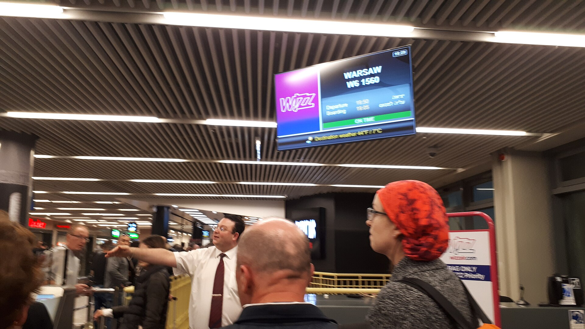

מחירי הטיסות לחו"ל, שהרקיעו שחקים בשנתיים האחרונות, מתחילים סוף־סוף לרדת. הסיבה המרכזית: חזרתן ההדרגתית של חברות התעופה הזרות לנמל התעופה בן־גוריון, אחרי תקופה ארוכה שבה נמנעו מטיסות לישראל. עבור הצרכן הישראלי, שהתרגל לשלם פרמיה כבדה על כל כרטיס, מדובר בבשורה שעשויה להחזיר את התחרות לשמיים ולחתוך מאות שקלים מעלות החופשה המשפחתית.

## מדוע מחירי הטיסות לחו"ל זינקו מלכתחילה?

במהלך תקופת המלחמה השעו עשרות חברות תעופה זרות את פעילותן בישראל, בהן ענקיות כמו לופטהנזה, איזיג'ט, ווויז אייר. התוצאה הייתה ירידה חדה בהיצע המושבים, בעוד הביקוש של הישראלים לטוס לחו"ל נותר גבוה. במצב כזה, חברת אל על והחברות הישראליות הקטנות יותר נהנו מנתח שוק חריג, ומחירי הכרטיסים ליעדים מבוקשים באירופה זינקו לעיתים פי שניים ואף יותר ביחס לימי שגרה.

התוצאה הורגשה היטב בכיס: טיסה שבשגרה עלתה כמה מאות שקלים לכיוון, הגיעה לא פעם לאלף שקלים ומעלה, גם ליעדים קרובים יחסית. עונת החגים והקיץ החריפו עוד יותר את התופעה.

## איך התחרות המתחדשת משפיעה על הכיס?

עם התייצבות המצב הביטחוני, חברות התעופה הזרות שבות בהדרגה לנתב"ג — וכל חברה שחוזרת מוסיפה מושבים לשוק ומגבירה את הלחץ על המחירים. ככל שההיצע גדל, כך נשחקת יכולתן של החברות לתמחר כרטיסים ברמות שיא.

הירידה מורגשת בעיקר ביעדים הפופולריים: לונדון, פריז, רומא, אתונה ויעדי נופש נוספים באירופה. חברות הלואו־קוסט, שנעדרו מהשוק זמן רב, הן שחקן קריטי כאן — עצם חזרתן מכריחה את החברות המסורתיות להתיישר כלפי מטה.

### טבלת השוואה: מגמת המחירים לפי סוג חברה

| סוג חברה | תקופת המלחמה | לאחר חזרת התחרות |
|---|---|---|
| חברות לואו־קוסט אירופיות | היעדרות כמעט מוחלטת | חזרה הדרגתית, מחירים אטרקטיביים |
| חברות מסורתיות זרות | היצע מצומצם, מחירים גבוהים | הרחבת קווים, לחץ להוזלה |
| חברות ישראליות | נתח שוק גבוה, פרמיה | תחרות מוגברת על הנוסע |

חשוב לסייג: הירידה אינה אחידה ואינה מיידית. במועדי שיא כמו חגים, חופשות בית ספר וסופי שבוע ארוכים, הביקוש הגבוה ימשיך לתמוך במחירים גבוהים יחסית גם בעידן התחרות.

## אל על מול הזרות: מי מרוויח ומי מפסיד?

עבור אל על, חזרת המתחרות משמעה סוף לתקופת הזהב שבה נהנתה מביקושים גבוהים לצד היצע מוגבל. מנגד, החברה בנתה בתקופה זו יתרון תפעולי ומותגי, ותצטרך כעת להיאבק על נאמנות הנוסעים באמצעות מבצעים, שדרוגי שירות ותוכניות נוסע מתמיד.

המנצח הגדול הוא הצרכן: ככל שהתחרות תתעצם, כך צפויות עוד מבצעים, יותר קווים ישירים ומחירים סבירים יותר. עם זאת, יש לזכור שעלויות התפעול בנתב"ג, לצד ביקוש מקומי חזק לטיסות, ימנעו ככל הנראה חזרה מלאה לרמות המחירים הזולות שהיו נהוגות לפני המשבר.

## איך לחסוך במחירי הטיסות לחו"ל?

גם בעידן של תחרות מתחדשת, ההתנהלות החכמה של הנוסע היא שקובעת כמה ישלם:

- **הזמינו מוקדם.** ליעדים מבוקשים, הזמנה של חודשים מראש כמעט תמיד זולה יותר מרכישה של הרגע האחרון.
- **היו גמישים בתאריכים.** טיסה באמצע השבוע או מחוץ לעונת השיא יכולה לחסוך מאות שקלים.
- **השוו בין מנועי חיפוש.** בדקו מספר אתרי השוואה ואל תסתמכו על מקור אחד בלבד.
- **שימו לב לעלויות הנלוות.** בכרטיסי לואו־קוסט, תוספות עבור מזוודות, בחירת מושב ותשלום בכרטיס אשראי עלולות לייקר משמעותית את ה"מחיר הזול".
- **עקבו אחרי מבצעי החזרה.** חברות שחוזרות לשוק נוטות להשיק מבצעי השקה אגרסיביים כדי לחזר אחרי לקוחות.

## מה צפוי בהמשך?

המגמה הכללית ברורה: ככל שיותר חברות זרות ישובו לפעול בנתב"ג באופן קבוע, כך יימשך הלחץ כלפי מטה על מחירי הטיסות לחו"ל. עונת הקיץ הקרובה תהווה מבחן מרכזי — היקף המושבים שיוצע יקבע עד כמה עמוקה תהיה ההוזלה. עבור הישראלים, שהמריאו לחו"ל בשיעורים גבוהים גם בשנים הקשות, מדובר בהזדמנות לתכנן חופשה במחיר שפוי יותר — ובלבד שיזמינו בתבונה ובזמן.
