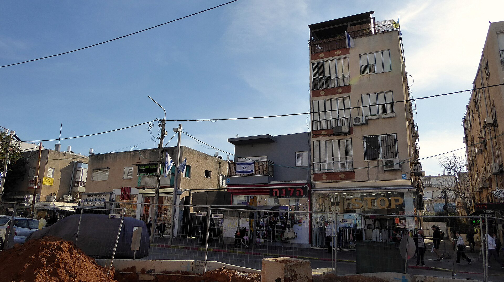

מלאי הדירות הלא מכורות בידי הקבלנים בישראל נמצא ברמות שיא היסטוריות, כאשר עשרות אלפי יחידות דיור ממתינות לרוכש. מדובר בתמונת מצב חריגה שנוצרה משילוב של ריבית גבוהה, ירידה חדה במספר העסקאות והצטברות מלאי מהיר יותר מקצב המכירות. עבור רוכשים פוטנציאליים, מלאי דירות לא מכורות ברמות אלה יוצר לראשונה זה זמן רב מרחב תמרון מול היזמים.

## למה נערם מלאי דירות לא מכורות?

הסיבה המרכזית להצטברות המלאי היא הריבית. בנק ישראל שמר על ריבית גבוהה יחסית לאורך זמן במטרה לרסן את האינפלציה, והתוצאה היא התייקרות ניכרת של החזרי המשכנתאות. משפחות רבות שתכננו לרכוש דירה נאלצו לדחות את המהלך, פשוט משום שההחזר החודשי הפך לבלתי אפשרי עבורן.

במקביל, בשנים האחרונות נכנסו לשוק פרויקטים רבים שיצאו לדרך בתקופת הריבית הנמוכה, כשהביקוש היה גבוה. כעת, כשהדירות הללו מסתיימות ומגיעות לשוק, הביקוש כבר התקרר — ונוצר פער בין ההיצע החדש לבין קצב המכירות בפועל.

### תפקידם של מבצעי המימון

כדי להזיז את המלאי, הקבלנים חזרו למבצעי מימון אגרסיביים בסגנון "20-80" ופריסות תשלום נדיבות, המאפשרות לרוכש לשלם חלק קטן מהמחיר במעמד החתימה ואת היתרה במסירה. בנק ישראל הידק בשנה האחרונה את הפיקוח על מבצעים אלה, מחשש שהם מסתירים את המחיר האמיתי ומעמיסים סיכון על הרוכשים והמערכת הבנקאית.

## האם מלאי גבוה יוריד את מחירי הדירות?

כאן טמונה ההפתעה. למרות הצניחה במספר העסקאות והמלאי הגבוה, מחירי הדירות לא ירדו בחדות. הסיבה נעוצה בעלויות הבנייה הגבוהות — מחסור בפועלי בניין, התייקרות חומרי גלם ומימון יקר — שמקשים על הקבלנים להוזיל מחירים מבלי להיכנס להפסד.

התוצאה היא שוק "תקוע": מוכרים שאינם ממהרים להוריד מחיר וקונים שממתינים בצד. במקום הוזלה גורפת, ההנחות מגיעות לרוב דרך הטבות מימון ולא דרך הפחתת מחיר המחירון.

| פרמטר | תקופת הריבית הנמוכה | המצב הנוכחי |
|---|---|---|
| ריבית בנק ישראל | נמוכה מאוד | גבוהה יחסית |
| קצב עסקאות | גבוה | נמוך |
| מלאי לא מכור | מתון | שיא היסטורי |
| כוח מיקוח של הרוכש | נמוך | גבוה יחסית |
| מבצעי מימון | מצומצמים | נפוצים ואגרסיביים |

## אילו אזורים מושפעים יותר?

הצטברות המלאי אינה אחידה בכל הארץ. באזורי הביקוש המרכזיים, כמו גוש דן, המחירים נותרו עמידים יחסית. לעומת זאת, בפריפריה ובערים שבהן נבנו פרויקטים רבים במקביל, נרשמת הצטברות מלאי משמעותית — ושם כוח המיקוח של הרוכשים גבוה במיוחד.

## מה כדאי לרוכשים לעשות עכשיו?

עבור מי שיכולת ההחזר שלו יציבה, התקופה הנוכחית עשויה להוות הזדמנות. הנה כמה עקרונות מנחים:

- **התמקדו בפרויקטים עם מלאי גבוה** — שם ליזם יש תמריץ אמיתי להתגמש במחיר ובתנאים.
- **בחנו את המחיר האמיתי מאחורי מבצע המימון** — פריסת תשלומים נוחה אינה תמיד הנחה כלכלית, וחשוב לחשב את העלות הכוללת.
- **התכוננו לתרחיש ריבית** — אל תסתמכו על ירידת ריבית עתידית שאינה ודאית בעת חישוב יכולת ההחזר.
- **בדקו את איתנות היזם** — בסביבה של מלאי גבוה ומימון יקר, יציבותו הפיננסית של הקבלן קריטית.

## מה צפוי בהמשך?

המפתח נמצא בידי בנק ישראל. תחילת מגמת הפחתת ריבית עשויה להחזיר קונים לשוק, לצמצם את המלאי ולחדש את הלחץ כלפי מעלה על המחירים. עד אז, סביר להניח שנמשיך לראות שוק דו-ראשי: מלאי גבוה שאינו נמכר בקצב, לצד מחירים שנותרים עיקשים בזכות עלויות הבנייה. עבור הרוכשים, זהו חלון הזדמנויות זהיר — שדורש בדיקה קפדנית של כל עסקה.
