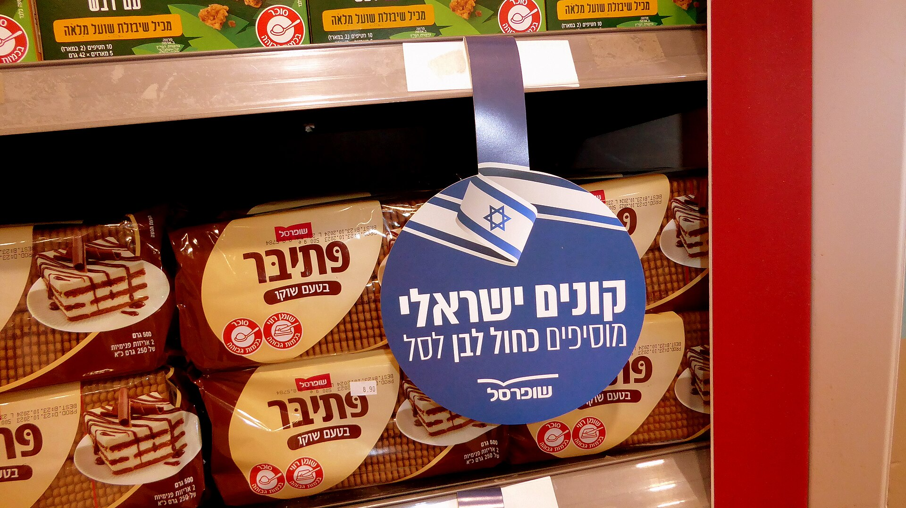

בעידן של יוקר מחיה מתמשך, **המותג הפרטי** הפך לאחד הכלים המרכזיים של הצרכן הישראלי לחיסכון בסל הקניות. מדובר במוצרים המיוצרים עבור רשת השיווק ונושאים את שמה המסחרי — ולרוב הם זולים בעשרות אחוזים ממותגים מובילים מקבילים. השאלה שמעסיקה מיליוני קונים היא פשוטה: האם באמת מקבלים את אותה איכות בפחות כסף?

התשובה, כפי שנראה, תלויה בקטגוריה. בחלק ניכר מהמוצרים הפער האיכותי הצטמצם כמעט לחלוטין, ובאחרים המותג המוביל עדיין שומר על יתרון מוחשי.

## מהו מותג פרטי ולמה הוא זול יותר?

מותג פרטי (Private Label בלעז) הוא מוצר שהרשת מזמינה מיצרן, לרוב אותו יצרן שמייצר גם את המותגים המובילים, אך משווקת אותו תחת שמה שלה. החיסכון נובע ממספר גורמים:

- **חיסכון בפרסום ובשיווק** — הרשת אינה משקיעה מיליונים בקמפיינים לכל מוצר.
- **מיקוח מול היצרנים** — הזמנות בהיקפים גדולים מוזילות את עלות הייצור.
- **מיקום מועדף על המדף** — הרשת מקדמת את מוצריה שלה בגובה העיניים.
- **שרשרת אספקה מקוצרת** — פחות מתווכים בדרך למדף.

כתוצאה מכך, מחיר המותג הפרטי נמוך בדרך כלל ב-20%-40% מהמותג המקביל, ולעיתים אף יותר בקטגוריות בסיסיות כמו מוצרי נייר, קטניות ומוצרי חלב.

## כמה גדל המותג הפרטי בישראל?

נתח המותג הפרטי בשוק הישראלי צומח בעקביות בשנים האחרונות, אך הוא עדיין נמוך משמעותית מהממוצע במערב אירופה, שם הוא מגיע במדינות מסוימות ל-40% ואף יותר מסך המכירות. בישראל ההערכות מדברות על נתח חד-ספרתי גבוה עד דו-ספרתי נמוך, עם מגמת עלייה ברורה.

הרשתות הגדולות זיהו את הפוטנציאל ומרחיבות אגרסיבית את הקו הפרטי:

- **שופרסל** עם מותגי הבית שלה בקטגוריות רבות.
- **רמי לוי** שבנתה נוכחות חזקה במוצרי יסוד.
- **יינות ביתן** ו**טיב טעם** שמרחיבות אף הן את ההיצע.
- רשתות ההארד-דיסקאונט שמבססות חלק ניכר מהמדף על מותג פרטי.

גל יוקר המחיה, לצד גל התייקרויות חוזר במחירי המזון, מאיץ את המעבר של צרכנים למוצרים הזולים יותר — מגמה שרק צפויה להתחזק.

## טבלת השוואה: מותג פרטי מול מותג מוביל

| קטגוריה | פער מחיר משוער לטובת המותג הפרטי | פער איכות מורגש |
|---|---|---|
| מוצרי נייר (טואלט, מגבות) | 25%-40% | נמוך מאוד |
| קטניות ופסטה | 20%-35% | נמוך |
| מוצרי חלב בסיסיים | 15%-30% | נמוך |
| חטיפים ומתוקים | 20%-30% | בינוני |
| קפה ושוקולד | 15%-25% | בינוני-גבוה |
| מוצרי טיפוח וקוסמטיקה | 20%-40% | משתנה |

*הנתונים הם הערכות כלליות ומשתנים בין רשתות ומבצעים.*

## מתי כדאי להעדיף מותג מוביל?

למרות היתרון המחירי הברור, ישנן קטגוריות שבהן ההבדל האיכותי עדיין מורגש. במוצרים שבהם הטעם, המרקם או הנוסחה מהווים ערך מרכזי — כמו קפה איכותי, שוקולד פרימיום או מוצרי טיפוח מסוימים — צרכנים רבים ממשיכים להעדיף את המותג המוביל.

בנוסף, מבצעי "1+1" ומועדוני הלקוחות של המותגים המובילים יכולים לעיתים לצמצם את הפער ואף לבטלו נקודתית. לכן ההמלצה הצרכנית הפרקטית היא **להשוות מחיר לק"ג או ליחידה**, ולא להסתמך רק על תווית המותג.

### איך לחסוך נכון בסל הקניות

1. השוו תמיד את המחיר ליחידת מידה (100 גרם, ק"ג, ליטר) ולא את מחיר האריזה.
2. התחילו בקטגוריות הבסיסיות — שם הפער גדול והסיכון נמוך.
3. נצלו את המותג הפרטי כ"עוגן" מול מבצעים של מותגים מובילים.
4. אל תפחדו לנסות — בקטגוריות רבות תתקשו להבחין בהבדל.

## מה הלאה?

המגמה ברורה: ככל שיוקר המחיה נמשך, הרשתות ימשיכו להשקיע במותג הפרטי, יעלו את איכותו ויעצבו אותו מחדש כדי לשבור את התדמית ה"זולה". עבור הצרכן זהו לרוב חדשות טובות — אך מומלץ להישאר ביקורתי, להשוות מחירים ולזכור שהמותג הפרטי הוא כלי לחיסכון, לא ערובה אוטומטית לעסקה הטובה ביותר.
