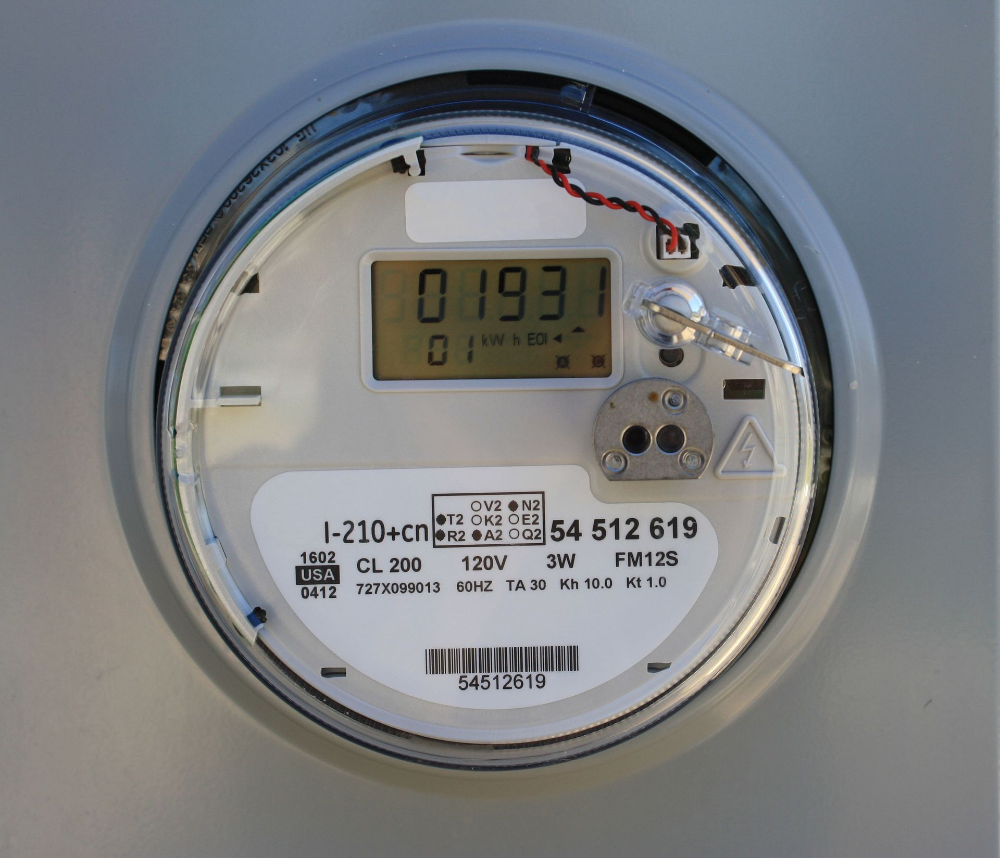

מעבר לאחד מ**ספקי חשמל פרטיים** הפך בשנתיים האחרונות לאחד המהלכים הצרכניים הפופולריים בישראל: מאות אלפי בתי אב כבר עזבו את התעריף האחיד של חברת החשמל ועברו לחברות פרטיות המציעות הנחה על מחיר הקילוואט-שעה. התשובה הקצרה לשאלה אם זה משתלם — כן, כמעט לכולם, אך גובה החיסכון תלוי ישירות בהרגלי הצריכה ובמסלול שתבחרו.

עם פתיחת שוק החשמל לתחרות, נכנסו לזירה שחקנים כמו אלקטרה פאוור, פזגז, סלקום אנרג'י, בזק ואחרים, שמתחרים על הצרכן הביתי בהנחות ובמבצעי הצטרפות. ההנחה ניתנת על רכיב ייצור החשמל, בעוד שרכיב ההולכה והחלוקה נותר בידי חברת החשמל וחברת נגה.

## איך עובד המעבר לספק חשמל פרטי?

המעבר פשוט ומהיר, ורבים לא מודעים לכמה שהוא הפך לנטול חיכוך. אינכם צריכים להחליף מונה, לנתק חשמל או להזמין טכנאי. הספק הפרטי מבצע את כל התהליך מול חברת החשמל, וכל שנדרש מכם הוא מספר חוזה (מספר משלם) שמופיע בחשבון החשמל, פרטים אישיים ואמצעי תשלום.

חשוב להבהיר: **אמינות אספקת החשמל אינה נפגעת**. גם לאחר המעבר, מי שאחראי על התשתית והתקלות הוא עדיין חברת החשמל. הספק הפרטי הוא למעשה גורם מסחרי שמוכר לכם את האנרגיה בהנחה.

### כמה באמת חוסכים?

כאן נדרשת זהירות צרכנית. ההנחות המשווקות אמנם נשמעות גבוהות, אך הן חלות רק על חלק מהחשבון — רכיב האנרגיה, שהוא כ-60%–70% מהתעריף. לכן הנחה של 15% על רכיב האנרגיה מתורגמת לחיסכון נמוך יותר בשורה התחתונה של החשבון.

## השוואת מסלולי חשמל פרטיים נפוצים

המסלולים בשוק מתחלקים לכמה סוגים עיקריים, שכל אחד מתאים לפרופיל צריכה שונה:

| סוג מסלול | מאפיין ההנחה | למי מתאים |
|---|---|---|
| הנחה קבועה כל היום | הנחה אחידה (כ-5%–7%) בכל שעות היממה | משקי בית עם צריכה מפוזרת |
| הנחת שעות היום | הנחה גבוהה יותר בשעות הבוקר והצהריים | עובדים מהבית, פנסיונרים |
| הנחת שעות הלילה | הנחה בשעות הערב והלילה | משפחות, מכונות כביסה בלילה |
| מסלול שבתות וחגים | הנחה מוגברת בסופי שבוע | מי שבבית בעיקר בסופ"ש |

העיקרון הצרכני המרכזי: התאימו את המסלול לזמנים שבהם אתם באמת צורכים חשמל. מי שמפעיל מזגן, תנור ומדיח בשעות הערב לא ייהנה ממסלול שמעניק הנחה דווקא בשעות הבוקר.

## מה כדאי לבדוק לפני שמצטרפים?

לפני החתימה, מומלץ לעבור על כמה נקודות מפתח שמפרידות בין מבצע אמיתי לבין הבטחה שיווקית:

- **תקופת ההנחה** — האם ההטבה קבועה לאורך זמן או שמדובר במחיר היכרות שיעלה בעוד מספר חודשים.
- **התניות בשעות** — ודאו מה בדיוק שעות ההנחה ואל תניחו שהיא חלה כל היום.
- **דמי הצטרפות או קנס יציאה** — רוב החברות אינן גובות, אך יש לוודא זאת.
- **מונה חכם** — חלק מהמסלולים הדיפרנציאליים (לפי שעות) מחייבים התקנת מונה חכם, שמותקן ללא עלות אך דורש תיאום.
- **שירות לקוחות** — בדקו את זמינות התמיכה וממשק המעקב אחר הצריכה.

### הזירה התחרותית מתחממת

התחרות בשוק צפויה להתעצם. ככל שיותר בתי אב עוברים לספקים פרטיים, החברות מגבירות את מאמצי השיווק, מה שמיטיב עם הצרכן. במקביל, התקנת מונים חכמים בכל הארץ — פרויקט שמוביל משק החשמל — צפויה לאפשר מסלולים חכמים ומדויקים יותר, המתגמלים צריכה בשעות הזולות.

עבור המשק כולו, המהלך משתלב במגמה רחבה יותר של ניהול ביקושים: הזזת הצריכה משעות השיא היקרות לשעות הזולות מקלה על העומס על הרשת ומפחיתה את הצורך בהקמת תחנות כוח נוספות.

## שורה תחתונה: כדאי, אבל בעיניים פקוחות

עבור מרבית הצרכנים, מעבר לספק חשמל פרטי הוא מהלך פשוט שמניב חיסכון של מאות שקלים בשנה, ללא סיכון באיכות האספקה. עם זאת, החיסכון אינו אוטומטי: בחירת מסלול לא מתאים עלולה לצמצם משמעותית את התועלת. הכלל הזהב — הכירו את פרופיל הצריכה שלכם, השוו בין מספר הצעות, וקראו את האותיות הקטנות לפני שאתם חותמים.
