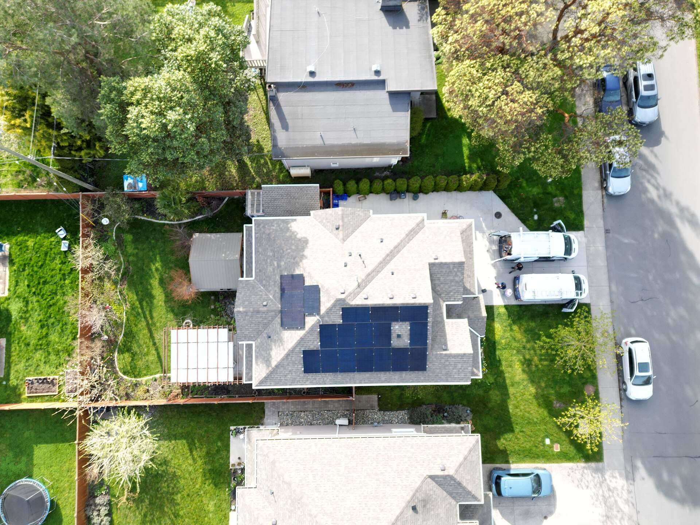

מחיר החשמל בישראל שב ותופס כותרות: התעריף הביתי ממשיך לטפס, וכל עדכון של רשות החשמל מיתרגם ישירות לחשבון הדו-חודשי שמגיע למשקי הבית. התשובה הקצרה לשאלה "למה זה קורה" היא שילוב של עלויות ייצור, מחירי דלקים גלובליים, השקעות ענק בשדרוג הרשת, והצורך לממן את המעבר לאנרגיות מתחדשות. הצרכן, בסופו של דבר, הוא זה שסופג את מרבית העלייה.

## מדוע מחיר החשמל ממשיך לעלות?

תעריף החשמל בישראל נקבע על ידי רשות החשמל, ומורכב ממספר רכיבים: עלות הייצור (כולל דלק וגז טבעי), עלות ההולכה והחלוקה ברשת, ורכיבים רגולטוריים נוספים. בשנים האחרונות כל אחד מהמרכיבים הללו נמצא בלחץ מעלה.

ראשית, מחירי האנרגיה העולמיים תנודתיים, והתלות בגז טבעי חושפת את המערכת לזעזועים. שנית, חברת החשמל ומנהל המערכת נדרשים להשקיע מיליארדי שקלים בשדרוג תשתיות מתיישנות ובחיבור מתקני אנרגיה סולארית ומערכות אגירה. חלק ניכר מההשקעה הזו מגולגל לתעריף.

## כמה באמת עולה לכם החשמל?

חשבון החשמל של משק בית ממוצע בישראל נע במאות שקלים בחודשיים, וקופץ משמעותית בחודשי הקיץ והחורף בשל השימוש האינטנסיבי במיזוג. חשוב להבין אילו מכשירים אחראים לחלק הארי מהצריכה — שם נמצא פוטנציאל החיסכון האמיתי.

| מכשיר / שימוש | נתח מצריכת החשמל הביתית (הערכה) | פוטנציאל חיסכון |
|---|---|---|
| מיזוג אוויר וחימום | גבוה מאוד | כוונון ל-24-25 מעלות, ניקוי מסננים |
| דוד חשמל | גבוה | שימוש בקולטים סולאריים, שעון שבת |
| מקרר ומקפיא | בינוני-קבוע | מכשיר בדירוג אנרגטי גבוה |
| מייבש כביסה | בינוני-גבוה | ייבוש על חבל בעונות החמות |
| תאורה ומכשירי המתנה | נמוך-בינוני | מעבר לתאורת לד, ניתוק מהשקע |

## איך חותכים את חשבון החשמל?

### מעבר לספק חשמל פרטי

מאז פתיחת שוק החשמל לתחרות, צרכנים יכולים לעבור מספקי חשמל פרטיים המציעים הנחה על רכיב האנרגיה בתעריף. ההנחות נעות בדרך כלל בטווח של כ-5% עד 15%, בהתאם למסלול — קבוע, לפי שעות היום, או לפי סוף שבוע. המעבר עצמו פשוט, נעשה דרך מונה חכם, ואינו כרוך בשינוי פיזי בבית. מומלץ להשוות מסלולים לפי פרופיל הצריכה האישי: מי שצורך בעיקר בשעות הלילה ייהנה ממסלול אחר ממי שבבית בשעות היום.

### שינוי הרגלי צריכה

חלק מהחיסכון אינו עולה דבר. כיוון המזגן לטמפרטורה מתונה, ייבוש כביסה בשמש, כיבוי מכשירים במצב המתנה והחלפת נורות ישנות בתאורת לד — כל אלה מצטברים למאות שקלים בשנה. שימוש בשעון שבת לדוד החשמל מונע חימום מיותר של מים לאורך היממה.

### הפקת חשמל ביתית

ככל שמחיר החשמל עולה, כך משתפרת הכדאיות של התקנת מערכת סולארית על גג הבית. משקי בית פרטיים ובנייני מגורים יכולים לייצר חשמל למכירה לרשת או לצריכה עצמית, מה שמקצר את תקופת ההחזר על ההשקעה. זהו אפיק שדורש הון ראשוני אך מספק תשואה יציבה לאורך שנים.

## מה צפוי בהמשך?

המגמה ארוכת הטווח ברורה: מעבר הדרגתי מייצור מבוסס דלקים לאנרגיה מתחדשת, לצד השקעות כבדות בתשתית. בטווח הקצר, התעריף צפוי להישאר תנודתי ולנוע בהתאם למחירי הגז והדלק. עבור הצרכן הישראלי, המסקנה המעשית היא שהחיסכון בחשמל הופך מ"נחמד שיהיה" לצעד כלכלי משתלם: כל אחוז בתעריף שממשיך לעלות מגדיל את הכדאיות של מעבר לספק זול יותר, של שדרוג מכשירים ושל התייעלות אנרגטית בבית.
