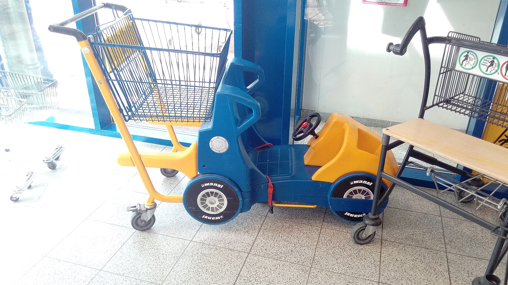

המותג הפרטי הפך בשנים האחרונות לאחד הכלים המרכזיים של הצרכן הישראלי במאבק ביוקר המחיה. מדובר במוצרים שמיוצרים עבור רשת השיווק ונושאים את שמה — כמו הקו הזול של שופרסל, רמי לוי או ויקטורי — ומוצעים במחיר נמוך משמעותית מהמותגים המובילים. הבשורה הצרכנית הפשוטה: מעבר למותג הפרטי בקטגוריות הנכונות יכול לחתוך עשרות ואף מאות שקלים מסל הקניות החודשי, ולרוב בלי פשרה מורגשת על האיכות.

## מה זה בעצם מותג פרטי ולמה הוא זול יותר?

המותג הפרטי הוא מוצר שהרשת מזמינה ישירות ממפעל יצרן, לרוב אותו מפעל שמייצר גם את המותגים המובילים, אך ללא עלויות השיווק, הפרסום ומאמצי המיתוג העצומים של החברות הגדולות. התוצאה: מחיר מדף נמוך בעשרות אחוזים.

החיסכון נובע משלושה גורמים עיקריים:

- **היעדר תקציבי פרסום** — אין קמפיינים בטלוויזיה או שלטי חוצות שהצרכן מממן בעקיפין.
- **כוח קנייה מרוכז** — הרשת מזמינה כמויות ענק ומקבלת מחיר נמוך מהיצרן.
- **מיקום מדף** — הרשת שולטת בחלל החנות ויכולה למקם את המותג הפרטי בגובה העיניים.

חשוב להבין: המותג הפרטי משתלם לרשתות לא פחות משהוא משתלם לצרכן. שולי הרווח על מוצרי המותג הפרטי גבוהים לרוב מאלו של המותגים הלאומיים, ולכן הרשתות דוחפות אותו באגרסיביות.

## כמה באמת חוסכים? השוואת מחירים

הפער בין המותג הפרטי למותג המוביל משתנה מקטגוריה לקטגוריה, אך בממוצע נע בין 20% ל-40%. הטבלה הבאה ממחישה את סדר הגודל של החיסכון הפוטנציאלי (הערכות מגמה, המחירים משתנים בין רשתות ולאורך זמן):

| קטגוריה | מותג מוביל (הערכה) | מותג פרטי (הערכה) | חיסכון משוער |
|---|---|---|---|
| קמח לבן 1 ק"ג | כ-6-7 ש"ח | כ-3-4 ש"ח | כ-40% |
| שמן קנולה 1 ליטר | כ-12-14 ש"ח | כ-8-9 ש"ח | כ-35% |
| שימורי טונה | כ-9-11 ש"ח | כ-6-7 ש"ח | כ-30% |
| נייר טואלט | כ-25-30 ש"ח | כ-16-20 ש"ח | כ-30% |
| קורנפלקס | כ-18-22 ש"ח | כ-12-14 ש"ח | כ-30% |

בחישוב שנתי, משפחה שמעבירה כשליש מסל הקניות שלה למותג הפרטי יכולה לחסוך אלפי שקלים בשנה.

## האם האיכות נפגעת?

זו השאלה הצרכנית המרכזית, והתשובה מורכבת. בקטגוריות של מוצרי יסוד — קמח, סוכר, שמן, שימורים, נייר וחומרי ניקוי בסיסיים — הפער האיכותי בין המותג הפרטי למותג המוביל זניח או לא קיים, פשוט כי מדובר במוצר אחיד. כאן החיסכון הוא כמעט "חינם".

לעומת זאת, בקטגוריות שבהן הטעם והמרקם קריטיים — קפה, שוקולד, מוצרי חלב מסוימים או חטיפים — חלק מהצרכנים כן מבחינים בהבדל ומעדיפים את המותג המוכר. עם זאת, גם כאן הפער הצטמצם, ורשתות כמו שופרסל השיקו קווי מותג פרטי "פרימיום" שמכוונים בדיוק לצרכן שלא מוכן להתפשר.

### מתי כדאי לעבור ומתי לא

- **כדאי בוודאות:** מוצרי יסוד, חומרי ניקוי, נייר, שימורים, קטניות יבשות.
- **שווה לנסות:** חטיפים, ביסקוויטים, מוצרי מאפה, רטבים.
- **לשיקול אישי:** קפה, שוקולד איכותי, גבינות מיוחדות — כאן הטעם מכריע.

## המגמה: המותג הפרטי רק מתחזק

על רקע גלי ההתייקרות בסל הקניות והלחץ הציבורי על יוקר המחיה, נתח המותג הפרטי בישראל נמצא במגמת עלייה עקבית. הרשתות מרחיבות את מגוון המוצרים תחת המותג הפרטי, נכנסות לקטגוריות חדשות ומשקיעות בעיצוב אריזות שמצמצם את הפער התדמיתי מול המותגים הלאומיים.

המגמה הזו מוכרת היטב באירופה, שם בשווקים כמו בריטניה, גרמניה ושווייץ המותג הפרטי מהווה נתח משמעותי מאוד מהמכירות — לעיתים מעל 40%. ישראל עדיין מפגרת אחרי המספרים הללו, אך מצמצמת את הפער במהירות.

עבור הצרכן, זו בשורה כפולה: מצד אחד, יותר אפשרויות זולות על המדף; מצד שני, התחרות שהמותג הפרטי יוצר מפעילה לחץ מחירים גם על המותגים המובילים. השורה התחתונה — סריקה מודעת של המדף וניסיון של מוצרי מותג פרטי בקטגוריות הנכונות הם אחת הדרכים הפשוטות והיעילות ביותר לחתוך את הוצאות הבית מבלי לוותר על איכות החיים.
