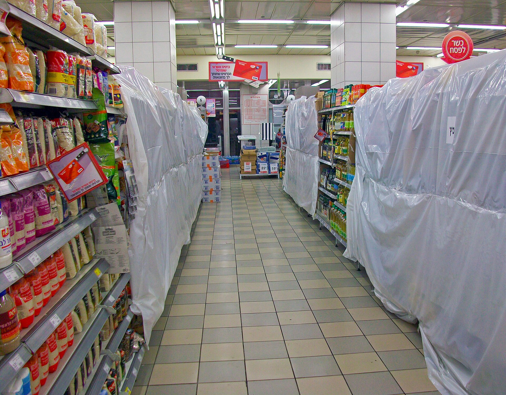

על רקע יוקר המחיה המתמשך, **המותג הפרטי** הפך לאחד הכלים המרכזיים של הצרכן הישראלי לצמצום ההוצאה בסופרמרקט. מדובר במוצרים הנמכרים תחת שמה של הרשת עצמה — שופרסל, רמי לוי, ויקטורי, יינות ביתן או טיב טעם — במחיר נמוך משמעותית מהמותגים המובילים, לעיתים בפער של 20% ועד 40%. בשנים האחרונות נתח המותג הפרטי בסל הקניות הישראלי גדל בהתמדה, והוא כבר מזמן אינו נחלת בעלי ההכנסה הנמוכה בלבד.

## מדוע המותג הפרטי מזנק דווקא עכשיו?

גל ההתייקרויות במזון, שהתגלגל מספקיות ענק כמו שטראוס, אסם-נסטלה, תנובה וקוקה-קולה אל המדפים, דחף צרכנים רבים לחפש חלופות זולות. כאשר חטיף או מוצר חלב מוכר מתייקר בעשרות אגורות, ההבדל מול המקבילה של המותג הפרטי הופך למורגש בקופה.

הרשתות, מצידן, מזהות כאן הזדמנות כפולה: הן עונות על ביקוש צרכני לחיסכון, וגם משפרות את הרווחיות שלהן. שולי הרווח על מותג פרטי גבוהים לרוב מאלה של מותג מסחרי, משום שהרשת חוסכת את עלויות השיווק והפרסום העצומות של יצרני המותגים הגדולים ומדלגת על חלק מהמתווכים.

## כמה באמת חוסכים? השוואת מחירים

החיסכון משתנה מקטגוריה לקטגוריה, אך בקטגוריות הבסיס הוא עקבי ומשמעותי. הטבלה הבאה ממחישה את פערי המחיר האופייניים (הערכות טווח, לא מחירים קבועים):

| קטגוריה | מותג מוביל (טווח) | מותג פרטי (טווח) | חיסכון מוערך |
|---|---|---|---|
| קמח לבן 1 ק"ג | כ-6-8 ₪ | כ-4-5 ₪ | 25%-35% |
| חלב 3% ליטר | מחיר מפוקח דומה | מחיר מפוקח דומה | זניח |
| נייר טואלט (מארז) | כ-30-40 ₪ | כ-18-25 ₪ | 30%-40% |
| קורנפלקס | כ-20-25 ₪ | כ-12-16 ₪ | 30%-40% |
| נוזל כלים | כ-15-20 ₪ | כ-8-12 ₪ | 35%-45% |

המסקנה ברורה: במוצרי ניקיון, נייר וקטגוריות יבשות, הפער עצום ולרוב האיכות דומה. במוצרים מפוקחים, כמו חלב 3% או לחם אחיד, המחיר כמעט זהה ולכן אין יתרון מובהק.

## האם האיכות נופלת?

זו השאלה הצרכנית המרכזית — והתשובה תלויה בקטגוריה. במוצרי בסיס כמו סוכר, מלח, קמח, שמן ומוצרי ניקיון, ההרכב פשוט וההבדל מהמותג המוביל לרוב זניח. פעמים רבות אותו יצרן שמייצר את המותג המוכר מייצר גם את המותג הפרטי באותו פס ייצור.

לעומת זאת, בקטגוריות טעם מובהקות — קפה, שוקולד, חטיפים, רטבים — הפער יכול להיות מורגש יותר, ופה שווה להתנסות לפני מעבר גורף. גם עולם המותג הפרטי התפצל: לצד קו "מחיר" בסיסי, הרשתות משיקות קווי פרימיום שמתחרים ישירות באיכות המותגים הגדולים.

## מי מפסיד מהמגמה?

המנצחים הגדולים הם הצרכנים והרשתות. המפסידות הן חברות המזון הגדולות, שרואות נתח שוק נשחק ונאלצות להגן על עמדתן באמצעות מבצעים, חדשנות וקיצוץ עלויות. עבור יצרנים קטנים המצב מורכב יותר: חלקם הופכים לספקי מותג פרטי של הרשתות ומרוויחים היקפי ייצור, ואחרים נדחקים מהמדף.

כדאי לזכור גם את הצד הבעייתי: ריכוזיות גוברת. ככל שהרשתות שולטות ביותר קטגוריות דרך המותג הפרטי, גדל כוחן מול הספקים ומול הצרכן כאחד.

## איך לקנות נכון מותג פרטי

- **השוו מחיר ליחידה** — בדקו את המחיר לק"ג או לליטר, לא את מחיר האריזה. זו הדרך הבטוחה לזהות חיסכון אמיתי.
- **התחילו מקטגוריות הבסיס** — קמח, סוכר, ניקיון ונייר: כאן החיסכון גבוה והסיכון לאכזבה נמוך.
- **התנסו בהדרגה** — קנו יחידה אחת של מוצר טעם לפני שאתם עוברים לחלוטין.
- **אל תזניחו את המבצעים** — לעיתים מבצע על מותג מוביל זול יותר מהמותג הפרטי במחיר מלא.
- **בדקו את קו הפרימיום** — לפעמים הוא מציע איכות גבוהה במחיר ביניים משתלם.

בשורה התחתונה, המותג הפרטי הוא כלי חיסכון אפקטיבי שכל צרכן ישראלי צריך לשקול — ובלבד שמשתמשים בו בחוכמה, קטגוריה אחר קטגוריה.
