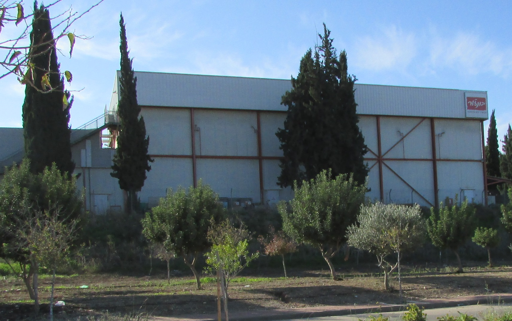

**אינטל בישראל** ניצבת בפרשת דרכים קריטית: החברה, שנחשבת שנים לאחת מהיצואניות הגדולות במשק ולמעסיק הפרטי הגדול בישראל, מתמודדת עם גל קיצוצים גלובלי, ירידה ברווחיות ותחרות חריפה מול יצרניות אסייתיות. בלב הסוגיה עומדת שאלה אחת מרכזית: מה יעלה בגורל ההשקעה הענקית בהרחבת מפעל השבבים בקריית גת, פרויקט שנחשב לאחד מעוגני הצמיחה של תעשיית ההיי-טק בדרום.

התשובה הקצרה: ההשקעה לא בוטלה, אך קצב ההתקדמות שלה הואט משמעותית לצד ההתייעלות הרחבה שמובילה הנהלת אינטל העולמית. עבור המשק הישראלי מדובר בסיכון ממשי — הן מבחינת יצוא, הן מבחינת תעסוקה והכנסות המדינה.

## מדוע אינטל כה חשובה למשק הישראלי?

אינטל פועלת בישראל מאז שנות השבעים, ומאז הפכה לאחד מעמודי התווך של תעשיית השבבים המקומית. לחברה מרכזי פיתוח בחיפה, בירושלים, בפתח תקווה ובבאר שבע, ומפעל הייצור המרכזי שלה שוכן בקריית גת. אינטל מעסיקה אלפי עובדים ישירות, ותורמת לתעסוקה של אלפים נוספים דרך קבלני משנה, ספקים ושירותים נלווים.

מעבר לתעסוקה, אינטל היא שחקן מפתח ב**יצוא ההיי-טק** הישראלי. השבבים המיוצרים בקריית גת נשלחים ללקוחות ברחבי העולם, ותורמים נתח משמעותי מיצוא הסחורות של המדינה. כל האטה בפעילות המפעל מהדהדת ישירות במאזן הסחר ובנתוני הצמיחה.

## מה קורה עם ההשקעה בקריית גת?

לפני מספר שנים הכריזה אינטל על תוכנית השקעה שאפתנית להרחבת המפעל בקריית גת, במסגרתה תוכננה הזרמה של עשרות מיליארדי דולרים לאורך העשור. המדינה, מצידה, התחייבה למענקים והטבות מס משמעותיים כחלק ממדיניות עידוד ההשקעות.

אולם המציאות העסקית של אינטל השתנתה. החברה נקלעה לתקופה מאתגרת: נתח השוק שלה נשחק, המעבר לטכנולוגיות ייצור מתקדמות התעכב, והתחרות מול יצרניות כמו טי-אס-אם-סי מטיוואן וסמסונג מדרום קוריאה החריפה. על רקע זה הכריזה ההנהלה הגלובלית על תוכנית התייעלות רחבה הכוללת קיצוצים בכוח האדם וריסון ההוצאות ההוניות.

המשמעות עבור קריית גת: לוחות הזמנים של ההרחבה נמתחו, וההתקדמות בפועל איטית מהמתוכנן. גורמים בענף מעריכים כי אינטל תבחן בקפידה כל שלב בהשקעה בהתאם לביקושים ולמצבה הפיננסי.

## אינטל מול המתחרות: תמונת מצב

כדי להבין את הלחץ שבו נתונה אינטל, כדאי לבחון את מיצובה מול השחקניות המרכזיות בתעשיית השבבים העולמית:

| חברה | מדינת בסיס | מודל עסקי עיקרי | מעמד בשוק |
|---|---|---|---|
| אינטל | ארצות הברית | תכנון וייצור עצמי | לחץ תחרותי גובר |
| טי-אס-אם-סי | טיוואן | ייצור עבור לקוחות (יציקה) | מובילה עולמית בייצור |
| סמסונג | דרום קוריאה | תכנון וייצור עצמי | שחקנית מובילה |
| אנבידיה | ארצות הברית | תכנון בלבד | מובילה בשבבי בינה מלאכותית |

הטבלה ממחישה את האתגר: בעוד אנבידיה ממריאה על גל הביקוש לשבבי בינה מלאכותית, וטי-אס-אם-סי שולטת בייצור עבור מרבית מעצבות השבבים בעולם, אינטל נאבקת לשמר את מעמדה ההיסטורי הן בתכנון והן בייצור.

## מה המשמעות לעובדים ולדרום?

האטה בהשקעה נושאת עמה סיכון תעסוקתי ממשי, בייחוד לאזור הדרום. קריית גת נהנתה בשנים האחרונות ממנוע צמיחה כלכלי משמעותי בזכות המפעל, שהזרים עבודה, הכנסות ופיתוח לאזור כולו. פגיעה בקצב ההשקעה עלולה להשפיע על שוק הנדל"ן המקומי, על העסקים הקטנים ועל אלפי משפחות התלויות בשרשרת האספקה של החברה.

עם זאת, חשוב לשמור על פרופורציות: אינטל לא הכריזה על עזיבת ישראל, ומרכזי הפיתוח שלה ממשיכים לפעול. השאלה היא בעיקר של קצב וגודל — האם ההשקעה תמומש במלואה ובלוח הזמנים המקורי, או שתיפרס על פני שנים רבות יותר.

## מה צופה העתיד?

גורלה של אינטל בישראל קשור בטבורו למהלכי ההתאוששות של החברה בזירה הגלובלית. אם אינטל תצליח להשיב לעצמה מקום בחזית טכנולוגיית הייצור ולזכות בהזמנות משמעותיות, הרחבת קריית גת עשויה לחזור למסלול. מנגד, המשך שחיקה במעמדה עלול להוביל לצמצום נוסף בתוכניות.

המדינה, מצידה, נדרשת לאזן בין הרצון לשמר את אחת ההשקעות הגדולות בתולדותיה, לבין הצורך להימנע מהסתמכות יתר על שחקן בודד. חיזוק המערכת האקולוגית של תעשיית השבבים המקומית — ובכללה הסטארטאפים והחברות הבינוניות — עשוי להפחית את התלות ולחזק את החוסן של המשק בטווח הארוך.
