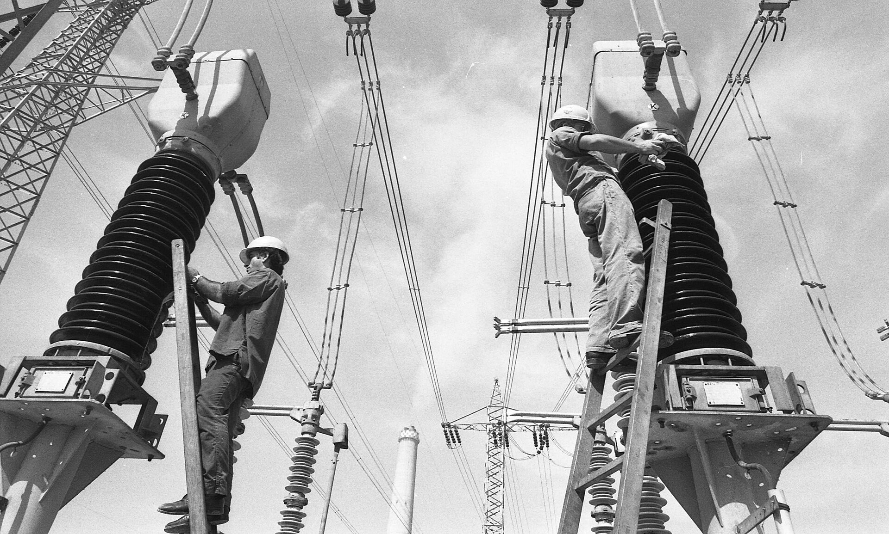

תעריף החשמל בישראל שב ומתייקר, וממשיך להעיב על תקציב משק הבית. בשורה התחתונה: העלייה בתעריף נובעת בעיקר מהתייקרות הדלקים המשמשים לייצור, מהשקעות כבדות בתשתיות ההולכה והחלוקה, ומעדכון מרכיבי התעריף שמאשרת רשות החשמל. עבור המשפחה הישראלית הממוצעת המשמעות היא חשבון גבוה יותר בכל חודשיים — אך יש כמה צעדים פרקטיים שמאפשרים לרסן את ההוצאה.

## מדוע תעריף החשמל מתייקר?

מחיר החשמל שאנחנו משלמים אינו מורכב רק מעלות הייצור. הוא כולל מרכיבי הולכה, חלוקה, ניהול מערכת ותשתיות. בשנים האחרונות נדרשה חברת החשמל ורשות החשמל להזרים השקעות אדירות בשדרוג הרשת, בחיבור אנרגיות מתחדשות ובחיזוק העמידות של המערכת — עלויות שמגולגלות בסופו של דבר אל הצרכן.

גורם מרכזי נוסף הוא מחיר הגז הטבעי והפחם המשמשים לייצור. תנודות במחירי האנרגיה העולמיים, לצד שער הדולר-שקל, משפיעים ישירות על עלות הייצור. כשמחירי הדלקים עולים, רשות החשמל מעדכנת את התעריף כלפי מעלה, לרוב בתחילת השנה הקלנדרית.

## כמה באמת עולה לכם החשמל?

משק בית ישראלי ממוצע צורך כמה מאות קילוואט-שעה בחודש, כאשר בחודשי הקיץ והחורף הצריכה מזנקת בשל השימוש האינטנסיבי במיזוג אוויר. חשבון דו-חודשי טיפוסי נע בין כמה מאות שקלים בעונות המעבר ועד למעל אלף שקלים בשיא הקיץ או החורף בבתים גדולים.

הצרכנים הגדולים בבית הם ברורים: מזגנים, דוד חשמל, מייבש כביסה, תנורים חשמליים ומקררים ישנים. זיהוי הצרכנים הללו הוא הצעד הראשון לחיסכון אמיתי.

## מעבר לספק חשמל פרטי: כדאי?

רפורמת משק החשמל פתחה את השוק לתחרות, וכיום פועלים בישראל ספקי חשמל פרטיים המציעים הנחות על מחיר הצריכה. חשוב להבין: ההנחה חלה על **רכיב האנרגיה** בלבד, לא על מלוא החשבון, ולכן ההטבה בפועל קטנה מאחוז ההנחה המפורסם.

| מסלול | הנחה מפורסמת | חיסכון שנתי מוערך* |
|---|---|---|
| ללא ספק פרטי | 0% | 0 ש"ח |
| מסלול הנחה קבועה | 5%-7% | כ-150-300 ש"ח |
| מסלול לפי שעות | עד 20% בשעות מסוימות | תלוי בהרגלי צריכה |
| מסלול ללקוחות מגוונים | 6%-15% | כ-200-500 ש"ח |

*הערכה למשק בית ממוצע; החיסכון בפועל תלוי בהיקף הצריכה ובדפוסי השימוש.

מסלולים "לפי שעות" משתלמים במיוחד למי שיכול להסיט צריכה לשעות הזולות — למשל הפעלת מכונת כביסה, מדיח או טעינת רכב חשמלי בלילה.

## חמישה צעדים לחיסכון בחשבון החשמל

- **טיימר לדוד החשמל** — הפעלה של שעה-שעתיים ביום מספיקה לרוב הבתים ומורידה משמעותית את הצריכה.
- **מיזוג חכם** — הגדרת המזגן ל-24-25 מעלות בקיץ במקום 20 חוסכת עשרות אחוזים בצריכת המזגן.
- **החלפת נורות לתאורת לד** — צריכת חשמל נמוכה בהרבה ואורך חיים ארוך.
- **ניתוק מכשירים במצב המתנה** — טלוויזיות, ממירים ומטענים צורכים חשמל גם כבויים לכאורה.
- **בדיקת מסלול הספק** — השוואת הצעות בין ספקי החשמל הפרטיים אחת לשנה.

## סולארי ביתי: ההשקעה שהופכת משתלמת יותר

ככל שתעריף החשמל עולה, כך מתקצר זמן ההחזר על השקעה במערכת סולארית ביתית. משק בית שמתקין מערכת פוטו-וולטאית על הגג יכול לקזז חלק ניכר מצריכתו, ובמסלולים מסוימים אף למכור עודפי ייצור לרשת. עבור בעלי בתים פרטיים או גגות פרטיים, זו הפכה לאחת ההשקעות הצרכניות המדוברות בישראל — אם כי היא דורשת הון ראשוני ובדיקת התאמה של הגג.

## שורה תחתונה

תעריף החשמל ימשיך ככל הנראה להיות רגיש למחירי האנרגיה העולמיים ולעלויות התשתית. הצרכן אינו יכול לשלוט במחיר שקובעת רשות החשמל, אך הוא בהחלט יכול לשלוט בכמות שהוא צורך ובמסלול שבו הוא רכוש. שילוב של הרגלי צריכה חכמים, בחירת ספק מתאים והשקעה נקודתית בטכנולוגיה חוסכת אנרגיה — יכול לחתוך מאות שקלים מהחשבון השנתי.
