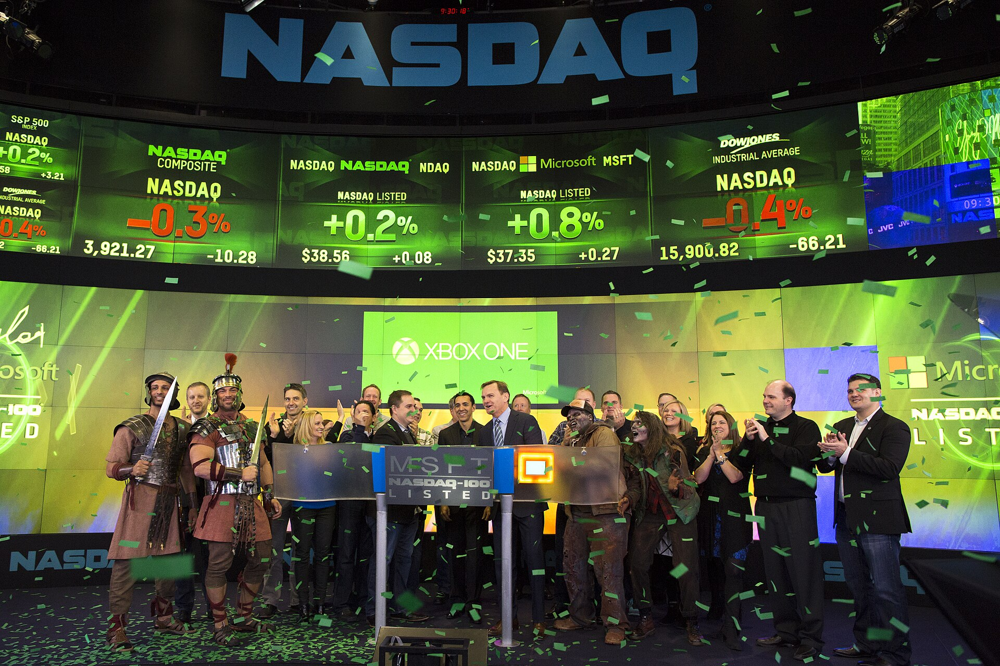

אחרי כשנתיים של קיפאון כמעט מוחלט, **גל ההנפקות** של חברות ההייטק הישראליות חוזר לחיים. חברות טכנולוגיה מקומיות, בעיקר בתחומי הסייבר והבינה המלאכותית, מסמנות מחדש את וול סטריט כיעד, על רקע התאוששות השווקים, התייצבות סביבת הריבית וירידת אי-הוודאות שאפיינה את השנים האחרונות. עבור אקוסיסטם ההייטק הישראלי, זו עשויה להיות נקודת מפנה שתשחרר לחץ שהצטבר במשך זמן רב.

## מה עומד מאחורי התפנית?

שוק ההנפקות הראשוניות (IPO) בעולם קפא כמעט לחלוטין בשנים 2022-2023, כשעליית הריבית החדה של הבנקים המרכזיים ייקרה את הכסף ופגעה קשות בשווי חברות הצמיחה. משקיעים העדיפו נכסים בטוחים, והחברות דחו את תוכניות ההנפקה שלהן.

כעת התמונה מתהפכת. ההערכות בשוק הן שהריבית בארצות הברית תמשיך במגמת ירידה מתונה, מה שמגדיל את התיאבון לסיכון ומחזיר את הזרקור למניות הטכנולוגיה. מדד נאסד"ק, שנסחר סביב שיאים היסטוריים, יוצר חלון הזדמנויות שחברות רבות מבקשות לנצל לפני שהוא ייסגר.

### למה דווקא עכשיו?

מעבר לתנאי המאקרו, נבנה "פקק" של חברות בשלות שהמתינו שנים להזדמנות. מדובר בחברות שגייסו הון פרטי בשווי גבוה בתקופת השיא של 2021, ושכעת נדרשות לספק נזילות למשקיעים ולעובדים. עבור רבות מהן, ההנפקה הפומבית היא הדרך הטבעית — אם כי חלקן בוחרות במסלול חלופי של מכירה (אקזיט) לתאגידים גדולים.

## מי החברות שמובילות את הגל?

בחזית עומדות חברות הסייבר, תחום שבו ישראל נחשבת למעצמה עולמית. לצידן, חברות המשלבות בינה מלאכותית במוצריהן זוכות לעניין מוגבר מצד משקיעים. גם חברות בתחום התוכנה הארגונית (SaaS) עם צמיחה יציבה נמצאות על הרדאר.

עם זאת, האווירה שונה מזו של 2021. המשקיעים מגלים היום **סלקטיביות גבוהה בהרבה**. בעוד שבתקופת הבועה חברות הונפקו על בסיס הבטחת צמיחה עתידית בלבד, כיום השוק דורש הכנסות מוכחות, מסלול ברור לרווחיות ומודל עסקי יציב. חברות שאינן עומדות בסטנדרטים אלה מתקשות לצאת לדרך.

## נאסד"ק או תל אביב?

למרות המאמצים של הבורסה בתל אביב למשוך חברות טכנולוגיה, נאסד"ק נותרת היעד המועדף על הענקיות הישראליות, בעיקר בשל הנזילות העמוקה, המכפילים הגבוהים והחשיפה לבסיס משקיעים גלובלי. עם זאת, מסתמנת מגמה של **רישום כפול** — חברות שמונפקות בוול סטריט אך נסחרות במקביל גם בתל אביב, מהלך שמאפשר למשקיע הישראלי חשיפה ישירה.

### טבלת השוואה: מסלולי ההנפקה

| פרמטר | נאסד"ק (ניו יורק) | הבורסה בתל אביב | רישום כפול |
|---|---|---|---|
| נזילות | גבוהה מאוד | בינונית | גבוהה |
| מכפילי שווי | גבוהים | נמוכים יותר | תלוי בשוק המוביל |
| עלות ורגולציה | גבוהה | נמוכה יחסית | גבוהה |
| חשיפה למשקיע הישראלי | עקיפה | ישירה | ישירה |
| קהל המשקיעים | גלובלי | מקומי בעיקר | משולב |

## מה המשמעות למשקיע הישראלי?

גל ההנפקות המתחדש הוא בשורה חיובית לכלכלה הישראלית. הנפקה מוצלחת מזרימה הון לחברות, מאפשרת מימוש רווחים למשקיעים המוקדמים ולעובדי החברות, וממחזרת כסף חזרה לאקוסיסטם דרך השקעות בסטארטאפים חדשים. "אפקט העושר" הזה עשוי לתמוך גם בצריכה המקומית ובענף הנדל"ן.

עם זאת, על המשקיע הפרטי לנהוג בזהירות. השקעה בחברות בהנפקה ראשונית נחשבת מסוכנת יחסית — מחירי המניות בתקופה שלאחר ההנפקה נוטים לתנודתיות גבוהה, ולא כל החברות שמתלהבות מהן בשלב ההנפקה מצליחות לשמור על השווי לאורך זמן. הכלל המנחה נותר: היכרות מעמיקה עם המודל העסקי והדוחות הכספיים, ולא היסחפות אחר ההייפ.

## הסיכונים שעוד מרחפים

למרות האופטימיות, מספר גורמים עלולים לבלום את הגל. אי-יציבות גאופוליטית באזור, האטה כלכלית עולמית או תיקון חד בשוקי המניות האמריקאיים — כל אלה עלולים לסגור במהירות את חלון ההזדמנויות. בנוסף, המצב הביטחוני בישראל מוסיף פרמיית סיכון שמשקיעים זרים לוקחים בחשבון בעת תמחור החברות. הגל הנוכחי, אם כן, שברירי מטבעו ותלוי בהמשך היציבות בשווקים.
