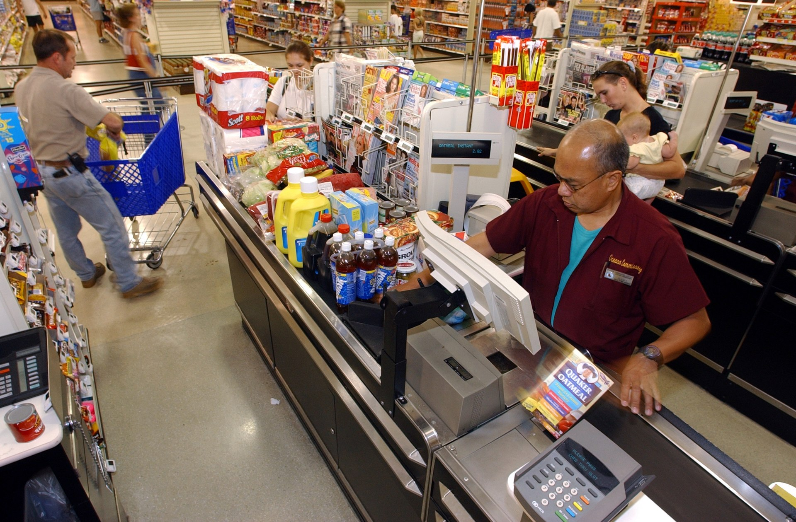

על רקע יוקר המחיה המתמשך וגל ההתייקרויות בסל המזון, **המותג הפרטי** של רשתות השיווק הפך לאחד הכלים המרכזיים של הצרכן הישראלי לחיסכון בקופה. מוצרים אלו, הנמכרים תחת שם הרשת במקום שם היצרן, מציעים בדרך כלל מחיר נמוך בעשרות אחוזים — ויותר ויותר קונים מגלים שהפער באיכות כבר אינו מה שהיה.

## מה זה בעצם מותג פרטי?

מותג פרטי (Private Label) הוא מוצר המיוצר עבור רשת שיווק ונמכר תחת המותג שלה — למשל "שופרסל", "רמי לוי" או "היפר". במקרים רבים המוצר מיוצר באותם פסי ייצור של המותגים המובילים, אך נחסכות עלויות השיווק, הפרסום והמיתוג היקרות. התוצאה: מחיר מדף נמוך משמעותית.

המגמה אינה ישראלית בלבד. בשווקים מפותחים באירופה, כמו גרמניה ובריטניה, נתח המותג הפרטי מסל הקניות עשוי להגיע לכ-40% ואף יותר. בישראל השיעור עדיין נמוך יותר, אך הוא נמצא במגמת עלייה ברורה, בעיקר מאז זינוק מחירי המזון בשנים האחרונות.

## כמה באמת חוסכים?

הפער בין מוצר מותג פרטי למותג מוביל משתנה מקטגוריה לקטגוריה. במוצרי יסוד בסיסיים — קמח, סוכר, שימורים, נייר טואלט וחומרי ניקוי — החיסכון יכול להגיע לעשרות אחוזים. בקטגוריות ממותגות יותר, כמו חטיפים או משקאות, הפער לעיתים קטן יותר, אך עדיין מורגש.

| קטגוריה | מותג מוביל (מחיר יחסי) | מותג פרטי (מחיר יחסי) | חיסכון מוערך |
|---|---|---|---|
| חומרי ניקוי | 100% | כ-60% | כ-40% |
| שימורים ומזון יבש | 100% | כ-65% | כ-35% |
| מוצרי חלב בסיסיים | 100% | כ-75% | כ-25% |
| חטיפים ומתוקים | 100% | כ-80% | כ-20% |

*הנתונים הם הערכות טווח להמחשה ומשתנים בין רשת לרשת ובין מבצע למבצע.

## למה דווקא עכשיו?

שילוב של גורמים דוחף את הצרכן הישראלי אל המדף הזול יותר. ראשית, **יוקר המחיה** וגל ההתייקרויות בסל המזון שחקו את כוח הקנייה של משקי הבית. שנית, הרשתות הגדולות זיהו הזדמנות עסקית: המותג הפרטי מניב להן שולי רווח נאים יותר ומחזק את נאמנות הלקוחות, ולכן הן משקיעות בהרחבת המגוון ובשיפור האיכות.

רשתות כמו **שופרסל**, **רמי לוי**, **טיב טעם** ו"ויקטורי" הרחיבו בשנים האחרונות את קווי המותג הפרטי — מקטגוריות בסיסיות ועד מוצרים פרימיום, אורגניים ואף מוצרי בריאות. במקביל, הרשתות הדיסקאונט והמדיניות הצרכנית המתגברת של השוואת מחירים דרך אפליקציות דחפו את המודעות למחיר.

## האם נפגעת האיכות?

זו השאלה שמעסיקה את הצרכנים יותר מכל. בעבר רווח הרושם שמותג פרטי משמעו איכות נחותה, אך המציאות השתנתה. בקטגוריות רבות — במיוחד מוצרי יסוד — הפער באיכות זניח, ולעיתים מדובר במוצר זהה כמעט לחלוטין למותג המוביל, המיוצר באותו מפעל.

עם זאת, לא כל המוצרים נולדו שווים. בקטגוריות שבהן הטעם, המרקם או הנוסחה קריטיים — למשל קפה, שוקולד או מוצרי טיפוח — ייתכנו פערים מורגשים. ההמלצה הצרכנית הפשוטה: להתנסות בהדרגה, קטגוריה אחר קטגוריה, ולהחליט לפי הטעם והשימוש בפועל.

## ההשלכות על יצרני המזון

העלייה בנתח המותג הפרטי מפעילה לחץ ישיר על **יצרני המזון** הגדולים בישראל. כאשר צרכנים נוטשים מותגים ותיקים לטובת חלופה זולה, היצרנים נאלצים להתגונן — בין באמצעות מבצעים אגרסיביים, ובין באמצעות ייצור המותג הפרטי עצמו עבור הרשתות, מהלך שהופך יריב לשותף.

מבחינת התחרותיות בשוק, המגמה נתפסת על ידי גורמים רבים כחיובית: היא מגבירה את הלחץ להורדת מחירים ומרחיבה את הבחירה של הצרכן. מנגד, יש הטוענים כי חיזוק יתר של המותגים הפרטיים עלול לפגוע ביצרנים הקטנים ובמגוון בטווח הארוך.

## שורה תחתונה לצרכן

המותג הפרטי הפך מפתרון של "שעת חירום כלכלית" לבחירה לגיטימית ואף מועדפת עבור חלק גדל של משקי הבית. עבור צרכן שמעוניין לצמצם את הוצאות סל הקניות מבלי לוותר על הרבה — זהו כלי חיסכון פשוט וזמין. הכלל הזהב: להשוות, להתנסות, ולזכור שמחיר גבוה אינו תמיד מעיד על איכות גבוהה יותר.
