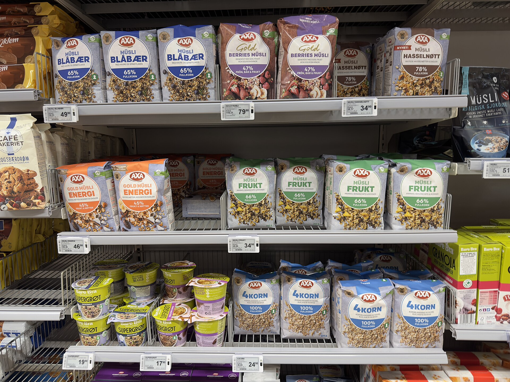

האריזה נראית בדיוק כמו קודם, המחיר על המדף לא זז - אבל אם תבדקו היטב, תגלו שקיבלתם פחות. זו **שרינקפלציה** (Shrinkflation), תופעת הצטמקות המוצרים שהפכה בשנים האחרונות לאחת הדרכים המרכזיות של יצרני המזון והמוצרים לצרכן לספוג עליות מחירים - מבלי שהצרכן ירגיש. במקום להעלות את המחיר בגלוי, היצרן פשוט מקטין את הכמות באריזה, וכך מייקר בפועל את המחיר ליחידה תוך שמירה על תג מחיר "קבוע".

## מהי שרינקפלציה ולמה היא כל כך אפקטיבית?

המונח שרינקפלציה הוא הלחם של המילים "הצטמקות" (shrink) ו"אינפלציה" (inflation). בשונה מהתייקרות רגילה, שבה הצרכן רואה מיד את המספר על המדף עולה, ההצטמקות פועלת מתחת לרדאר. מחקרי צרכנות מלמדים כי צרכנים רגישים הרבה יותר לשינוי במחיר מאשר לשינוי בכמות. שקית חטיף שירדה מ-100 גרם ל-90 גרם, בקבוק שמן שהצטמק מליטר לתשיעיות הליטר, או מארז יוגורטים שירד משמונה יחידות לשש - כל אלה עוברים לרוב מתחת לסף המודעות של הקונה.

התוצאה: המחיר ליחידה או ל-100 גרם מזנק לעיתים בעשרות אחוזים, בעוד הצרכן משוכנע שהמחיר "נשאר אותו דבר".

## למה זה קורה דווקא עכשיו?

גל ההתייקרויות בשוק חומרי הגלם העולמי - קקאו, קפה, שמן, חיטה וסוכר - הפעיל לחץ כבד על מרווחי הרווח של היצרנים. במקום להתעמת חזיתית עם הצרכן הרגיש למחיר, רבים בחרו בדרך העקיפה. בישראל, שבה ריכוזיות שוק המזון גבוהה ומספר קטן של יצרנים שולט בקטגוריות מרכזיות, לתופעה יש קרקע פורייה במיוחד.

גם הפיקוח הרגולטורי מוגבל: אין חובה ברורה ליידע את הצרכן שכמות המוצר קטנה, כל עוד המשקל המעודכן מודפס על האריזה - גם אם באותיות קטנות בגב המוצר.

## איך מזהים שרינקפלציה בסל הקניות?

הכלי החזק ביותר של הצרכן נמצא דווקא בתווית המחיר על המדף - המחיר המושווה **ל-100 גרם, ל-100 מיליליטר או ליחידה**. זהו המספר האמיתי שמאפשר להשוות בין מוצרים ולזהות התייקרות סמויה.

הנה כמה סימנים אופייניים:

- אריזה שנראית "מעודכנת" או בעיצוב חדש - לעיתים הזדמנות להסתיר הקטנת כמות.
- ניסוחים כמו "אריזה נוחה יותר" או "פורמט חדש".
- שינוי קל במשקל שמופיע רק בגב המוצר.
- מארזים שבהם מספר היחידות ירד בלי הכרזה.

## טבלה: כך נראית ההצטמקות בפועל

הדוגמאות שלהלן הן להמחשה של מנגנון התופעה (המחירים אינם נתוני שוק ספציפיים):

| מוצר | כמות "לפני" | כמות "אחרי" | מחיר על המדף | ייקור בפועל ליחידה |
|------|-------------|-------------|--------------|--------------------|
| שקית חטיף | 100 גרם | 90 גרם | ללא שינוי | כ-11% |
| בקבוק שמן | 1,000 מ"ל | 900 מ"ל | ללא שינוי | כ-11% |
| מארז יוגורט | 8 יחידות | 6 יחידות | ללא שינוי | כ-33% |
| שוקולד טבלה | 100 גרם | 85 גרם | ללא שינוי | כ-18% |

כפי שניתן לראות, גם שינוי כמות "קטן" מתורגם לייקור משמעותי במחיר האמיתי שהצרכן משלם.

## מה אפשר לעשות כצרכן?

השרינקפלציה קשה להימנעות מוחלטת, אך ניתן לצמצם את פגיעתה:

1. **השוו תמיד למחיר ל-100 גרם/יחידה** - זהו הנתון המשקף את השווי האמיתי.
2. **שקלו מותגים פרטיים** - המותגים הפרטיים של הרשתות ורשתות ההנחה מציעים לרוב יחס כמות-מחיר עדיף.
3. **בדקו את גב האריזה** - שם מסתתר המשקל המעודכן.
4. **עקבו אחר קטגוריות רגישות** - מוצרי קקאו, קפה ושמן חשופים במיוחד להצטמקות בשל עליית חומרי הגלם.

## שורה תחתונה

שרינקפלציה היא התייקרות שקטה שמכרסמת בכוח הקנייה של משק הבית הישראלי מבלי שרבים שמים לב. בעולם שבו האינפלציה בפועל גבוהה מהמספרים היבשים על המדף, המודעות של הצרכן היא ההגנה הטובה ביותר. שנייה אחת של השוואת מחיר ל-100 גרם יכולה לחסוך עשרות ומאות שקלים לאורך שנה שלמה של קניות.
